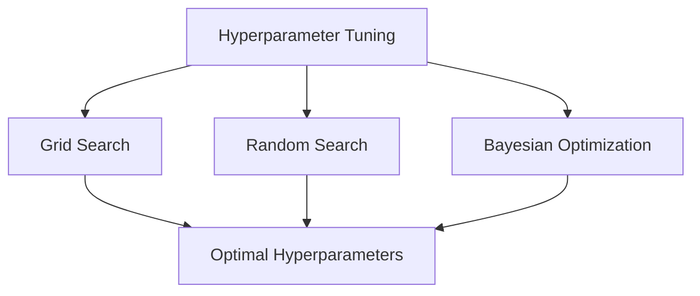
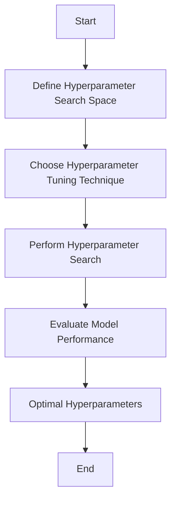

Hyperparameter tuning is a crucial aspect of machine learning that can significantly impact the performance of a model. In this article, we will delve into the world of hyperparameter tuning, exploring its importance, best practices, and providing actionable advice for engineers.

## Table of Contents
1. [Introduction to Hyperparameter Tuning](#introduction-to-hyperparameter-tuning)
2. [Types of Hyperparameters](#types-of-hyperparameters)
3. [Hyperparameter Tuning Techniques](#hyperparameter-tuning-techniques)
4. [Best Practices for Hyperparameter Tuning](#best-practices-for-hyperparameter-tuning)
5. [Visual Insights Gallery](#visual-insights-gallery)
6. [Summary and Conclusion](#summary-and-conclusion)
7. [FAQ](#faq)

## Introduction to Hyperparameter Tuning
Hyperparameter tuning is the process of selecting the optimal hyperparameters for a machine learning model. Hyperparameters are parameters that are set before training a model, and they can have a significant impact on the model's performance.


## Types of Hyperparameters
There are several types of hyperparameters, including:
* **Model hyperparameters**: These are hyperparameters that are specific to a particular model, such as the number of hidden layers in a neural network.
* **Regularization hyperparameters**: These are hyperparameters that control the amount of regularization applied to a model, such as the L1 and L2 regularization coefficients.
* **Optimization hyperparameters**: These are hyperparameters that control the optimization algorithm used to train a model, such as the learning rate and batch size.
```markdown
| Hyperparameter Type | Description |
| --- | --- |
| Model Hyperparameters | Model-specific hyperparameters |
| Regularization Hyperparameters | Hyperparameters that control regularization |
| Optimization Hyperparameters | Hyperparameters that control the optimization algorithm |
```
## Hyperparameter Tuning Techniques
There are several hyperparameter tuning techniques, including:
* **Grid Search**: This involves searching through a predefined grid of hyperparameters to find the optimal combination.
* **Random Search**: This involves randomly sampling hyperparameters from a predefined distribution to find the optimal combination.
* **Bayesian Optimization**: This involves using a probabilistic approach to search for the optimal hyperparameters.

## Hyperparameter Tuning Techniques: Flowchart

## Best Practices for Hyperparameter Tuning
Here are some best practices for hyperparameter tuning:
> **Note:** Start with a small grid of hyperparameters and gradually increase the size of the grid as needed.
> **Warning:** Avoid over-tuning by using techniques such as cross-validation to evaluate model performance.
> **Tip:** Use automated hyperparameter tuning tools to simplify the process and save time.
```python
# Example code for hyperparameter tuning using scikit-learn
from sklearn.model_selection import GridSearchCV
from sklearn.ensemble import RandomForestClassifier
from sklearn.datasets import load_iris

# Load the iris dataset
iris = load_iris()
X = iris.data
y = iris.target

# Define the hyperparameter search space
param_grid = {
    'n_estimators': [100, 200, 300],
    'max_depth': [None, 5, 10]
}

# Perform hyperparameter tuning using grid search
grid_search = GridSearchCV(RandomForestClassifier(), param_grid, cv=5)
grid_search.fit(X, y)

# Print the optimal hyperparameters
print(grid_search.best_params_)
```
## Visual Insights Gallery
Here are some visual insights into hyperparameter tuning:


## Summary and Conclusion
Hyperparameter tuning is a crucial aspect of machine learning that can significantly impact the performance of a model. By following best practices and using automated hyperparameter tuning tools, engineers can simplify the process and save time. Remember to start with a small grid of hyperparameters and gradually increase the size of the grid as needed, and avoid over-tuning by using techniques such as cross-validation to evaluate model performance.

## FAQ
Q: What is hyperparameter tuning?
A: Hyperparameter tuning is the process of selecting the optimal hyperparameters for a machine learning model.
Q: What are the types of hyperparameters?
A: There are several types of hyperparameters, including model hyperparameters, regularization hyperparameters, and optimization hyperparameters.
Q: What are the best practices for hyperparameter tuning?
A: Some best practices for hyperparameter tuning include starting with a small grid of hyperparameters, avoiding over-tuning, and using automated hyperparameter tuning tools.