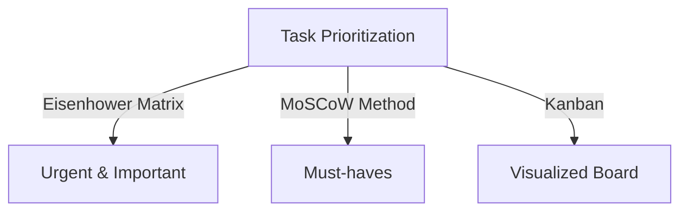
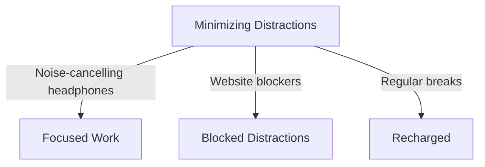

As engineers, we're constantly striving to improve our craft, deliver high-quality work, and meet deadlines. However, with the rise of remote work and freelancing, it's becoming increasingly important to develop effective productivity habits to stay ahead of the game. In this article, we'll delve into the best practices for engineers to boost their productivity and achieve success in their careers.

## Table of Contents
1. [Introduction to Productivity Habits](#introduction-to-productivity-habits)
2. [Time Management Strategies](#time-management-strategies)
3. [Task Prioritization Techniques](#task-prioritization-techniques)
4. [Minimizing Distractions and Staying Focused](#minimizing-distractions-and-staying-focused)
5. [Conclusion and Summary](#conclusion-and-summary)

## Introduction to Productivity Habits
Developing good productivity habits is crucial for engineers to deliver high-quality work, meet deadlines, and achieve career success. It's essential to understand that productivity is a personal and continuous process that requires effort, dedication, and self-awareness.


> **Note:** Productivity habits can vary from person to person, and what works for one engineer may not work for another. It's essential to experiment and find the techniques that work best for you.

## Time Management Strategies
Effective time management is critical for engineers to prioritize tasks, meet deadlines, and deliver high-quality work. Here are some time management strategies that engineers can use:
* **Pomodoro Technique:** Work in focused 25-minute increments, followed by a 5-minute break.
* **Time blocking:** Schedule tasks in fixed time blocks, allowing for focused work and minimal distractions.
* **Calendar management:** Use calendars to schedule tasks, meetings, and deadlines, ensuring a clear overview of the workweek.

```markdown
| Time Management Strategy | Description |
| --- | --- |
| Pomodoro Technique | Work in focused 25-minute increments, followed by a 5-minute break |
| Time blocking | Schedule tasks in fixed time blocks, allowing for focused work and minimal distractions |
| Calendar management | Use calendars to schedule tasks, meetings, and deadlines, ensuring a clear overview of the workweek |
```

## Task Prioritization Techniques
Prioritizing tasks is essential for engineers to focus on the most critical tasks, meet deadlines, and deliver high-quality work. Here are some task prioritization techniques that engineers can use:
* **Eisenhower Matrix:** Prioritize tasks based on their urgency and importance.
* **MoSCoW Method:** Prioritize tasks based on their must-haves, should-haves, could-haves, and won't-haves.
* **Kanban:** Visualize tasks on a board, allowing for easy prioritization and workflow management.



## Minimizing Distractions and Staying Focused
Minimizing distractions and staying focused is crucial for engineers to deliver high-quality work, meet deadlines, and achieve career success. Here are some techniques for minimizing distractions and staying focused:
* **Noise-cancelling headphones:** Use noise-cancelling headphones to block out distractions and stay focused.
* **Website blockers:** Use website blockers to block distracting websites and stay focused on work.
* **Regular breaks:** Take regular breaks to recharge and avoid burnout.



## Conclusion and Summary
In conclusion, developing good productivity habits is essential for engineers to deliver high-quality work, meet deadlines, and achieve career success. By using time management strategies, task prioritization techniques, and minimizing distractions, engineers can stay focused, productive, and successful in their careers.

## Visual Insights Gallery
Here are some visual insights to help engineers boost their productivity:


## Frequently Asked Questions
1. **What is the most effective time management strategy for engineers?**
The most effective time management strategy for engineers is the Pomodoro Technique, which involves working in focused 25-minute increments, followed by a 5-minute break.
2. **How can engineers prioritize tasks effectively?**
Engineers can prioritize tasks effectively by using the Eisenhower Matrix, which involves prioritizing tasks based on their urgency and importance.
3. **What are some techniques for minimizing distractions and staying focused?**
Some techniques for minimizing distractions and staying focused include using noise-cancelling headphones, website blockers, and taking regular breaks.