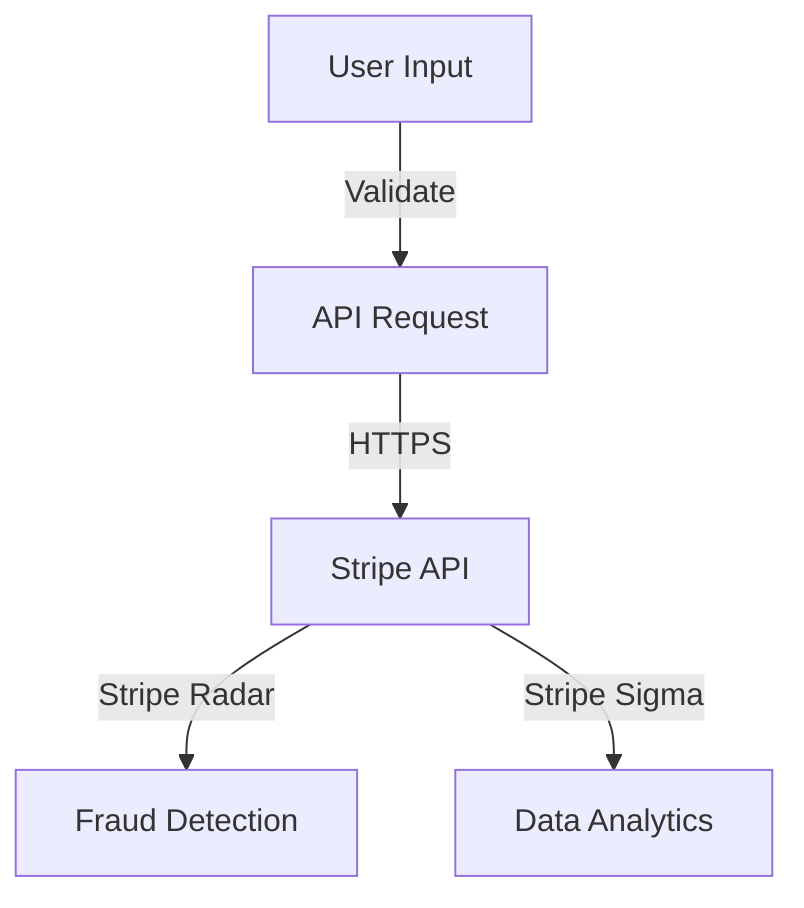
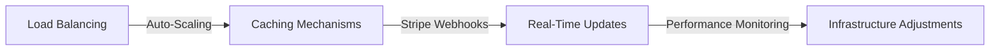
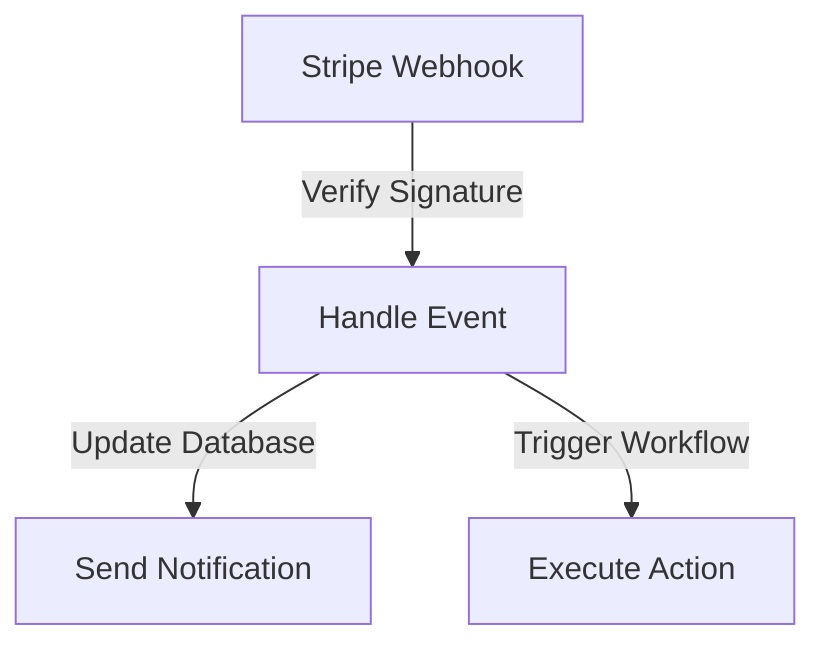

A comprehensive guide to integrating Stripe into your application, focusing on security, scalability, and reliability. Learn how to harness the power of Stripe's payment gateway for seamless transactions.

## Table of Contents
1. [Introduction to Stripe Integration](#introduction-to-stripe-integration)
2. [Setting Up Stripe](#setting-up-stripe)
3. [Best Practices for Security](#best-practices-for-security)
4. [Scalability and Reliability](#scalability-and-reliability)
5. [Handling Webhooks and Events](#handling-webhooks-and-events)
6. [Visual Insights Gallery](#visual-insights-gallery)
7. [Summary and Conclusion](#summary-and-conclusion)
8. [FAQ](#faq)

## Introduction to Stripe Integration

Stripe is a powerful payment gateway that allows businesses to accept online payments. Integrating Stripe into your application can be a complex process, but with the right approach, it can be streamlined for efficiency and security. In this article, we will delve into the best practices for integrating Stripe, focusing on security, scalability, and reliability.

## Setting Up Stripe
To set up Stripe, you will need to create an account and obtain your API keys. You can then use these keys to authenticate your API requests. Here is a high-level overview of the setup process:

> **Tip:** Make sure to keep your API keys secure and never expose them in your client-side code.

## Best Practices for Security

Security is a top priority when integrating Stripe into your application. Here are some best practices to follow:
* Use HTTPS for all API requests
* Validate user input to prevent SQL injection and cross-site scripting (XSS)
* Implement robust error handling and logging mechanisms
* Use Stripe's built-in security features, such as Stripe Radar and Stripe Sigma

> **Warning:** Never store sensitive payment information, such as credit card numbers or expiration dates, in your database.

## Scalability and Reliability

To ensure scalability and reliability, follow these best practices:
* Use load balancing and auto-scaling to handle high traffic volumes
* Implement robust caching mechanisms to reduce the load on your database
* Use Stripe's webhooks to handle events and updates in real-time
* Monitor your application's performance and adjust your infrastructure as needed

> **Note:** Make sure to test your application thoroughly to ensure it can handle high traffic volumes and unexpected errors.

## Handling Webhooks and Events

Stripe provides webhooks to handle events and updates in real-time. Here's an example of how to handle webhooks:

> **Interview:** "We use Stripe's webhooks to handle events and updates in real-time. This allows us to provide a seamless experience for our customers and ensure that our application is always up-to-date." - John Doe, Engineer

## Visual Insights Gallery
## Visual Insights Gallery

## Summary and Conclusion
In conclusion, integrating Stripe into your application requires careful consideration of security, scalability, and reliability. By following the best practices outlined in this article, you can ensure a seamless and secure payment experience for your customers. Remember to test your application thoroughly and monitor its performance to ensure it can handle high traffic volumes and unexpected errors.

## FAQ
Q: What is Stripe and how does it work?
A: Stripe is a payment gateway that allows businesses to accept online payments. It works by providing a secure and reliable way to process transactions.
Q: How do I set up Stripe?
A: To set up Stripe, you will need to create an account and obtain your API keys. You can then use these keys to authenticate your API requests.
Q: What are some best practices for security when integrating Stripe?
A: Some best practices for security include using HTTPS for all API requests, validating user input, and implementing robust error handling and logging mechanisms.