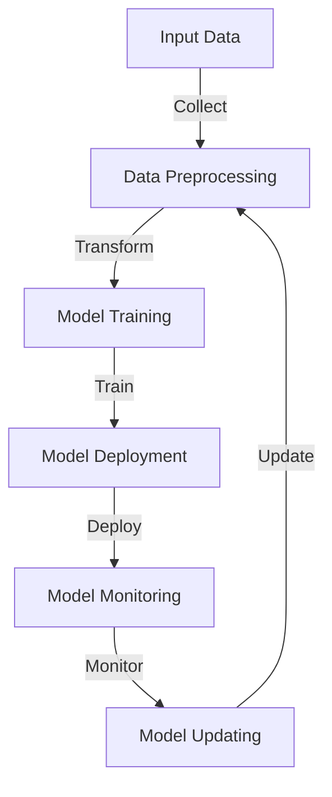
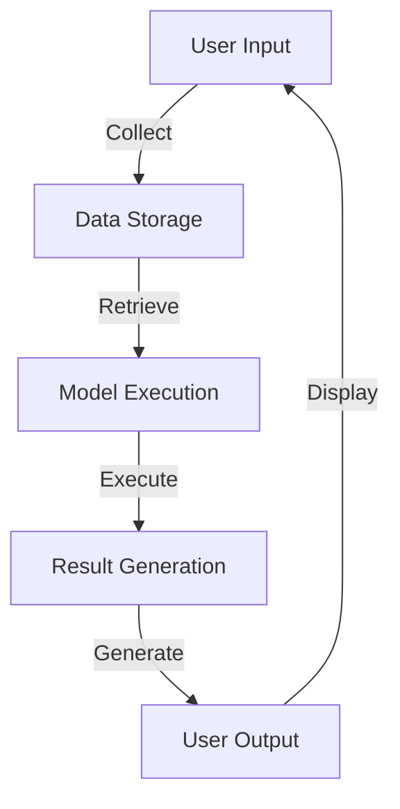

In the realm of artificial intelligence and machine learning, the development of modern products has become increasingly complex. As these products continue to evolve, it's essential to implement a workflow that can efficiently manage and optimize their performance. This is where Agentic Agentic Workflow comes into play. In this article, we'll delve into the world of Agentic Agentic Workflow, exploring its significance, benefits, and applications in modern product development.

## Introduction to Agentic Agentic Workflow

Agentic Agentic Workflow is a decentralized, autonomous workflow that enables machines to make decisions and take actions independently. This workflow is critical for modern products, as it allows them to adapt to changing environments, learn from experiences, and improve their performance over time. By leveraging Agentic Agentic Workflow, developers can create products that are more efficient, effective, and responsive to user needs.

## Benefits of Agentic Agentic Workflow

The benefits of Agentic Agentic Workflow are numerous. Some of the most significant advantages include:
* **Improved Efficiency**: Agentic Agentic Workflow automates many tasks, reducing the need for human intervention and minimizing the risk of errors.
* **Enhanced Adaptability**: This workflow enables products to adapt to changing environments, ensuring they remain relevant and effective in dynamic situations.
* **Increased Responsiveness**: Agentic Agentic Workflow allows products to respond quickly to user needs, providing a more seamless and engaging experience.

## Architecture of Agentic Agentic Workflow

The architecture of Agentic Agentic Workflow involves a continuous cycle of data collection, preprocessing, model training, deployment, monitoring, and updating. This cycle ensures that products remain up-to-date, accurate, and effective in their decision-making processes.

## Applications of Agentic Agentic Workflow

Agentic Agentic Workflow has a wide range of applications in modern product development, including:
* **Smart Home Devices**: Agentic Agentic Workflow can be used to create smart home devices that learn and adapt to user preferences, optimizing energy consumption and improving overall comfort.
* **Autonomous Vehicles**: This workflow is critical for autonomous vehicles, enabling them to navigate complex environments, avoid obstacles, and make decisions in real-time.
* **Healthcare Systems**: Agentic Agentic Workflow can be applied to healthcare systems, allowing them to analyze patient data, diagnose conditions, and provide personalized treatment recommendations.

## Implementation of Agentic Agentic Workflow

Implementing Agentic Agentic Workflow requires a deep understanding of machine learning, data analysis, and software development. It involves designing and deploying a system that can collect and process data, train and deploy models, and generate results in real-time.

> **Note:** Agentic Agentic Workflow is a complex and multifaceted concept that requires careful consideration and planning. Developers must ensure that their implementation is secure, efficient, and transparent, with clear lines of communication and well-defined goals.

## Visual Insights Gallery
## Visual Insights Gallery

## Summary and Conclusion
In conclusion, Agentic Agentic Workflow is a critical component of modern product development, enabling machines to make decisions and take actions independently. By leveraging this workflow, developers can create products that are more efficient, effective, and responsive to user needs. As the field of artificial intelligence and machine learning continues to evolve, the importance of Agentic Agentic Workflow will only continue to grow.

## FAQ
* **Q: What is Agentic Agentic Workflow?**
A: Agentic Agentic Workflow is a decentralized, autonomous workflow that enables machines to make decisions and take actions independently.
* **Q: What are the benefits of Agentic Agentic Workflow?**
A: The benefits of Agentic Agentic Workflow include improved efficiency, enhanced adaptability, and increased responsiveness.
* **Q: What are the applications of Agentic Agentic Workflow?**
A: Agentic Agentic Workflow has a wide range of applications in modern product development, including smart home devices, autonomous vehicles, and healthcare systems.