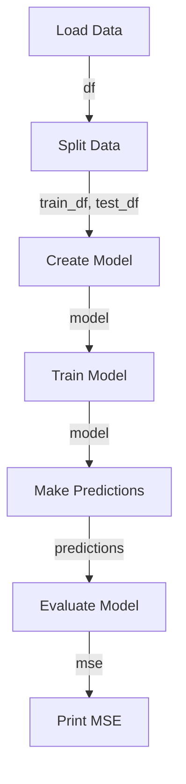

In the era of data-driven decision making, time-series forecasting has become an indispensable tool for businesses and organizations to predict future trends and make informed decisions. With the increasing availability of historical data, companies can leverage analytical time-series forecasting to optimize their operations, improve customer satisfaction, and stay ahead of the competition. In this article, we will delve into the world of time-series forecasting, exploring its importance, applications, and implementation using Python and Pandas.

## Introduction to Time-Series Forecasting
Time-series forecasting involves analyzing historical data to predict future values. This technique is widely used in various industries, including finance, retail, and healthcare, to forecast sales, demand, and other key performance indicators. 


## Importance of Time-Series Forecasting
Time-series forecasting is critical for modern products because it enables businesses to:
* Predict demand and optimize inventory management
* Identify seasonal trends and adjust pricing strategies accordingly
* Detect anomalies and prevent potential losses
* Improve customer satisfaction by providing personalized recommendations
* Enhance operational efficiency by optimizing resource allocation

## Applications of Time-Series Forecasting
Time-series forecasting has numerous applications across various industries, including:
### Finance
* Stock price prediction
* Portfolio optimization
* Risk management
### Retail
* Sales forecasting
* Inventory management
* Supply chain optimization
### Healthcare
* Patient flow prediction
* Resource allocation
* Disease outbreak forecasting

## Implementation of Time-Series Forecasting using Python and Pandas
Python and Pandas are popular libraries used for time-series forecasting. Here's an example of how to implement a basic time-series forecasting model using Python and Pandas:
```python
import pandas as pd
import numpy as np
from sklearn.model_selection import train_test_split
from sklearn.ensemble import RandomForestRegressor
from sklearn.metrics import mean_squared_error

# Load the dataset
df = pd.read_csv('data.csv', index_col='date', parse_dates=['date'])

# Split the data into training and testing sets
train_df, test_df = train_test_split(df, test_size=0.2, random_state=42)

# Create a random forest regressor model
model = RandomForestRegressor(n_estimators=100, random_state=42)

# Train the model
model.fit(train_df.index.values.reshape(-1, 1), train_df['value'])

# Make predictions
predictions = model.predict(test_df.index.values.reshape(-1, 1))

# Evaluate the model
mse = mean_squared_error(test_df['value'], predictions)
print(f'MSE: {mse}')
```

## Advanced Time-Series Forecasting Techniques
For more complex time-series forecasting tasks, advanced techniques such as:
* ARIMA (AutoRegressive Integrated Moving Average)
* Prophet
* LSTM (Long Short-Term Memory) networks
can be used. These techniques can handle multiple seasonality, non-linear trends, and other complex patterns in the data.

## Visualizing Time-Series Data
Visualizing time-series data is crucial for understanding trends, patterns, and anomalies. Here's an example of how to visualize time-series data using Python and Matplotlib:
```python
import matplotlib.pyplot as plt

# Plot the data
plt.plot(df.index, df['value'])
plt.xlabel('Date')
plt.ylabel('Value')
plt.title('Time-Series Data')
plt.show()
```
```mermaid
graph TD
    A["Time"] -->|df.index| B["Value"]
    B -->|df['value']| C["Plot"]
    C -->|plt.plot| D["Show Plot"]
    D -->|plt.show| E["Display Plot"]
```
## Visual Insights Gallery
## Visual Insights Gallery
### Time-Series Data

### Forecasting Model

### Evaluation Metrics


## Summary and Conclusion
In conclusion, analytical time-series forecasting is a critical component of modern products, enabling businesses to make data-driven decisions, optimize operations, and improve customer satisfaction. By leveraging Python and Pandas, businesses can implement time-series forecasting models and visualize time-series data to gain valuable insights. Whether you're a data scientist, business analyst, or product manager, understanding time-series forecasting is essential for staying ahead of the competition and driving business success.

## FAQ
* Q: What is time-series forecasting?
A: Time-series forecasting involves analyzing historical data to predict future values.
* Q: What are the applications of time-series forecasting?
A: Time-series forecasting has numerous applications across various industries, including finance, retail, and healthcare.
* Q: How can I implement time-series forecasting using Python and Pandas?
A: You can implement time-series forecasting using Python and Pandas by loading the dataset, splitting the data into training and testing sets, creating a model, training the model, making predictions, and evaluating the model.