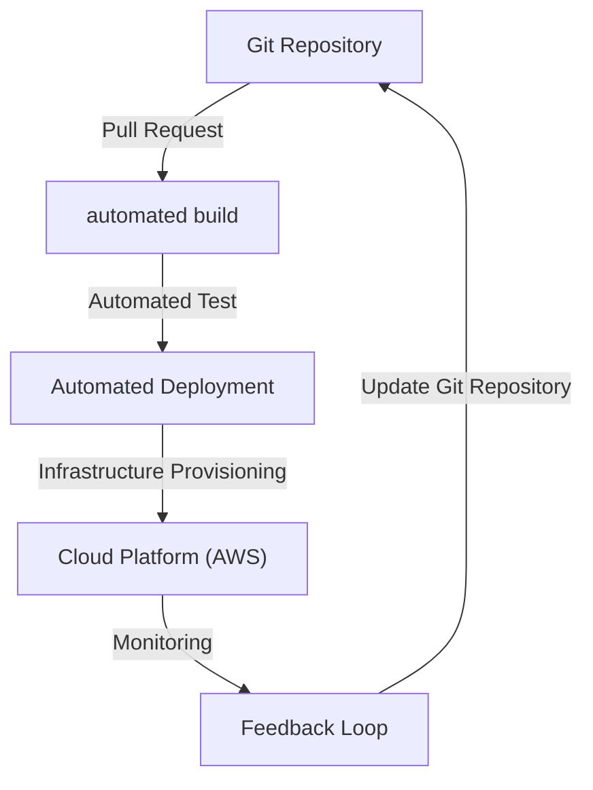
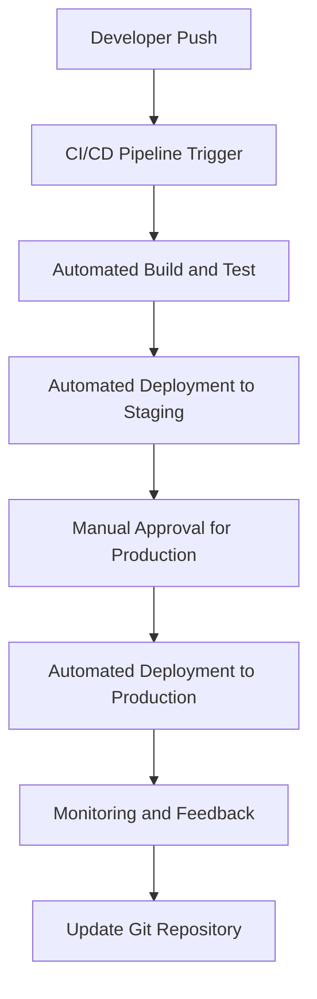

In the ever-evolving landscape of software development, embracing efficiency, reliability, and speed is paramount. Modern products, especially those deployed on cloud platforms like AWS, require a streamlined approach to manage infrastructure, applications, and deployment processes. This is where Automated GitOps Workflow comes into play, revolutionizing the way development teams operate. In this article, we'll delve into the depths of why adopting an automated GitOps workflow is no longer a choice but a necessity for modern products.

## Introduction to GitOps

GitOps is a methodology that leverages Git as the single source of truth for declarative configuration and automation. It combines the principles of DevOps with the practices of infrastructure as code (IaC) to manage and monitor applications. By automating workflows, teams can significantly reduce manual errors, increase deployment frequency, and enhance overall quality.

## The Importance of Automation in GitOps
Automation is the backbone of a successful GitOps workflow. It ensures that the desired state of the system is consistently applied across all environments, from development to production. This consistency is crucial for maintaining predictability and reliability in modern products.

```plaintext
# Example of a basic GitOps workflow automation script
pipeline {
    agent any
    stages {
        stage('Build') {
            steps {
                sh 'make build'
            }
        }
        stage('Deploy') {
            steps {
                sh 'make deploy'
            }
        }
    }
}
```

## Benefits of Automated GitOps Workflow

The benefits of implementing an automated GitOps workflow are multifaceted:
- **Version Control:** Every change is tracked, allowing for easy rollbacks and auditing.
- **Consistency:** Ensures that the desired state is consistently applied, reducing configuration drift.
- **Efficiency:** Automates repetitive tasks, freeing up resources for more strategic initiatives.
- **Reliability:** Minimizes human error, leading to more reliable deployments.

```markdown
### Comparison of Manual vs. Automated GitOps Workflow
| Aspect | Manual Workflow | Automated GitOps Workflow |
| --- | --- | --- |
| Error Rate | High | Low |
| Deployment Speed | Slow | Fast |
| Scalability | Limited | High |
| Security | Vulnerable | Enhanced |
```

## Implementing Automated GitOps with Terraform and AWS

Terraform, as an IaC tool, plays a pivotal role in automating the provisioning and management of cloud infrastructure on platforms like AWS. By integrating Terraform with GitOps practices, teams can automate the deployment of cloud resources, ensuring that the infrastructure aligns with the desired state defined in Git.

```terraform
# Example Terraform configuration for an AWS EC2 instance
provider "aws" {
  region = "us-west-2"
}

resource "aws_instance" "example" {
  ami           = "ami-abc123"
  instance_type = "t2.micro"
}
```

## Architecture of an Automated GitOps Workflow


## Flow of Automated GitOps Workflow


## Visual Insights Gallery
## Visual Insights Gallery


## Summary/Conclusion
In conclusion, adopting an automated GitOps workflow is critical for modern products, especially those leveraging cloud platforms like AWS. By integrating automation with GitOps practices and tools like Terraform, development teams can significantly enhance the efficiency, reliability, and speed of their deployment processes. As the software development landscape continues to evolve, embracing automated GitOps workflows will be key to staying competitive and delivering high-quality products.

## FAQ
- **Q: What is GitOps?**
  A: GitOps is a methodology that uses Git as the single source of truth for declarative configuration and automation.
- **Q: Why is automation important in GitOps?**
  A: Automation ensures consistency, reduces manual errors, and increases deployment frequency.
- **Q: How does Terraform fit into an automated GitOps workflow?**
  A: Terraform is used for infrastructure as code, automating the provisioning and management of cloud resources.
- **Q: What are the benefits of an automated GitOps workflow?**
  A: Benefits include version control, consistency, efficiency, reliability, and enhanced security.