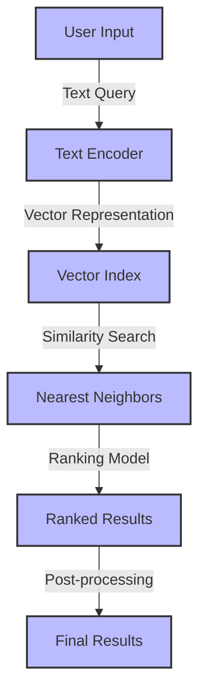
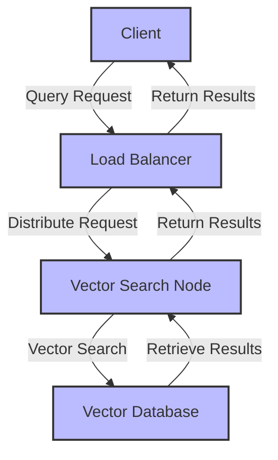

Autonomous vector search is revolutionizing the way we interact with data, enabling modern products to provide more accurate and personalized results. As we delve into the world of artificial intelligence and machine learning, it's essential to understand the significance of autonomous vector search in modern products.

## Introduction to Autonomous Vector Search

Autonomous vector search is a cutting-edge technology that utilizes artificial intelligence and machine learning algorithms to search and retrieve relevant data from vast datasets. This technology has the ability to learn from user interactions, adapt to new data, and improve search results over time.

## How Autonomous Vector Search Works
```markdown
### Mermaid.js Diagram: Autonomous Vector Search Flow

### Autonomous Vector Search Architecture

> **Note:** Autonomous vector search utilizes a combination of natural language processing (NLP) and machine learning algorithms to convert text queries into vector representations, enabling efficient and accurate search results.

## Benefits of Autonomous Vector Search
| Benefit | Description |
| --- | --- |
| Improved Accuracy | Autonomous vector search provides more accurate results by leveraging machine learning algorithms and vector representations. |
| Personalization | Autonomous vector search enables personalized results by learning from user interactions and adapting to new data. |
| Scalability | Autonomous vector search is designed to handle large datasets and scale to meet the needs of modern products. |

## Real-World Applications of Autonomous Vector Search

Autonomous vector search has numerous real-world applications, including:
* Search engines
* Recommendation systems
* Chatbots
* Virtual assistants

> **Tip:** Autonomous vector search can be used to improve the efficiency and effectiveness of various applications, from search engines to virtual assistants.

## Challenges and Limitations of Autonomous Vector Search
> **Warning:** Autonomous vector search is not without its challenges and limitations, including:
* Data quality and availability
* Algorithmic complexity
* Scalability and performance

## Visual Insights Gallery
## Visual Insights Gallery


## Summary and Conclusion
Autonomous vector search is a critical component of modern products, enabling more accurate and personalized results. By leveraging machine learning algorithms and vector representations, autonomous vector search provides a powerful tool for searching and retrieving relevant data from vast datasets. As the technology continues to evolve, we can expect to see even more innovative applications of autonomous vector search in the future.

## FAQ
Q: What is autonomous vector search?
A: Autonomous vector search is a cutting-edge technology that utilizes artificial intelligence and machine learning algorithms to search and retrieve relevant data from vast datasets.
Q: How does autonomous vector search work?
A: Autonomous vector search works by converting text queries into vector representations, enabling efficient and accurate search results.
Q: What are the benefits of autonomous vector search?
A: The benefits of autonomous vector search include improved accuracy, personalization, and scalability.