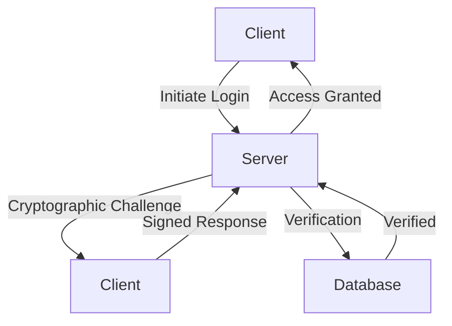

In the ever-evolving landscape of cybersecurity, the importance of implementing robust authentication mechanisms cannot be overstated. As technology advances and more services move online, the potential attack vectors for malicious actors to exploit also increase. One crucial aspect of securing modern products is the integration of cryptographic Multi-Factor Authentication (MFA). In this article, we will delve into the depths of why cryptographic MFA is not just a recommendation, but a necessity for any product aiming to protect its users' sensitive information.

## Introduction to Cryptographic MFA

Cryptographic MFA combines traditional authentication methods (like passwords) with advanced cryptographic techniques to provide an additional layer of security. This approach ensures that even if an attacker manages to obtain a user's password, they will not be able to access the system without also possessing the cryptographic key or token. This significantly reduces the risk of unauthorized access, protecting both the user and the product from potential breaches.

## Understanding the Need for Cryptographic MFA
### The Limitations of Traditional MFA
While traditional MFA methods (such as SMS-based one-time passwords) offer better security than single-factor authentication, they are not foolproof. SMS-based MFA, for example, can be vulnerable to SIM swapping attacks, where an attacker convinces the carrier to transfer the victim's phone number to a SIM card controlled by the attacker. Cryptographic MFA, on the other hand, relies on cryptographic protocols that are designed to be highly secure against such attacks.

### Implementing Cryptographic MFA
```markdown
### Example of Cryptographic MFA Flow
1. User initiates login.
2. Server requests cryptographic challenge.
3. Client generates response using private key.
4. Server verifies response using public key.
```
The process involves the client and server agreeing on a cryptographic protocol, such as Elliptic Curve Cryptography (ECC) or RSA. The client then uses their private key to sign a challenge provided by the server, and the server verifies this signature using the client's public key. This process ensures that only the rightful owner of the private key can successfully authenticate.

## Architectural Overview of Cryptographic MFA Integration


The integration of cryptographic MFA into a product's architecture involves several key components:
- **Client**: The user's device or application.
- **Server**: The product's server that handles authentication requests.
- **Database**: Stores user credentials and public keys.

## Best Practices for Implementation
> **Note:** When implementing cryptographic MFA, consider the following best practices:
- **Use Established Protocols**: Stick to well-tested cryptographic protocols like TLS or OAuth.
- **Key Management**: Implement a robust key management system to securely store and manage cryptographic keys.
- **User Education**: Educate users on the importance and proper use of cryptographic MFA.

## Conclusion
In conclusion, the implementation of cryptographic MFA is a critical step in securing modern products against cyber threats. By understanding the limitations of traditional MFA methods and adopting cryptographic techniques, product developers can significantly enhance the security posture of their applications. As cybersecurity threats continue to evolve, the importance of robust authentication mechanisms will only continue to grow.

## Visual Insights Gallery


## Frequently Asked Questions
- **Q: What is cryptographic MFA?**
  - A: Cryptographic MFA is a method of authentication that uses cryptographic techniques to provide an additional layer of security beyond traditional passwords.
- **Q: Why is cryptographic MFA important?**
  - A: Cryptographic MFA is important because it significantly reduces the risk of unauthorized access to systems and data, even if an attacker obtains a user's password.
- **Q: How does cryptographic MFA work?**
  - A: Cryptographic MFA works by using cryptographic protocols where the client signs a challenge with their private key, and the server verifies this signature using the client's public key.