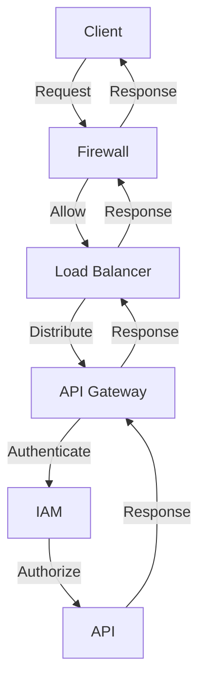
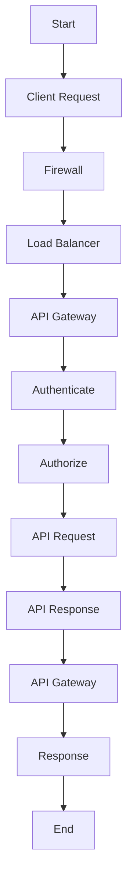

In today's digital landscape, Application Programming Interfaces (APIs) have become the backbone of modern products, enabling seamless communication between different applications, services, and systems. However, this increased reliance on APIs has also introduced new security risks, making hardened API security a critical component of modern product development. In this article, we will delve into the importance of API security, explore common threats and vulnerabilities, and discuss strategies for hardening API security.

## Introduction to API Security
API security refers to the practices and protocols used to protect APIs from unauthorized access, use, and exploitation. As APIs continue to play a vital role in modern product development, ensuring their security is crucial to prevent data breaches, unauthorized access, and other malicious activities.


## Common API Threats and Vulnerabilities
APIs are susceptible to various threats and vulnerabilities, including:
* **SQL Injection**: Malicious input is injected into APIs to manipulate database queries.
* **Cross-Site Scripting (XSS)**: Malicious code is injected into APIs to steal user data or take control of user sessions.
* **Denial of Service (DoS)**: APIs are overwhelmed with traffic to make them unavailable to users.
* **Man-in-the-Middle (MitM)**: APIs are intercepted to steal sensitive data or inject malicious code.
```markdown
| Threat | Description | Example |
| --- | --- | --- |
| SQL Injection | Malicious input is injected into APIs | `SELECT * FROM users WHERE name = 'admin' OR '1' = '1'` |
| Cross-Site Scripting (XSS) | Malicious code is injected into APIs | `<script>alert('XSS')</script>` |
| Denial of Service (DoS) | APIs are overwhelmed with traffic | `while true; do curl -X GET https://example.com/api; done` |
| Man-in-the-Middle (MitM) | APIs are intercepted to steal sensitive data | `sslstrip -l 8080 -w output.log` |
```
## Hardening API Security
To harden API security, developers can implement various strategies, including:
* **Authentication and Authorization**: Implementing robust authentication and authorization mechanisms to ensure only authorized users can access APIs.
* **Input Validation and Sanitization**: Validating and sanitizing user input to prevent SQL injection and XSS attacks.
* **Rate Limiting and IP Blocking**: Limiting the number of requests from a single IP address to prevent DoS attacks.
* **Encryption**: Encrypting sensitive data to prevent MitM attacks.
```javascript
// Example of input validation and sanitization using Node.js and Express.js
const express = require('express');
const app = express();

app.use(express.json());

app.post('/api/users', (req, res) => {
  const { name, email } = req.body;
  if (!name || !email) {
    return res.status(400).send({ error: 'Name and email are required' });
  }
  // Sanitize user input
  const sanitizedEmail = email.replace(/[^a-zA-Z0-9@._-]/g, '');
  // ...
});
```
## API Security Architecture
A robust API security architecture should include multiple layers of defense, including:
* **Firewall**: Blocking unauthorized traffic to APIs.
* **Load Balancer**: Distributing traffic to multiple instances of APIs.
* **API Gateway**: Managing API requests and responses.
* **Identity and Access Management (IAM)**: Managing user identities and access to APIs.

## API Security Flow
The following flowchart illustrates the API security flow:

## Visual Insights Gallery
The following images provide visual insights into API security:


## Summary and Conclusion
In conclusion, hardened API security is critical for modern products to prevent data breaches, unauthorized access, and other malicious activities. By implementing robust authentication and authorization mechanisms, input validation and sanitization, rate limiting and IP blocking, and encryption, developers can significantly improve API security. A robust API security architecture should include multiple layers of defense, and the API security flow should be designed to ensure that only authorized users can access APIs.

## FAQ
* **Q: What is API security?**
A: API security refers to the practices and protocols used to protect APIs from unauthorized access, use, and exploitation.
* **Q: What are common API threats and vulnerabilities?**
A: Common API threats and vulnerabilities include SQL injection, cross-site scripting (XSS), denial of service (DoS), and man-in-the-middle (MitM) attacks.
* **Q: How can I harden API security?**
A: To harden API security, implement robust authentication and authorization mechanisms, input validation and sanitization, rate limiting and IP blocking, and encryption.
* **Q: What is the importance of API security architecture?**
A: A robust API security architecture should include multiple layers of defense, including firewall, load balancer, API gateway, and identity and access management (IAM).