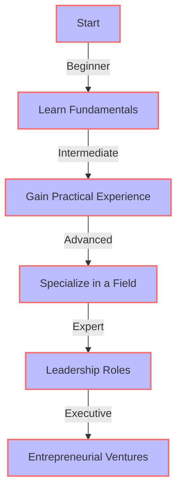
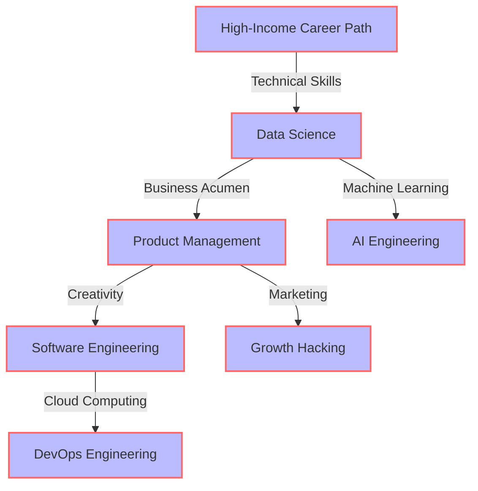

# Why High-Income Career Paths are Critical for Modern Products
In today's fast-paced, technology-driven world, having a high-income career path is no longer a luxury, but a necessity. With the rising costs of living, student loan debt, and the constant need to upskill, professionals must prioritize career paths that offer financial stability and growth. In this article, we will delve into the importance of high-income career paths for modern products and provide insights on how to achieve success in these fields.

## Introduction to High-Income Career Paths

High-income career paths are not just limited to traditional fields like medicine and law. With the rise of technology, new career paths have emerged that offer high salaries and growth opportunities. Some of these fields include data science, product management, and software engineering. These careers require a unique combination of technical skills, business acumen, and creativity, making them highly sought after by top companies.

## The Importance of High-Income Career Paths for Modern Products
High-income career paths are critical for modern products because they enable professionals to invest in their skills and stay up-to-date with the latest technologies. This, in turn, allows them to create innovative products that meet the evolving needs of customers. Moreover, high-income career paths provide the financial stability needed to take risks and pursue entrepreneurial ventures, leading to the creation of new products and services.
```markdown
| Career Path | Median Salary | Growth Opportunities |
| --- | --- | --- |
| Data Scientist | $118,000 | High |
| Product Manager | $115,000 | High |
| Software Engineer | $105,000 | Medium |
```
As shown in the table above, high-income career paths like data science, product management, and software engineering offer high median salaries and growth opportunities.

## Flowchart for Career Advancement

The flowchart above illustrates the career advancement path for professionals in high-income career fields. It highlights the importance of continuous learning, practical experience, and specialization in a field.

## Architecture of a High-Income Career Path

The architecture of a high-income career path involves a combination of technical skills, business acumen, and creativity. The diagram above illustrates the various fields and specializations within high-income career paths.

> **Tip:** To succeed in high-income career paths, professionals must be willing to continuously learn and adapt to new technologies and trends.

## Visual Insights Gallery
## Visual Insights Gallery


## Summary and Conclusion
In conclusion, high-income career paths are critical for modern products because they enable professionals to invest in their skills and stay up-to-date with the latest technologies. By pursuing high-income career paths, professionals can create innovative products that meet the evolving needs of customers and achieve financial stability and growth.

## FAQ
1. What are some high-income career paths?
 * Data science, product management, and software engineering are some examples of high-income career paths.
2. How can I get started in a high-income career path?
 * Start by learning the fundamentals of your chosen field and gaining practical experience through internships or projects.
3. What skills are required for high-income career paths?
 * Technical skills, business acumen, and creativity are some of the key skills required for high-income career paths.