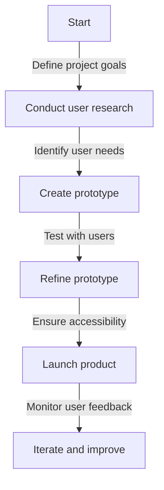
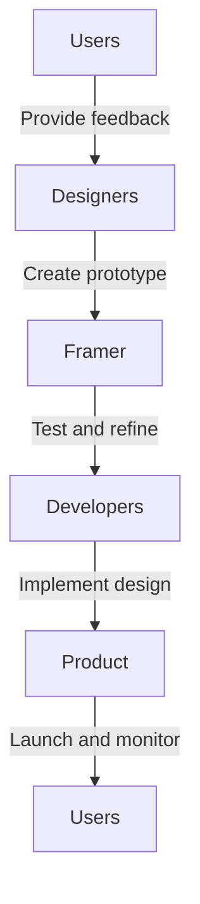

In today's digital landscape, creating products that are accessible and usable by everyone is no longer a nicety, but a necessity. With the rise of digital transformation, companies are recognizing the importance of inclusive design in creating products that cater to diverse user needs. One crucial aspect of inclusive design is the use of Framer prototypes. In this article, we will delve into the world of Framer prototypes and explore why they are critical for modern products.

## Introduction to Framer Prototypes
Framer prototypes are interactive, high-fidelity designs that allow designers to test and validate their products with real users. These prototypes are created using Framer, a popular design tool that enables designers to create interactive designs without writing code. 


## Benefits of Inclusive Framer Prototypes
Inclusive Framer prototypes offer numerous benefits, including:
* Improved usability: By testing products with real users, designers can identify usability issues early on and make data-driven design decisions.
* Enhanced accessibility: Inclusive Framer prototypes ensure that products are accessible to users with disabilities, reducing the risk of exclusion and legal issues.
* Increased user engagement: Interactive prototypes allow designers to test and refine the user experience, leading to higher user engagement and conversion rates.
```markdown
| Benefit | Description |
| --- | --- |
| Improved Usability | Identify usability issues early on |
| Enhanced Accessibility | Ensure products are accessible to users with disabilities |
| Increased User Engagement | Test and refine the user experience |
```
## Creating Inclusive Framer Prototypes
Creating inclusive Framer prototypes requires a thoughtful and user-centered approach. Here are some tips to get you started:
> **Tip:** Conduct user research to understand the needs and preferences of your target audience.
> **Note:** Use accessibility guidelines, such as the Web Content Accessibility Guidelines (WCAG), to ensure your prototype is accessible.
```javascript
// Example code for creating an accessible button
function createAccessibleButton() {
  const button = document.createElement('button');
  button.textContent = 'Click me';
  button.setAttribute('aria-label', 'Click me');
  return button;
}
```
## Flowchart for Inclusive Framer Prototype Creation
Here is a Mermaid.js flowchart that illustrates the process of creating an inclusive Framer prototype:

## Architecture for Inclusive Framer Prototypes
The architecture for inclusive Framer prototypes involves a user-centered approach, with multiple stakeholders and design elements working together to create an accessible and usable product. Here is a Mermaid.js diagram that illustrates the architecture:

## Overcoming Challenges in Inclusive Framer Prototype Creation
Creating inclusive Framer prototypes can be challenging, especially for designers who are new to accessibility and inclusive design. Here are some common challenges and solutions:
> **Warning:** Don't assume you know what users need – conduct user research to validate your assumptions.
> **Interview:** Talk to users with disabilities to gain a deeper understanding of their needs and preferences.

## Visual Insights Gallery
Here are some visual insights that illustrate the importance of inclusive Framer prototypes:


## Summary and Conclusion
Inclusive Framer prototypes are critical for modern products, as they ensure that products are accessible and usable by everyone. By following the tips and best practices outlined in this article, designers can create inclusive Framer prototypes that meet the needs of diverse users. Remember to conduct user research, use accessibility guidelines, and test and refine your prototype to ensure it is accessible and usable.

## FAQ
Q: What is a Framer prototype?
A: A Framer prototype is an interactive, high-fidelity design that allows designers to test and validate their products with real users.
Q: Why is inclusive design important?
A: Inclusive design is important because it ensures that products are accessible and usable by everyone, regardless of their abilities or disabilities.
Q: How can I create an inclusive Framer prototype?
A: To create an inclusive Framer prototype, conduct user research, use accessibility guidelines, and test and refine your prototype to ensure it is accessible and usable.