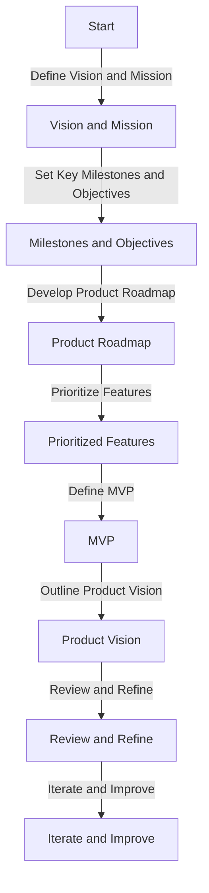

In the fast-paced world of startups, having a well-planned founder roadmap can be the difference between success and failure. A founder roadmap is a strategic plan that outlines the key milestones, goals, and objectives for a startup, serving as a guide for the founding team to navigate the complexities of building a modern product. In this article, we will delve into the importance of an optimized founder roadmap and provide actionable insights on how to create one.

## Introduction to Founder Roadmaps

A founder roadmap is a dynamic document that outlines the vision, mission, and objectives of a startup. It provides a clear direction for the founding team, investors, and stakeholders, ensuring everyone is aligned and working towards the same goals. A well-crafted founder roadmap should be flexible, adaptable, and responsive to changes in the market, industry, and customer needs.

## Benefits of an Optimized Founder Roadmap

An optimized founder roadmap offers numerous benefits, including:
* **Clear direction**: A well-defined roadmap provides a clear sense of purpose and direction, helping the founding team stay focused on the key objectives.
* **Improved communication**: A shared understanding of the roadmap ensures that all stakeholders are aligned and working towards the same goals.
* **Increased efficiency**: By prioritizing tasks and resources, a founder roadmap helps optimize the use of time, money, and talent.
* **Better decision-making**: A roadmap provides a framework for making informed decisions, reducing the risk of missteps and misallocations.

## Creating an Optimized Founder Roadmap
### Step 1: Define the Vision and Mission

The first step in creating an optimized founder roadmap is to define the vision and mission of the startup. This involves:
* **Identifying the problem**: Clearly articulating the problem the startup aims to solve.
* **Defining the solution**: Outlining the solution and how it addresses the problem.
* **Establishing the mission**: Crafting a concise and compelling mission statement that captures the essence of the startup.

### Step 2: Set Key Milestones and Objectives

The next step is to set key milestones and objectives, including:
* **Short-term goals**: Establishing achievable milestones for the next 6-12 months.
* **Long-term vision**: Outlining the long-term vision and objectives for the startup.
* **Key performance indicators (KPIs)**: Defining metrics to measure progress and success.

### Step 3: Develop a Product Roadmap

A product roadmap is a critical component of the founder roadmap, outlining the key features, functionalities, and releases. This involves:
* **Prioritizing features**: Identifying the most important features and functionalities.
* **Defining the minimum viable product (MVP)**: Establishing the minimum requirements for the first release.
* **Outlining the product vision**: Crafting a clear and compelling product vision statement.

## Flowchart: Founder Roadmap Development

## Architecture: Founder Roadmap Framework

> **Note:** A well-crafted founder roadmap is a living document that should be regularly reviewed and refined to ensure it remains relevant and effective.

> **Tip:** Use a collaborative approach to develop the founder roadmap, involving the founding team, investors, and stakeholders to ensure everyone is aligned and committed to the vision and mission.

> **Warning:** A poorly planned founder roadmap can lead to confusion, miscommunication, and misallocation of resources, ultimately jeopardizing the success of the startup.

## Visual Insights Gallery
## Visual Insights Gallery

## Summary and Conclusion
In conclusion, an optimized founder roadmap is a critical component of a startup's success, providing a clear direction, improving communication, increasing efficiency, and enabling better decision-making. By following the steps outlined in this article, founders can create a well-crafted roadmap that guides their startup towards achieving its vision and mission.

## FAQ
* Q: What is a founder roadmap?
A: A founder roadmap is a strategic plan that outlines the key milestones, goals, and objectives for a startup.
* Q: Why is an optimized founder roadmap important?
A: An optimized founder roadmap provides a clear direction, improves communication, increases efficiency, and enables better decision-making.
* Q: How do I create a founder roadmap?
A: To create a founder roadmap, define the vision and mission, set key milestones and objectives, develop a product roadmap, and regularly review and refine the roadmap.