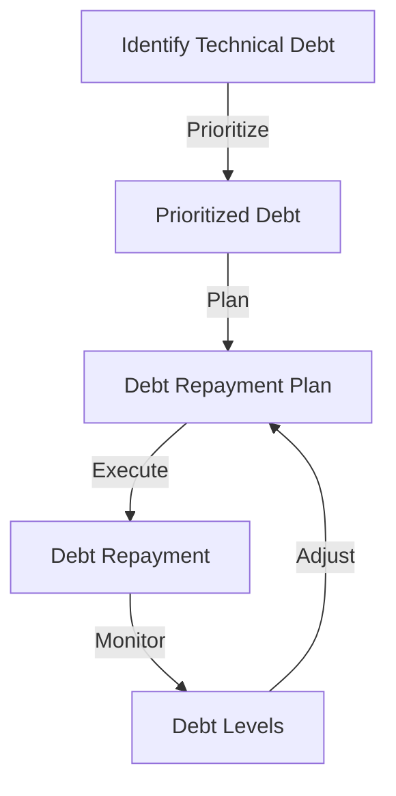
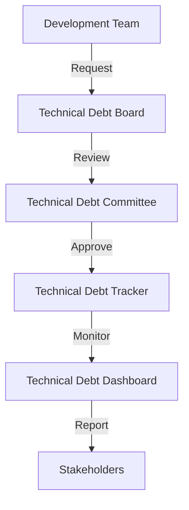

In the fast-paced world of software development, the concept of technical debt has often been viewed as a necessary evil. It refers to the costs and trade-offs that come with implementing quick fixes or workarounds to meet immediate project deadlines, rather than taking the time to develop a more robust and maintainable solution. However, the idea of "productive technical debt" challenges this conventional wisdom by suggesting that strategic technical debt can actually be a key driver of innovation and growth.

## Understanding Technical Debt
Technical debt is a metaphor that was first introduced by Ward Cunningham in 1992. It is used to describe the costs associated with implementing a quick fix or workaround, rather than taking the time to develop a more robust and maintainable solution. This debt can take many forms, including code that is difficult to maintain, inefficient algorithms, and outdated technology stacks. 


## The Benefits of Productive Technical Debt
While technical debt is often viewed as a negative, it can actually be a powerful tool for driving innovation and growth. By taking on strategic technical debt, development teams can quickly prototype and test new ideas, without getting bogged down in perfecting every detail. This approach can help teams to:
* Move quickly and stay ahead of the competition
* Test and validate assumptions, rather than relying on intuition
* Develop a minimum viable product (MVP) that can be used to gather feedback and iterate
```markdown
| Benefits | Description |
| --- | --- |
| Speed | Move quickly and stay ahead of the competition |
| Innovation | Test and validate assumptions, rather than relying on intuition |
| Feedback | Develop a minimum viable product (MVP) that can be used to gather feedback and iterate |
```
## Managing Technical Debt
While technical debt can be beneficial, it is also important to manage it effectively. This involves:
* Prioritizing debt based on business value and risk
* Developing a plan to pay down debt over time
* Monitoring debt levels and adjusting the plan as needed
> **Note:** Technical debt should be viewed as a strategic investment, rather than a necessary evil. By managing it effectively, teams can use technical debt to drive innovation and growth, while also minimizing the risks associated with it.

## Technical Debt Flow
The following Mermaid.js diagram illustrates the flow of technical debt:

## Architecture for Managing Technical Debt
The following Mermaid.js diagram illustrates the architecture for managing technical debt:

## Best Practices for Productive Technical Debt
To get the most out of technical debt, teams should follow these best practices:
* **Be intentional**: Technical debt should be taken on strategically, with a clear understanding of the benefits and risks.
* **Prioritize**: Debt should be prioritized based on business value and risk, with the most critical debt being addressed first.
* **Monitor**: Debt levels should be monitored regularly, with adjustments made to the plan as needed.
* **Communicate**: Technical debt should be communicated clearly to stakeholders, with regular updates on progress and plans.

## Visual Insights Gallery
The following images provide additional insights into the concept of productive technical debt:


## Summary
In conclusion, technical debt is a natural part of the software development process. By embracing productive technical debt, teams can drive innovation and growth, while also minimizing the risks associated with it. By prioritizing debt, developing a plan to pay it down, and monitoring debt levels, teams can use technical debt to their advantage.

## FAQ
* Q: What is technical debt?
A: Technical debt refers to the costs and trade-offs associated with implementing quick fixes or workarounds, rather than taking the time to develop a more robust and maintainable solution.
* Q: How can technical debt be beneficial?
A: Technical debt can be beneficial by allowing teams to quickly prototype and test new ideas, without getting bogged down in perfecting every detail.
* Q: How should technical debt be managed?
A: Technical debt should be managed by prioritizing debt based on business value and risk, developing a plan to pay down debt over time, and monitoring debt levels and adjusting the plan as needed.