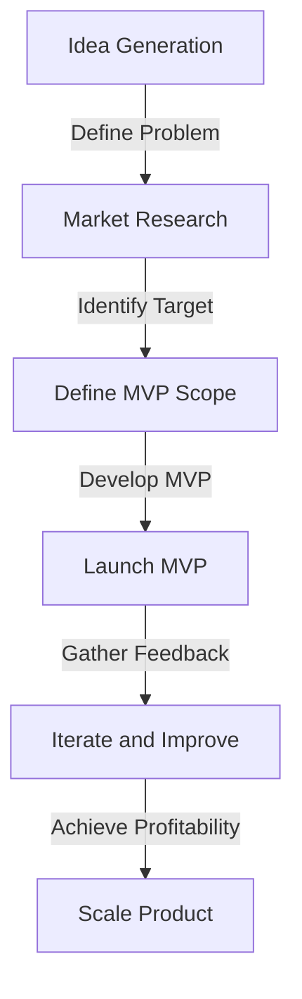
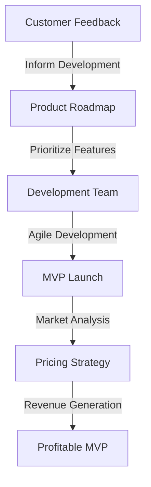

In the fast-paced world of modern product development, creating a Minimum Viable Product (MVP) has become a cornerstone strategy for startups and established companies alike. An MVP is a product with just enough features to satisfy early customers and provide feedback for future development. However, the key to success lies not just in launching an MVP, but in ensuring it is profitable. In this article, we will delve into the importance of profitable MVP development, its benefits, and how to achieve it.

## Understanding the Basics of MVP Development

MVP development is centered around the concept of lean startup methodology, which emphasizes rapid experimentation, customer feedback, and continuous iteration. The primary goal of an MVP is to test hypotheses about the product and its market, thereby reducing the risk of investing in a product that might not meet customer needs.

### Key Principles of MVP Development
To develop a successful MVP, several key principles must be considered:
- **Customer Feedback:** The ability to gather feedback from early adopters and make data-driven decisions.
- **Iterative Development:** Continuous improvement and iteration based on feedback and market analysis.
- **Minimal Features:** Focus on the core features that provide the most value to the customer.

## The Importance of Profitable MVP Development

Profitable MVP development is critical because it ensures that the product can sustain itself financially from an early stage. This approach allows companies to:
- **Reduce Financial Risk:** By generating revenue from the outset, the financial risk associated with product development is significantly mitigated.
- **Attract Investors:** A profitable MVP is more attractive to investors, as it demonstrates a clear path to sustainability and scalability.
- **Inform Future Development:** Profitability indicators can inform future development decisions, ensuring that resources are allocated efficiently.

### Mermaid.js Diagram: MVP Development Flow

## Strategies for Achieving Profitable MVP Development
### Focus on High-Impact Features
Identifying and prioritizing features that have the highest impact on customer value and revenue generation is crucial. This involves thorough market research and understanding of customer needs.

### Pricing Strategies
Implementing an effective pricing strategy from the outset can significantly impact the profitability of an MVP. This might involve tiered pricing, freemium models, or subscription services, depending on the product and target market.

### Efficient Development Processes
Adopting agile development methodologies and leveraging cost-effective technologies can help reduce development costs without compromising on quality. This ensures that the MVP can be developed and launched quickly, with the ability to iterate based on feedback.

### Mermaid.js Diagram: Architecture for Profitable MVP

> **Tip:** Regularly reviewing and adjusting the product roadmap based on customer feedback and market trends is essential for maintaining a profitable MVP.

## Visual Insights Gallery
## Visual Insights into MVP Development

## Summary and Conclusion
In conclusion, profitable MVP development is not just about launching a product with minimal features; it's about creating a sustainable business model from the outset. By focusing on high-impact features, efficient development processes, and effective pricing strategies, companies can ensure their MVP is not only viable but also profitable. This approach reduces financial risk, attracts investors, and informs future development decisions, ultimately leading to the success of the product in the market.

## FAQ
- **Q: What is the primary goal of an MVP?**
  - A: The primary goal of an MVP is to test hypotheses about the product and its market, reducing the risk of investing in a product that might not meet customer needs.
- **Q: Why is profitability important in MVP development?**
  - A: Profitability ensures that the product can sustain itself financially from an early stage, reducing financial risk and making it more attractive to investors.
- **Q: How can companies achieve profitable MVP development?**
  - A: By focusing on high-impact features, adopting efficient development processes, and implementing effective pricing strategies.