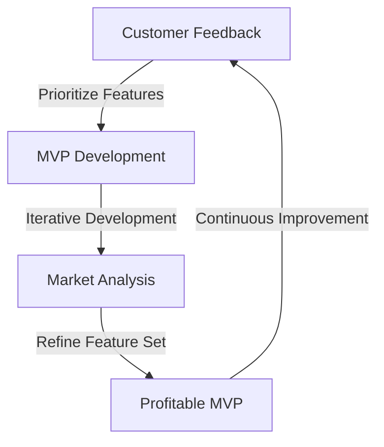
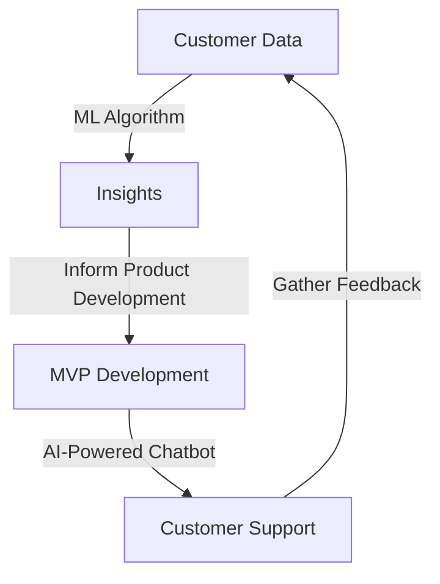

## Introduction to Advanced MVP Development

In the first part of this series, we explored the fundamentals of Minimum Viable Product (MVP) development and its importance in modern product development. In this advanced follow-up, we will dive deeper into the nuances of profitable MVP development, examine real-world case studies, and discuss the latest trends and technologies that can enhance the MVP development process.

## Overcoming Common Challenges in MVP Development
One of the primary challenges in MVP development is balancing the need for a minimal feature set with the desire to provide a comprehensive solution that meets customer needs. To overcome this challenge, it's essential to prioritize features based on customer feedback and market analysis.

This flowchart illustrates the iterative process of MVP development, where customer feedback and market analysis inform the development of a profitable MVP.

## Real-World Case Studies in Profitable MVP Development
Let's examine a few real-world case studies that demonstrate the effectiveness of profitable MVP development:
- **Dropbox:** Dropbox launched its MVP as a simple file-sharing service, which quickly gained popularity. The company then iterated on its MVP, adding new features and refining its service based on customer feedback.
- **Airbnb:** Airbnb launched its MVP as a simple platform for booking air mattresses in living rooms. The company then expanded its platform to include a wide range of accommodations, refining its service based on customer feedback and market analysis.

## Leveraging Technology to Enhance MVP Development

The latest technologies, such as artificial intelligence (AI) and machine learning (ML), can significantly enhance the MVP development process. For example, AI-powered chatbots can provide customer support and gather feedback, while ML algorithms can analyze customer data and inform product development.

This flowchart illustrates the role of AI and ML in enhancing the MVP development process.

## Best Practices for Profitable MVP Development
To ensure profitable MVP development, several best practices must be followed:
- **Prioritize Customer Feedback:** Gather feedback from early adopters and make data-driven decisions.
- **Iterate Continuously:** Continuously improve and iterate on the MVP based on customer feedback and market analysis.
- **Focus on Core Features:** Focus on the core features that provide the most value to the customer.

## Conclusion
Profitable MVP development is a critical component of modern product development. By understanding the nuances of MVP development, examining real-world case studies, and leveraging the latest technologies, companies can create successful and profitable MVPs that meet customer needs and drive business growth.

## Visual Insights Gallery
Here are a few visual insights that highlight the importance of profitable MVP development:
- [MVP Development Lifecycle](https://picsum.photos/seed/mvp-lifecycle/800/400)
- [Prioritizing Customer Feedback](https://picsum.photos/seed/customer-feedback/800/400)
- [Leveraging AI and ML in MVP Development](https://picsum.photos/seed/ai-ml-mvp/800/400)