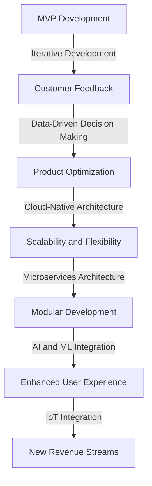

## Part 2: Advanced Strategies for Profitable MVP Development

In the first part of this series, we explored the fundamentals of profitable MVP development and its importance in modern product development. In this advanced guide, we will delve deeper into the architecture and strategies required to create a profitable MVP, including real-world case studies and emerging trends.

### Advanced Principles of MVP Development
To take MVP development to the next level, consider the following advanced principles:
- **Data-Driven Decision Making:** Utilize data analytics and machine learning to inform product decisions and optimize the user experience.
- **Cloud-Native Architecture:** Leverage cloud-native technologies to enable scalability, flexibility, and cost-effectiveness.
- **Microservices Architecture:** Adopt a microservices approach to facilitate modular development, easier maintenance, and faster iteration.

### Real-World Case Studies

Let's examine a real-world example of a company that successfully developed a profitable MVP:
- **Company X:** Developed an e-commerce platform using a cloud-native, microservices architecture. By leveraging data analytics and machine learning, they were able to optimize their product offerings and improve customer engagement, resulting in a significant increase in revenue.

### Emerging Trends in MVP Development

Stay ahead of the curve by incorporating emerging trends into your MVP development strategy:
- **Artificial Intelligence (AI) and Machine Learning (ML):** Integrate AI and ML to enhance the user experience, improve product recommendations, and optimize business operations.
- **Internet of Things (IoT):** Explore opportunities to integrate IoT devices and sensors to create new revenue streams and enhance the product offering.

### Advanced Architecture for Profitable MVP Development

This advanced architecture for profitable MVP development highlights the importance of iterative development, customer feedback, and data-driven decision making. By leveraging cloud-native and microservices architectures, companies can create scalable and flexible products that can adapt to changing market conditions. The integration of AI, ML, and IoT technologies can further enhance the user experience and create new revenue streams.

## Visual Insights Gallery
### Image 1: MVP Development Roadmap

### Image 2: Cloud-Native Architecture Diagram

### Image 3: Microservices Architecture Example
