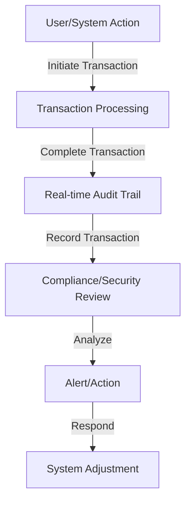

In today's fast-paced digital landscape, ensuring the security and integrity of financial transactions and data is more crucial than ever. One often overlooked yet vital component in achieving this is the implementation of a real-time audit trail. This feature is not just a compliance requirement but a cornerstone of trust, security, and operational efficiency for modern fintech products. In this article, we'll delve into the importance of real-time audit trails, their benefits, and how they can be effectively implemented.

## Introduction to Real-time Audit Trails

A real-time audit trail refers to the ability of a system to record and report all actions, changes, and transactions as they happen. This includes not just financial transactions but also system changes, user activities, and data modifications. The real-time aspect ensures that these records are updated instantly, providing a current and accurate picture of system activity at any given moment.

## Benefits of Real-time Audit Trails
### Enhanced Security
Real-time audit trails significantly enhance the security posture of fintech products by providing immediate visibility into potential security breaches or unauthorized activities. This allows for swift action to mitigate risks and prevent further damage.

### Compliance and Regulatory Requirements
Many regulatory bodies require financial institutions and fintech companies to maintain detailed records of transactions and system activities. A real-time audit trail ensures compliance with these regulations, reducing the risk of legal and financial repercussions.

### Operational Efficiency
Beyond security and compliance, real-time audit trails can improve operational efficiency. They provide valuable insights into system performance, helping identify bottlenecks, and areas for improvement. This can lead to better customer service, reduced downtime, and increased productivity.

### Data Integrity and Accuracy
By tracking all changes and transactions in real-time, audit trails help ensure data integrity and accuracy. This is crucial for financial institutions where even small discrepancies can have significant consequences.

## Implementing Real-time Audit Trails
### Architecture for Real-time Audit Trails

Implementing a real-time audit trail requires a thoughtful approach to system architecture. It involves integrating the audit trail functionality at the core of the system, ensuring that all transactions and actions are captured and recorded in real-time.

### Best Practices for Real-time Audit Trails
> **Note:** When designing a real-time audit trail system, consider the following best practices:
- Ensure all transactions and system changes are logged in real-time.
- Implement robust data encryption to protect audit trail records.
- Regularly review and analyze audit trail data for security and compliance issues.
- Automate alert systems for suspicious activities.

## Challenges and Future Directions
### Overcoming Implementation Challenges
> **Warning:** Implementing real-time audit trails can be complex, especially in legacy systems. It requires careful planning, significant resources, and a deep understanding of both the system architecture and regulatory requirements.

### Future of Real-time Audit Trails
As fintech continues to evolve, the importance of real-time audit trails will only grow. Future directions may include the integration of AI and machine learning to enhance analysis and prediction capabilities, further automating compliance and security processes.

## Visual Insights Gallery
## Visual Insights Gallery

## Summary/Conclusion
In conclusion, real-time audit trails are a critical component of modern fintech products, offering enhanced security, compliance, operational efficiency, and data integrity. Their implementation requires a thoughtful and integrated approach to system architecture and a commitment to best practices. As the fintech landscape continues to evolve, the role of real-time audit trails will become even more pivotal in ensuring trust, security, and compliance.

## FAQ
- **Q: What is a real-time audit trail?**
  A: A real-time audit trail is the ability of a system to record and report all actions, changes, and transactions as they happen.
- **Q: Why are real-time audit trails important?**
  A: They enhance security, ensure compliance, improve operational efficiency, and maintain data integrity.
- **Q: How can real-time audit trails be implemented?**
  A: Through a thoughtful system architecture that integrates audit trail functionality at its core, ensuring all transactions and actions are captured and recorded in real-time.