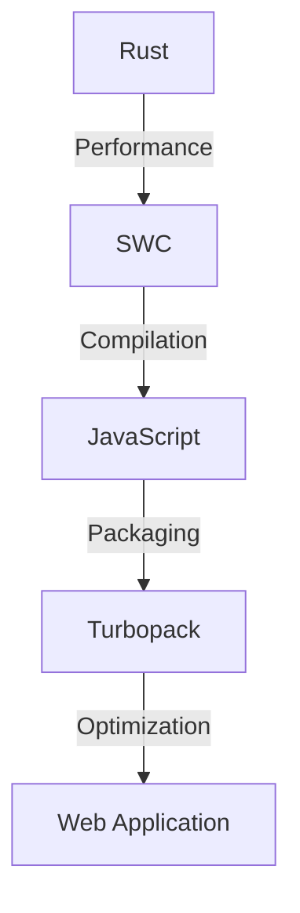
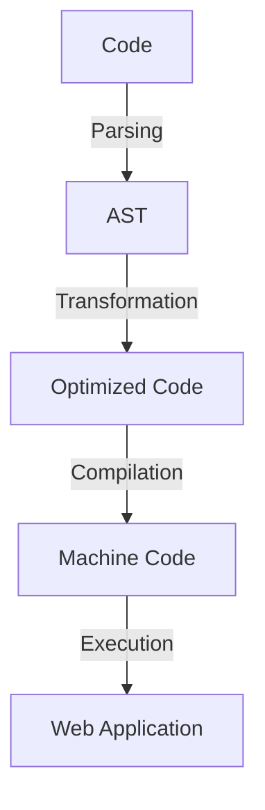

# Why Rust is the Future of Web Tooling (SWC, Turbopack, and more)
Rust, a systems programming language, is revolutionizing the world of web tooling with its focus on performance, reliability, and security. As web development continues to evolve, the need for efficient and scalable tools has become increasingly important. In this article, we will explore the role of Rust in shaping the future of web tooling, with a focus on SWC, Turbopack, and other notable projects.

## Introduction to Rust and Web Tooling

Rust's growing popularity in web development can be attributed to its unique set of features, including ownership and borrowing, which enable developers to write memory-safe code without sacrificing performance. This, combined with the language's focus on concurrency and parallelism, makes Rust an attractive choice for building high-performance web tools.

## SWC: The Rust-Based Toolchain

SWC (Speedy Web Compiler) is a Rust-based toolchain that has gained significant attention in recent years. SWC provides a drop-in replacement for Babel, with improved performance and support for modern JavaScript features. By leveraging Rust's performance capabilities, SWC is able to outperform traditional JavaScript-based toolchains, making it an ideal choice for large-scale web applications.

```rust
// Example of using SWC to compile JavaScript code
use swc::Compiler;

fn main() {
    let compiler = Compiler::new();
    let code = "console.log('Hello, World!');";
    let compiled_code = compiler.compile(code);
    println!("{}", compiled_code);
}
```

## Turbopack: The Future of Web Packaging

Turbopack is a new, Rust-based packaging system designed to replace traditional bundlers like Webpack. By leveraging Rust's performance and concurrency features, Turbopack is able to achieve faster build times and improved caching capabilities. With Turbopack, developers can expect to see significant improvements in development speed and overall productivity.

```javascript
// Example of using Turbopack to bundle a web application
import { bundle } from 'turbopack';

const config = {
  // Turbopack configuration options
};

bundle(config).then((output) => {
  console.log(output);
});
```

## Mermaid.js Diagram: Web Tooling Architecture


## Mermaid.js Diagram: Data Flow


## Other Notable Projects

In addition to SWC and Turbopack, there are several other notable projects that demonstrate the potential of Rust in web tooling. These include:

* WebAssembly (Wasm): a binary format for executing code in web browsers
* wasm-pack: a tool for packaging and deploying Wasm modules
* Cargo: the package manager for Rust, which provides a convenient way to manage dependencies and build Rust projects

## Conclusion
Rust is poised to play a significant role in the future of web tooling, with projects like SWC and Turbopack leading the charge. By leveraging Rust's performance, reliability, and security features, developers can build faster, more efficient, and more scalable web tools. As the web development landscape continues to evolve, it's likely that we'll see even more innovative applications of Rust in this space.

## Visual Insights Gallery
### Image 1: Rust-Based Web Tooling Ecosystem

### Image 2: Performance Comparison

### Image 3: Developer Workflow


## Summary
In this article, we explored the role of Rust in shaping the future of web tooling, with a focus on SWC, Turbopack, and other notable projects. By leveraging Rust's performance, reliability, and security features, developers can build faster, more efficient, and more scalable web tools.

## FAQ
### Q: What is Rust, and why is it used in web tooling?
A: Rust is a systems programming language that is used in web tooling due to its focus on performance, reliability, and security. Its unique set of features, including ownership and borrowing, enable developers to write memory-safe code without sacrificing performance.
### Q: What is SWC, and how does it compare to traditional JavaScript-based toolchains?
A: SWC (Speedy Web Compiler) is a Rust-based toolchain that provides a drop-in replacement for Babel, with improved performance and support for modern JavaScript features. By leveraging Rust's performance capabilities, SWC is able to outperform traditional JavaScript-based toolchains.
### Q: What is Turbopack, and how does it improve web packaging?
A: Turbopack is a new, Rust-based packaging system designed to replace traditional bundlers like Webpack. By leveraging Rust's performance and concurrency features, Turbopack is able to achieve faster build times and improved caching capabilities.