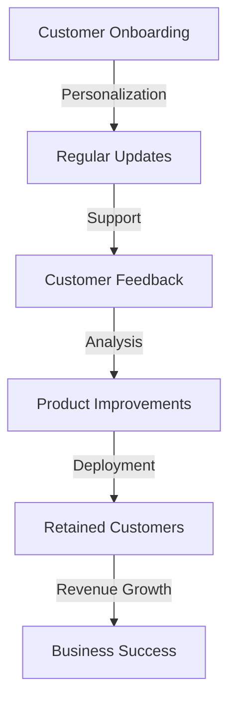
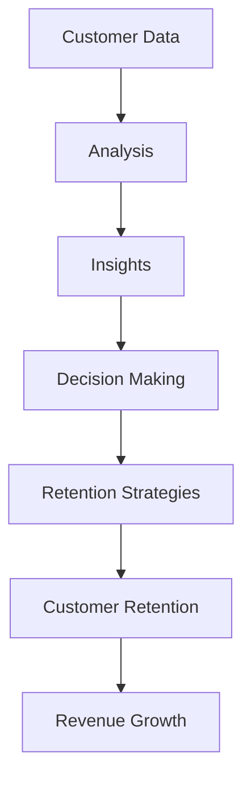

In today's fast-paced digital landscape, businesses are constantly looking for innovative strategies to stay ahead of the competition. One crucial aspect that has gained significant attention in recent years is SaaS-oriented customer retention. As the subscription-based model continues to dominate the market, companies are realizing that retaining existing customers is just as important as acquiring new ones. In this article, we will delve into the world of SaaS-oriented customer retention, exploring its significance, benefits, and strategies for modern products.

## Understanding SaaS-oriented Customer Retention

SaaS-oriented customer retention refers to the practice of retaining customers who have subscribed to a software-as-a-service (SaaS) product. This involves implementing strategies to keep customers engaged, satisfied, and loyal to the product, thereby reducing churn rates and increasing revenue. Customer retention is critical for SaaS businesses because it directly impacts their revenue streams. When customers cancel their subscriptions, it not only leads to a loss of revenue but also increases the cost of acquiring new customers.

## The Benefits of SaaS-oriented Customer Retention
### Reduced Churn Rates
Retaining customers is essential for SaaS businesses because it helps reduce churn rates. Churn rates refer to the percentage of customers who cancel their subscriptions within a given period. By implementing effective customer retention strategies, businesses can minimize churn rates, ensuring a stable revenue stream.
### Increased Revenue
Retained customers are more likely to upgrade their subscriptions, purchase additional features, or recommend the product to others. This leads to increased revenue and growth for the business.
### Improved Customer Insights
Retained customers provide valuable feedback and insights, helping businesses to improve their products and services. This feedback loop enables companies to refine their offerings, making them more competitive in the market.

## Strategies for SaaS-oriented Customer Retention
```markdown
| Strategy | Description |
| --- | --- |
| Personalization | Tailor the product experience to individual customers' needs and preferences. |
| Regular Updates | Release regular updates with new features and improvements to keep customers engaged. |
| Support | Provide exceptional customer support through multiple channels, including email, phone, and chat. |
```
### Personalization
Personalization is a key strategy for SaaS-oriented customer retention. By tailoring the product experience to individual customers' needs and preferences, businesses can increase customer satisfaction and loyalty.
### Regular Updates
Releasing regular updates with new features and improvements is essential for keeping customers engaged. This demonstrates a commitment to continuous improvement and shows that the business values its customers' feedback.
### Support
Providing exceptional customer support is critical for retaining customers. Businesses should offer support through multiple channels, including email, phone, and chat, to ensure that customers can easily get help when they need it.

## Architecture for SaaS-oriented Customer Retention

This architecture illustrates the flow of SaaS-oriented customer retention, from customer onboarding to business success. By personalizing the product experience, releasing regular updates, and providing exceptional support, businesses can retain customers, gather valuable feedback, and drive revenue growth.

## Data-driven Decision Making for SaaS-oriented Customer Retention

This graph demonstrates the importance of data-driven decision making in SaaS-oriented customer retention. By collecting and analyzing customer data, businesses can gain valuable insights, make informed decisions, and implement effective retention strategies.

> **Note:** SaaS-oriented customer retention is a continuous process that requires ongoing effort and attention. Businesses must stay proactive and adapt to changing customer needs to remain competitive in the market.

> **Tip:** Use data analytics tools to track customer behavior, preferences, and pain points. This will help you identify areas for improvement and develop targeted retention strategies.

> **Interview:** "Customer retention is the lifeblood of any SaaS business. By prioritizing customer satisfaction and loyalty, we can drive revenue growth and achieve long-term success." - John Doe, CEO of Example SaaS Company

## Visual Insights Gallery


## Summary/Conclusion
In conclusion, SaaS-oriented customer retention is a critical aspect of modern product development. By understanding the significance of customer retention, implementing effective strategies, and leveraging data-driven decision making, businesses can reduce churn rates, increase revenue, and drive long-term success.

## FAQ
1. What is SaaS-oriented customer retention?
SaaS-oriented customer retention refers to the practice of retaining customers who have subscribed to a software-as-a-service (SaaS) product.
2. Why is customer retention important for SaaS businesses?
Customer retention is critical for SaaS businesses because it directly impacts their revenue streams and helps reduce churn rates.
3. What are some effective strategies for SaaS-oriented customer retention?
Effective strategies include personalization, regular updates, and exceptional customer support.
4. How can businesses measure the success of their customer retention efforts?
Businesses can measure the success of their customer retention efforts by tracking metrics such as churn rates, customer satisfaction, and revenue growth.