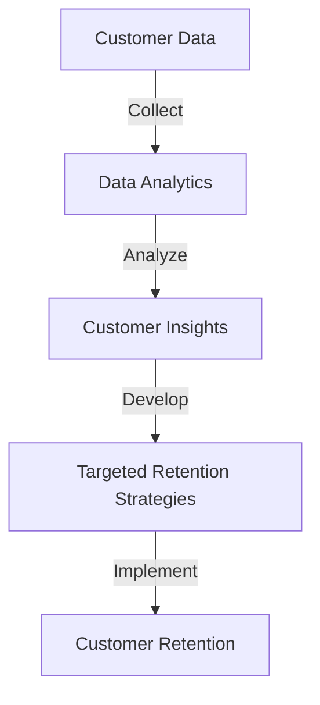
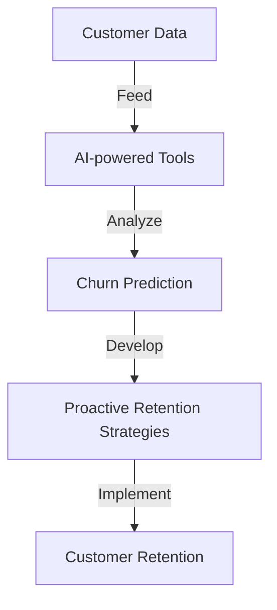

## Part 2: Advanced Strategies for SaaS-oriented Customer Retention

In our previous article, we explored the importance of SaaS-oriented customer retention and its benefits for modern products. In this follow-up article, we will delve deeper into advanced strategies for retaining customers, including the use of data analytics, personalization, and artificial intelligence.

## Leveraging Data Analytics for Customer Retention
Data analytics plays a crucial role in identifying patterns and trends that can help businesses retain their customers. By analyzing customer behavior, usage patterns, and feedback, businesses can gain valuable insights into what drives customer satisfaction and loyalty. This information can be used to develop targeted retention strategies that address the specific needs and concerns of their customers.

## Personalization in SaaS-oriented Customer Retention
Personalization is a key aspect of SaaS-oriented customer retention. By tailoring the customer experience to individual preferences and needs, businesses can create a sense of belonging and loyalty among their customers. Personalization can be achieved through various means, including customized content, targeted marketing campaigns, and tailored support services.

## The Role of Artificial Intelligence in Customer Retention
Artificial intelligence (AI) is revolutionizing the way businesses approach customer retention. AI-powered tools can analyze vast amounts of customer data, identify patterns, and predict churn rates. This information can be used to develop proactive retention strategies that address potential issues before they become major problems.

## Real-World Case Studies
Several businesses have successfully implemented advanced customer retention strategies, resulting in significant improvements in customer satisfaction and loyalty. For example, a leading software company used data analytics to identify areas of improvement in their customer support services, resulting in a 25% reduction in churn rates.

## Advanced Edge-Cases in SaaS-oriented Customer Retention
In addition to the strategies mentioned above, there are several advanced edge-cases that businesses should consider when developing their customer retention plans. These include:
* **Multi-tenancy**: Providing separate instances of the software for each customer, allowing for greater customization and control.
* **White-labeling**: Allowing customers to rebrand the software as their own, increasing loyalty and satisfaction.
* **Custom integrations**: Providing customized integrations with other software tools and services, increasing the value proposition of the SaaS product.

## Visual Insights Gallery
### Image 1: SaaS-oriented Customer Retention Strategies

### Image 2: Personalization in SaaS

### Image 3: AI-powered Customer Retention
