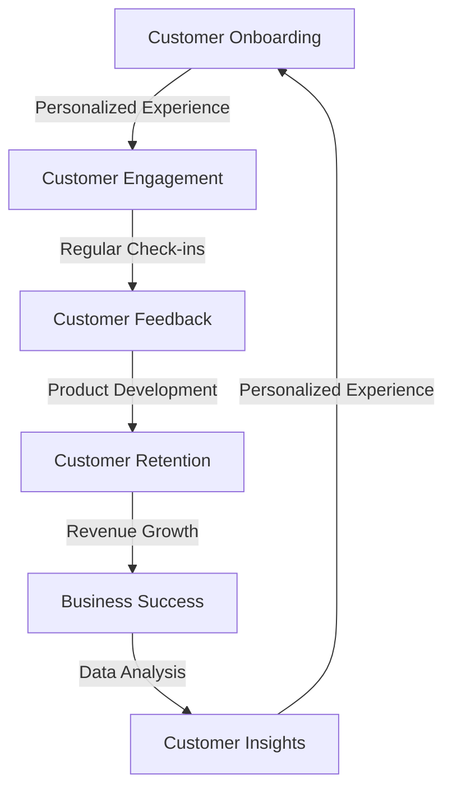

## Introduction to Advanced SaaS-oriented Customer Retention Strategies

In the first part of this series, we explored the significance and benefits of SaaS-oriented customer retention. In this article, we will delve deeper into advanced strategies for retaining customers, including real-world case studies and new trends in the industry. We will also examine the edge cases and challenges that SaaS businesses face when implementing customer retention strategies.

## Real-World Case Studies of Successful SaaS-oriented Customer Retention
### Case Study 1: HubSpot's Customer Retention Strategy
HubSpot, a leading marketing, sales, and customer service platform, has implemented a robust customer retention strategy that focuses on providing exceptional customer experience. Their strategy includes:
* Personalized onboarding experiences for new customers
* Regular check-ins with customers to ensure they are getting the most out of the platform
* A comprehensive knowledge base and community forum for customers to access resources and support
* A customer feedback loop that informs product development and improvement

## Edge Cases and Challenges in SaaS-oriented Customer Retention
### Edge Case 1: Handling High-Churn Industries
Certain industries, such as e-learning and fitness, are prone to high churn rates due to the nature of their products. To mitigate this, SaaS businesses in these industries must implement strategies that focus on:
* Building strong relationships with customers through regular communication and support
* Offering flexible pricing plans and subscription options to accommodate changing customer needs
* Providing high-quality, engaging content that keeps customers motivated and invested in the product

## Advanced Architecture for SaaS-oriented Customer Retention

This diagram illustrates the advanced architecture for SaaS-oriented customer retention, highlighting the importance of personalized experiences, regular check-ins, and customer feedback in driving customer retention and revenue growth.

## New Trends in SaaS-oriented Customer Retention
### Trend 1: AI-Powered Customer Retention
The use of artificial intelligence (AI) and machine learning (ML) is becoming increasingly popular in SaaS-oriented customer retention. AI-powered tools can help businesses:
* Analyze customer behavior and predict churn
* Personalize customer experiences through tailored content and recommendations
* Automate customer support and feedback loops

## Implementing Advanced SaaS-oriented Customer Retention Strategies

To implement advanced SaaS-oriented customer retention strategies, businesses must:
* Invest in robust customer relationship management (CRM) systems
* Develop comprehensive customer feedback loops
* Provide ongoing training and support for customer-facing teams
* Continuously monitor and analyze customer behavior and feedback

## Overcoming Challenges in Advanced SaaS-oriented Customer Retention
### Challenge 1: Data Quality and Integration
One of the biggest challenges in implementing advanced SaaS-oriented customer retention strategies is ensuring data quality and integration. Businesses must:
* Invest in robust data management systems
* Ensure seamless integration between different data sources and systems
* Develop comprehensive data analytics and insights capabilities

## Visual Insights Gallery
### Image 1: SaaS Customer Retention Funnel

### Image 2: Advanced Customer Retention Strategy

### Image 3: AI-Powered Customer Retention
