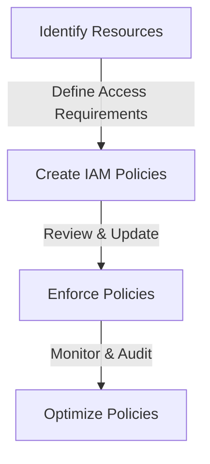
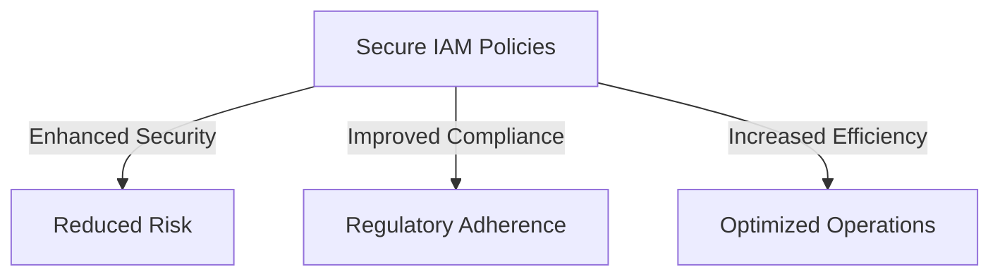

In the ever-evolving landscape of cloud computing and DevOps, security remains a paramount concern for organizations. As more businesses migrate their operations to the cloud, the need for robust security measures has never been more pressing. At the heart of cloud security lies Identity and Access Management (IAM), which plays a crucial role in controlling who can access resources within an organization's cloud infrastructure. A secure IAM policy is not just a best practice; it's a critical component for protecting modern products from unauthorized access, data breaches, and other security threats. In this article, we'll delve into the importance of secure IAM policies, explore how they can be effectively implemented, and discuss the benefits they bring to modern products.

## Introduction to IAM Policies

IAM policies are essentially a set of rules that define what actions a user, group, or role can perform on a specific resource. These policies can be customized to fit the specific needs of an organization, allowing for fine-grained control over access to cloud resources. By using IAM policies, organizations can ensure that their cloud infrastructure is secure and compliant with regulatory requirements.

```markdown
### Example of an IAM Policy
{
    "Version": "2012-10-17",
    "Statement": [
        {
            "Sid": "AllowEC2ReadOnly",
            "Effect": "Allow",
            "Action": [
                "ec2:Describe*"
            ],
            "Resource": "*"
        }
    ]
}
```

## Implementing Secure IAM Policies
Implementing secure IAM policies involves several key steps, including identifying the resources that need to be protected, determining the access requirements for each resource, and creating policies that enforce these requirements. It's also essential to regularly review and update IAM policies to ensure they remain effective and aligned with changing business needs.



## Best Practices for Secure IAM Policies
To ensure the security and effectiveness of IAM policies, several best practices should be followed. These include:

- **Least Privilege Principle**: Granting only the minimum permissions necessary for a user or role to perform their tasks.
- **Regular Policy Reviews**: Periodically reviewing IAM policies to ensure they remain up-to-date and effective.
- **Monitoring and Auditing**: Continuously monitoring and auditing IAM policies to detect and respond to security incidents.

## Benefits of Secure IAM Policies
Secure IAM policies offer numerous benefits, including enhanced security, improved compliance, and increased efficiency. By controlling access to cloud resources, organizations can reduce the risk of data breaches and other security threats. Additionally, secure IAM policies can help organizations meet regulatory requirements, reducing the risk of non-compliance and associated penalties.



## Real-World Example: AWS IAM

Amazon Web Services (AWS) provides a comprehensive IAM service that allows organizations to manage access to AWS resources. AWS IAM policies can be used to control access to AWS services, such as EC2, S3, and RDS. By using AWS IAM, organizations can ensure that their AWS resources are secure and accessible only to authorized users.

| AWS IAM Feature | Description |
| --- | --- |
| Users | Manage access for individual users |
| Groups | Manage access for groups of users |
| Roles | Manage access for applications and services |
| Policies | Define permissions for users, groups, and roles |

## Visual Insights Gallery
## Visual Insights Gallery


## Summary/Conclusion
In conclusion, secure IAM policies are critical for modern products, as they provide a robust security framework for controlling access to cloud resources. By implementing secure IAM policies, organizations can reduce the risk of security threats, improve compliance, and increase efficiency. As the cloud computing landscape continues to evolve, the importance of secure IAM policies will only continue to grow.

## FAQ
1. **What is IAM?**
Identity and Access Management (IAM) is a set of processes and technologies used to manage digital identities and control access to computer resources.
2. **Why are secure IAM policies important?**
Secure IAM policies are important because they help protect cloud resources from unauthorized access, data breaches, and other security threats.
3. **How can I implement secure IAM policies?**
To implement secure IAM policies, identify the resources that need to be protected, determine the access requirements for each resource, and create policies that enforce these requirements.
4. **What are some best practices for secure IAM policies?**
Best practices for secure IAM policies include the least privilege principle, regular policy reviews, and monitoring and auditing.
5. **What benefits do secure IAM policies offer?**
Secure IAM policies offer enhanced security, improved compliance, and increased efficiency.