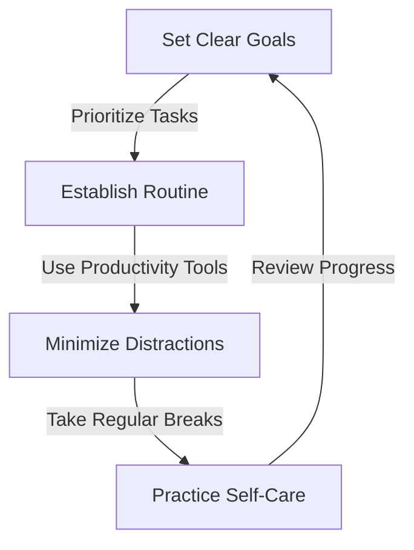

In today's fast-paced and competitive business landscape, staying productive is crucial for professionals, especially seniors, to deliver high-quality results and maintain a competitive edge. Senior productivity habits are essential for modern products, as they directly impact the overall success and efficiency of a project. In this article, we will explore the importance of senior productivity habits and provide actionable tips on how to cultivate them.

## Table of Contents
1. [Introduction to Senior Productivity Habits](#introduction-to-senior-productivity-habits)
2. [Benefits of Senior Productivity Habits](#benefits-of-senior-productivity-habits)
3. [Strategies for Developing Senior Productivity Habits](#strategies-for-developing-senior-productivity-habits)
4. [Common Challenges and Solutions](#common-challenges-and-solutions)
5. [Best Practices for Implementing Senior Productivity Habits](#best-practices-for-implementing-senior-productivity-habits)

## Introduction to Senior Productivity Habits
Senior productivity habits refer to the practices and routines that experienced professionals use to manage their time, prioritize tasks, and maintain a high level of performance. These habits are critical for modern products, as they enable seniors to:

- Deliver high-quality results
- Meet tight deadlines
- Collaborate effectively with team members
- Adapt to changing project requirements

## Benefits of Senior Productivity Habits
Developing senior productivity habits can have numerous benefits, including:
- Improved time management
- Increased efficiency
- Enhanced collaboration
- Better work-life balance
- Greater job satisfaction
```markdown
| Benefit | Description |
| --- | --- |
| Improved Time Management | Prioritize tasks, manage deadlines, and minimize distractions |
| Increased Efficiency | Complete tasks quickly, reduce errors, and improve overall performance |
| Enhanced Collaboration | Communicate effectively, delegate tasks, and build strong team relationships |
| Better Work-Life Balance | Maintain a healthy balance between work and personal life |
| Greater Job Satisfaction | Feel accomplished, motivated, and engaged in work |
```
> **Note:** Senior productivity habits can vary depending on individual preferences, work styles, and project requirements. It's essential to experiment and find the habits that work best for you.

## Strategies for Developing Senior Productivity Habits
To develop senior productivity habits, consider the following strategies:
- Set clear goals and priorities
- Use productivity tools and software
- Establish a routine and stick to it
- Minimize distractions and interruptions
- Take regular breaks and practice self-care

## Common Challenges and Solutions
Despite the benefits of senior productivity habits, many professionals face challenges in developing and maintaining them. Common challenges include:
- Procrastination
- Distractions
- Lack of motivation
- Poor time management
To overcome these challenges, try the following solutions:
- Break tasks into smaller, manageable chunks
- Use the Pomodoro Technique
- Eliminate distractions and minimize interruptions
- Reward yourself for achieving milestones

## Best Practices for Implementing Senior Productivity Habits
To implement senior productivity habits effectively, follow these best practices:
- Start small and gradually build up your habits
- Be consistent and patient
- Monitor your progress and adjust your habits as needed
- Seek support from colleagues, mentors, or coaches
- Continuously learn and improve your skills and knowledge

## Visual Insights Gallery


## Summary/Conclusion
In conclusion, senior productivity habits are critical for modern products, as they enable experienced professionals to deliver high-quality results, meet tight deadlines, and collaborate effectively with team members. By developing senior productivity habits, professionals can improve their time management, increase their efficiency, and enhance their collaboration. Remember to start small, be consistent, and continuously learn and improve your skills and knowledge.

## FAQ
Q: What are senior productivity habits?
A: Senior productivity habits refer to the practices and routines that experienced professionals use to manage their time, prioritize tasks, and maintain a high level of performance.
Q: Why are senior productivity habits important?
A: Senior productivity habits are important because they enable professionals to deliver high-quality results, meet tight deadlines, and collaborate effectively with team members.
Q: How can I develop senior productivity habits?
A: To develop senior productivity habits, set clear goals and priorities, use productivity tools and software, establish a routine and stick to it, minimize distractions and interruptions, and take regular breaks and practice self-care.