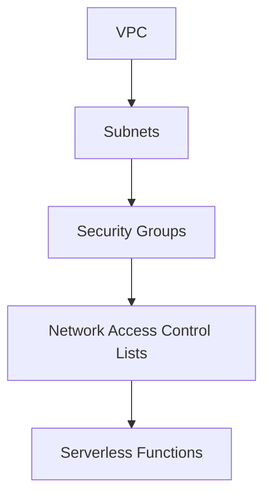
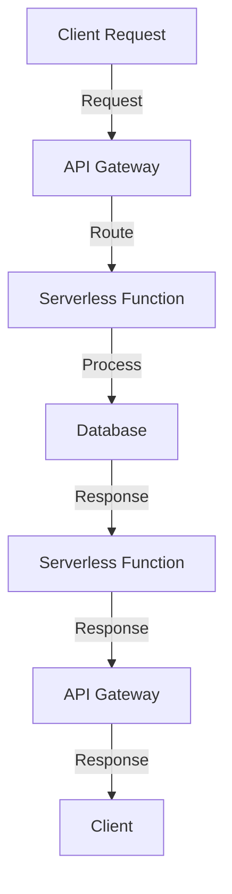

In today's fast-paced digital landscape, companies are constantly seeking ways to improve their products and services. One crucial aspect of achieving this goal is by leveraging the power of cloud computing, particularly through the use of serverless architectures. Amazon Web Services (AWS) offers a robust platform for building and deploying modern products, with its Virtual Private Cloud (VPC) being a critical component. In this article, we will delve into the importance of serverless AWS VPC for modern products and explore how it can help businesses stay ahead of the curve.

## Introduction to Serverless AWS VPC

Serverless computing is a cloud computing model where the cloud provider manages the infrastructure, and the user only pays for the computing resources they use. AWS VPC is a virtual networking environment that allows users to launch AWS resources in a virtual network that they define. By combining serverless computing with AWS VPC, businesses can create a highly scalable, secure, and cost-effective infrastructure for their modern products.

## Benefits of Serverless AWS VPC
### Scalability and Flexibility
Serverless AWS VPC allows businesses to scale their infrastructure up or down as needed, without having to worry about provisioning or managing servers. This scalability, combined with the flexibility of AWS VPC, enables companies to quickly adapt to changing market conditions and customer demands.
```terraform
# Example Terraform configuration for a serverless AWS VPC
provider "aws" {
  region = "us-west-2"
}

resource "aws_vpc" "example" {
  cidr_block = "10.0.0.0/16"
}
```
### Security and Compliance
AWS VPC provides a highly secure environment for businesses to deploy their modern products. With features such as network access control lists, security groups, and subnet isolation, companies can ensure that their infrastructure is protected from unauthorized access.
```markdown
| Security Feature | Description |
| --- | --- |
| Network Access Control Lists | Control traffic flow in and out of the VPC |
| Security Groups | Control traffic flow to and from individual resources |
| Subnet Isolation | Isolate resources into separate subnets for added security |
```
### Cost-Effectiveness
Serverless AWS VPC helps businesses reduce their infrastructure costs by only paying for the computing resources they use. This cost-effectiveness, combined with the scalability and flexibility of the platform, makes it an attractive option for companies looking to optimize their spending.


## Architecture and Design
### High-Level Architecture
The high-level architecture of a serverless AWS VPC typically consists of the following components:
* AWS VPC
* Subnets
* Security Groups
* Network Access Control Lists
* Serverless Functions (e.g., AWS Lambda)

### Data Flow
The data flow in a serverless AWS VPC typically involves the following steps:
1. Client Request: The client sends a request to the serverless function.
2. API Gateway: The API Gateway receives the request and routes it to the serverless function.
3. Serverless Function: The serverless function processes the request and returns a response.
4. Database: The serverless function interacts with the database to retrieve or store data.


## Visual Insights Gallery
## Visual Insights Gallery


## Summary and Conclusion
In conclusion, serverless AWS VPC is a critical component for modern products, offering scalability, flexibility, security, and cost-effectiveness. By leveraging the power of serverless computing and AWS VPC, businesses can create a highly efficient and effective infrastructure for their products and services. As the digital landscape continues to evolve, it is essential for companies to stay ahead of the curve by adopting innovative technologies and strategies.

## FAQ
* Q: What is serverless computing?
A: Serverless computing is a cloud computing model where the cloud provider manages the infrastructure, and the user only pays for the computing resources they use.
* Q: What is AWS VPC?
A: AWS VPC is a virtual networking environment that allows users to launch AWS resources in a virtual network that they define.
* Q: What are the benefits of using serverless AWS VPC?
A: The benefits of using serverless AWS VPC include scalability, flexibility, security, and cost-effectiveness.