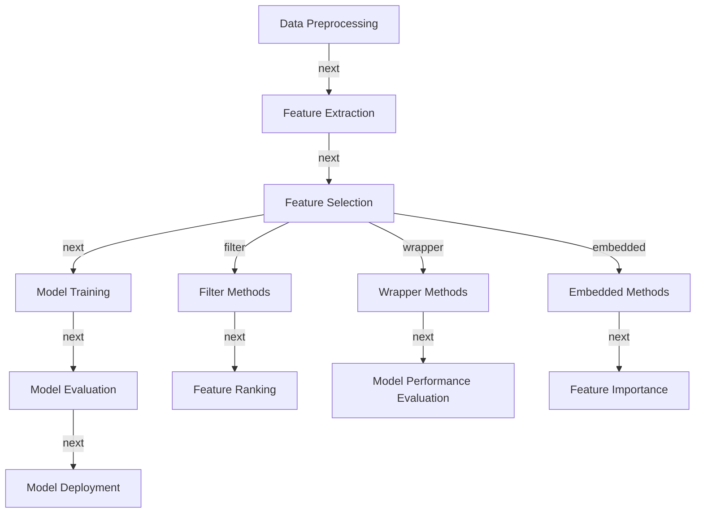
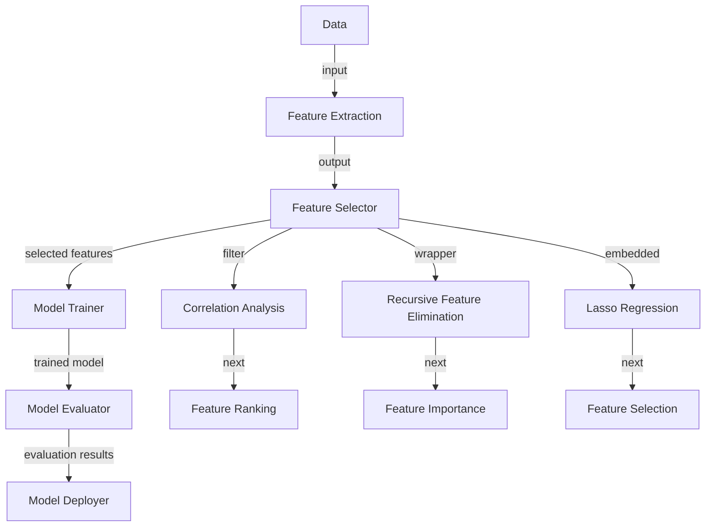

In the era of big data, developing modern products that can handle and make sense of the vast amounts of information available is crucial. One of the key steps in achieving this goal is through statistical feature selection, a process that enables data scientists to identify the most relevant features in a dataset. In this article, we will delve into the world of statistical feature selection, exploring its importance, methods, and applications in modern product development.

## Introduction to Statistical Feature Selection
Statistical feature selection is a technique used in data science to select a subset of the most relevant features from a large dataset. The primary goal of feature selection is to reduce the dimensionality of the data, thereby improving model performance, reducing overfitting, and enhancing interpretability. 


## Benefits of Statistical Feature Selection
The benefits of statistical feature selection are numerous. Some of the most significant advantages include:
- **Improved Model Performance**: By selecting the most relevant features, models can learn more effectively, leading to better prediction accuracy and overall performance.
- **Reduced Overfitting**: Feature selection helps reduce the risk of overfitting by eliminating irrelevant features that can cause models to become too complex.
- **Enhanced Interpretability**: With fewer features, models become easier to interpret, allowing data scientists to gain deeper insights into the relationships between variables.
- **Faster Training Times**: Feature selection can significantly reduce the training time for models, as they have to process fewer features.

## Methods of Statistical Feature Selection
There are several methods of statistical feature selection, including:
- **Filter Methods**: These methods evaluate features based on their inherent characteristics, such as correlation, mutual information, or variance.
- **Wrapper Methods**: These methods use a machine learning algorithm to evaluate the usefulness of features and select the best subset.
- **Embedded Methods**: These methods combine the advantages of filter and wrapper methods, selecting features during the training process.

```python
# Example of feature selection using correlation
import pandas as pd
import numpy as np

# Generate a random dataset
np.random.seed(0)
data = np.random.rand(100, 10)
df = pd.DataFrame(data, columns=[f'Feature {i}' for i in range(1, 11)])

# Calculate correlation matrix
corr_matrix = df.corr()

# Select features with high correlation
selected_features = corr_matrix.columns[corr_matrix['Feature 1'].abs() > 0.5]
print(selected_features)
```

## Mermaid.js Diagram: Feature Selection Process


## Mermaid.js Diagram: Feature Selection Architecture


## Best Practices for Statistical Feature Selection
- **Use Domain Knowledge**: Incorporate domain expertise to select features that are relevant to the problem at hand.
- **Evaluate Multiple Methods**: Compare the performance of different feature selection methods to choose the best one for the dataset.
- **Monitor Performance**: Continuously monitor the performance of the model and adjust the feature selection process as needed.

> **Tip:** Use techniques like cross-validation to evaluate the performance of feature selection methods and avoid overfitting.

## Challenges and Limitations of Statistical Feature Selection
- **High-Dimensional Data**: Feature selection can be challenging when dealing with high-dimensional data, where the number of features is large compared to the number of samples.
- **Noise and Outliers**: Noisy or outlier data can negatively impact the feature selection process, leading to poor model performance.
- **Interpretability**: Feature selection can sometimes reduce the interpretability of models, making it difficult to understand the relationships between variables.

> **Warning:** Feature selection should not be used as a replacement for data preprocessing. It is essential to clean and preprocess the data before applying feature selection techniques.

## Visual Insights Gallery
## Visual Insights Gallery


## Summary and Conclusion
Statistical feature selection is a crucial step in modern product development, enabling data scientists to identify the most relevant features in a dataset. By applying feature selection techniques, developers can improve model performance, reduce overfitting, and enhance interpretability. However, it is essential to be aware of the challenges and limitations of feature selection, such as high-dimensional data, noise, and outliers. By following best practices and using domain knowledge, developers can effectively apply feature selection techniques to build better models and create more accurate predictions.

## FAQ
1. **What is statistical feature selection?**
Statistical feature selection is a technique used in data science to select a subset of the most relevant features from a large dataset.
2. **Why is feature selection important?**
Feature selection is essential for improving model performance, reducing overfitting, and enhancing interpretability.
3. **What are the different methods of feature selection?**
The different methods of feature selection include filter methods, wrapper methods, and embedded methods.
4. **How do I choose the best feature selection method?**
The best feature selection method depends on the dataset and the problem at hand. It is recommended to evaluate multiple methods and choose the one that performs best.
5. **What are the challenges and limitations of feature selection?**
The challenges and limitations of feature selection include high-dimensional data, noise, and outliers, which can negatively impact the feature selection process and model performance.