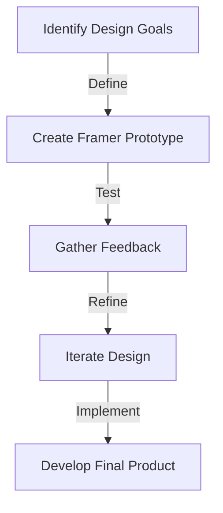
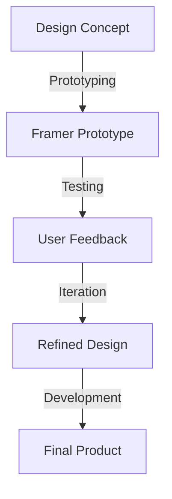

In the ever-evolving landscape of product design, staying ahead of the curve is crucial for success. One often-underestimated aspect of this process is the strategic use of Framer prototypes. As we delve into the world of modern product development, it becomes clear that a well-crafted prototype is not just a nicety, but a necessity. In this article, we will explore the importance of strategic Framer prototyping and how it can elevate your product to the next level.

## Table of Contents
1. [Introduction to Framer Prototyping](#introduction-to-framer-prototyping)
2. [Benefits of Strategic Framer Prototyping](#benefits-of-strategic-framer-prototyping)
3. [Designing with Framer](#designing-with-framer)
4. [Integrating Framer into Your Workflow](#integrating-framer-into-your-workflow)
5. [Best Practices for Framer Prototyping](#best-practices-for-framer-prototyping)

## Introduction to Framer Prototyping

Framer is a powerful tool used for creating interactive prototypes. It allows designers to bring their ideas to life, test usability, and refine their designs before moving into development. By leveraging Framer, designers can create high-fidelity prototypes that simulate the real user experience, making it an invaluable asset in the design process.

## Benefits of Strategic Framer Prototyping

Strategic Framer prototyping offers a multitude of benefits, including improved usability, enhanced collaboration, and reduced development time. By creating interactive prototypes, designers can identify and fix usability issues early on, ensuring a smoother user experience. Additionally, Framer prototypes facilitate effective communication among team members and stakeholders, aligning everyone's vision and expectations.

## Designing with Framer

Designing with Framer involves more than just creating a visual representation of your product. It's about crafting an experience that resonates with your target audience. By focusing on interaction design and user flows, you can create prototypes that not only look amazing but also function intuitively.

> **Tip:** When designing with Framer, consider starting with low-fidelity wireframes to establish the basic layout and flow of your product. Then, gradually add more detail and interactivity to refine the design.

## Integrating Framer into Your Workflow

Integrating Framer into your workflow can seem daunting, but it's simpler than you think. Start by identifying key areas where Framer can add value, such as usability testing or design refinement. Then, establish a routine for creating and reviewing prototypes, ensuring that all team members are aligned and working towards the same goals.

## Best Practices for Framer Prototyping

To get the most out of Framer prototyping, follow these best practices:
- Keep your prototypes focused on specific design questions or hypotheses.
- Test your prototypes with real users to gather meaningful feedback.
- Iterate based on feedback, refining your design until it meets your goals.
- Collaborate with your team to ensure everyone is aligned with the design vision.

## Visual Insights Gallery
## Visual Insights Gallery

## Summary/Conclusion
In conclusion, strategic Framer prototyping is a critical component of modern product development. By leveraging Framer's capabilities, designers can create interactive, high-fidelity prototypes that improve usability, enhance collaboration, and reduce development time. Whether you're a seasoned designer or just starting out, incorporating Framer into your workflow can significantly elevate the quality and success of your products.

## FAQ
- Q: What is Framer, and how does it differ from other design tools?
  A: Framer is a design tool focused on creating interactive prototypes, allowing for more realistic usability testing and design refinement compared to static design tools.
- Q: How do I get started with Framer prototyping?
  A: Start by identifying your design goals, then create a simple prototype to test and refine your ideas. Gradually add more complexity and interactivity as you iterate.
- Q: Can Framer be used for web and mobile app design?
  A: Yes, Framer is versatile and can be used for designing both web and mobile applications, allowing you to test and refine user interactions across different platforms.