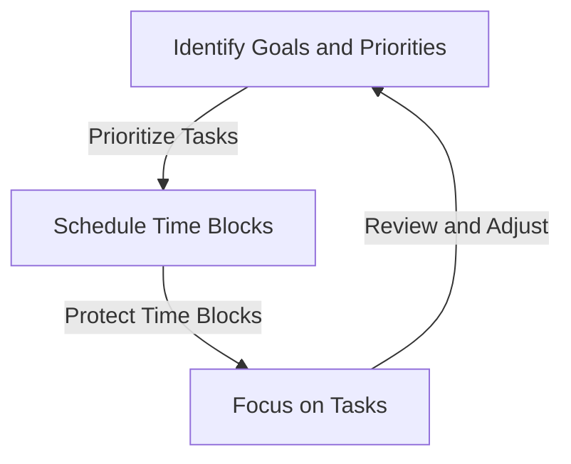
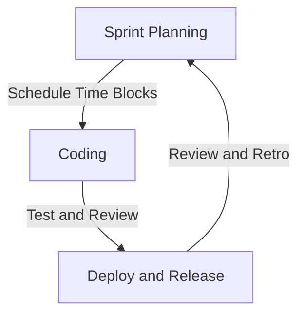

In today's fast-paced, technology-driven world, managing time effectively is crucial for the success of modern products. With the rise of remote work and automation, staying organized and focused is more important than ever. One technique that has gained popularity in recent years is structured time blocking. In this article, we will explore the benefits of structured time blocking and why it is critical for modern products.

## Introduction to Time Blocking

Time blocking is a time management technique where you schedule your day into fixed, uninterrupted blocks of time. Each block is dedicated to a specific task or activity, allowing you to focus on one thing at a time. This approach helps to eliminate distractions, increase productivity, and reduce stress.

## Benefits of Structured Time Blocking
### Increased Productivity
Structured time blocking helps you prioritize tasks and manage your time more efficiently. By dedicating specific blocks of time to specific tasks, you can avoid multitasking and minimize distractions. This leads to increased productivity and better work quality.
### Improved Work-Life Balance
Time blocking allows you to schedule personal and family time, ensuring a better work-life balance. By setting clear boundaries between work and personal life, you can reduce the risk of burnout and improve overall well-being.
### Enhanced Team Collaboration
Structured time blocking can also improve team collaboration and communication. By scheduling regular team meetings and updates, you can ensure everyone is on the same page and working towards the same goals.

```markdown
| Benefit | Description |
| --- | --- |
| Increased Productivity | Prioritize tasks and manage time more efficiently |
| Improved Work-Life Balance | Schedule personal and family time to reduce burnout |
| Enhanced Team Collaboration | Improve communication and ensure everyone is on the same page |
```

## Implementing Structured Time Blocking
### Step 1: Identify Your Goals and Priorities
Identify your short-term and long-term goals, and prioritize tasks accordingly. Use the Eisenhower Matrix to categorize tasks into urgent vs. important.
### Step 2: Schedule Your Time Blocks
Schedule your time blocks in a calendar or planner, leaving some buffer time for unexpected tasks or emergencies.
### Step 3: Protect Your Time Blocks
Communicate your time blocks to your team and stakeholders, and protect them from distractions and interruptions.



## Overcoming Common Challenges
> **Note:** One common challenge to implementing structured time blocking is dealing with unexpected interruptions or emergencies. To overcome this, schedule some buffer time in your calendar for unexpected tasks or emergencies.
> **Tip:** Use technology to your advantage by setting reminders, notifications, and automated scheduling tools to help you stay on track.

## Real-World Example

A software development team uses structured time blocking to manage their sprint cycles. They schedule specific time blocks for coding, testing, and review, ensuring that each task is completed efficiently and effectively.



## Visual Insights Gallery
## Visual Insights Gallery


## Summary and Conclusion
In conclusion, structured time blocking is a critical technique for modern products, allowing teams to manage their time more efficiently, increase productivity, and improve work-life balance. By implementing structured time blocking, teams can overcome common challenges, prioritize tasks, and achieve their goals.

## FAQ
1. What is structured time blocking?
Structured time blocking is a time management technique where you schedule your day into fixed, uninterrupted blocks of time.
2. How do I implement structured time blocking?
Identify your goals and priorities, schedule your time blocks, and protect them from distractions and interruptions.
3. What are the benefits of structured time blocking?
Increased productivity, improved work-life balance, and enhanced team collaboration.