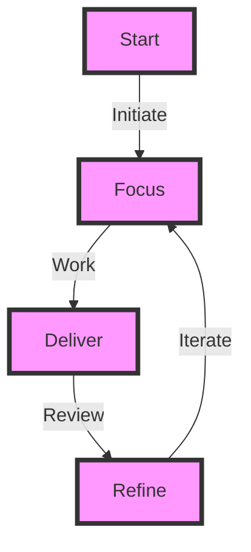
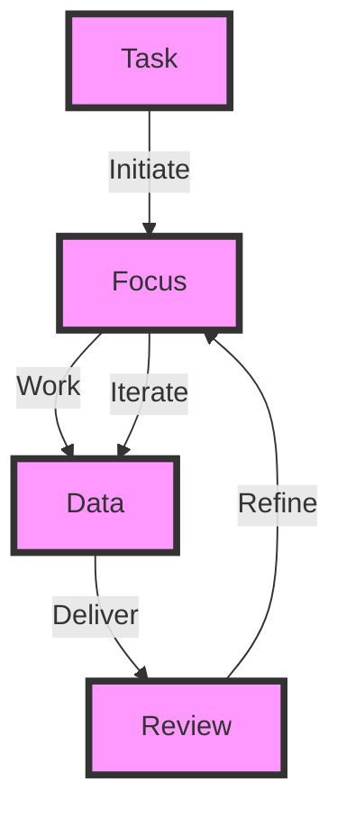

In today's fast-paced, digitally driven world, maintaining an uninterrupted productivity loop is crucial for the success of modern products. With the rise of remote work and automation, teams are looking for ways to streamline their workflows, reduce distractions, and increase efficiency. An uninterrupted productivity loop is essential for achieving these goals, as it enables teams to focus on high-priority tasks, minimize interruptions, and maximize output.

## Introduction to Uninterrupted Productivity Loop

The uninterrupted productivity loop refers to a continuous cycle of focused work, uninterrupted by distractions, meetings, or other non-essential tasks. This loop is critical for modern products, as it allows teams to deliver high-quality results, meet deadlines, and stay competitive in the market. By minimizing interruptions and maximizing focus, teams can achieve a state of flow, which is essential for productivity, creativity, and innovation.

## Benefits of Uninterrupted Productivity Loop
The benefits of an uninterrupted productivity loop are numerous. Some of the most significant advantages include:
* Increased productivity: By minimizing distractions and maximizing focus, teams can complete tasks more efficiently and effectively.
* Improved quality: With an uninterrupted productivity loop, teams can focus on delivering high-quality results, rather than rushing to meet deadlines.
* Enhanced creativity: The uninterrupted productivity loop allows teams to enter a state of flow, which is essential for creativity, innovation, and problem-solving.
* Better work-life balance: By completing tasks efficiently and effectively, teams can achieve a better work-life balance, reducing stress and burnout.

## Architecture of Uninterrupted Productivity Loop

The architecture of an uninterrupted productivity loop involves several key components, including focus, work, delivery, review, and refinement. By initiating a task, focusing on the work, delivering results, reviewing progress, and refining the process, teams can create a continuous cycle of productivity and improvement.

## Implementing Uninterrupted Productivity Loop
To implement an uninterrupted productivity loop, teams can follow these steps:
| Step | Description |
| --- | --- |
| 1 | Identify high-priority tasks and focus on them first |
| 2 | Minimize distractions, such as meetings, emails, and social media |
| 3 | Use time-blocking to schedule focused work sessions |
| 4 | Take regular breaks to recharge and avoid burnout |
| 5 | Review progress regularly and refine the process as needed |

## Data Flow in Uninterrupted Productivity Loop

The data flow in an uninterrupted productivity loop involves several key stages, including task initiation, focus, work, data delivery, review, and refinement. By iterating through these stages, teams can create a continuous cycle of productivity and improvement.

## Challenges and Limitations
> **Note:** Implementing an uninterrupted productivity loop can be challenging, especially in teams with multiple stakeholders, competing priorities, and limited resources. Common challenges include:
* Difficulty in prioritizing tasks and focusing on high-priority work
* Limited resources, such as time, budget, and personnel
* Competing priorities and stakeholder expectations
* Difficulty in minimizing distractions and staying focused

## Overcoming Challenges
> **Tip:** To overcome these challenges, teams can use several strategies, including:
* Prioritizing tasks using the Eisenhower Matrix
* Using time-blocking to schedule focused work sessions
* Minimizing distractions, such as meetings, emails, and social media
* Taking regular breaks to recharge and avoid burnout

## Visual Insights Gallery
## Visual Insights Gallery

## Summary and Conclusion
In conclusion, an uninterrupted productivity loop is critical for modern products, as it enables teams to focus on high-priority tasks, minimize distractions, and maximize output. By implementing an uninterrupted productivity loop, teams can achieve a state of flow, deliver high-quality results, and stay competitive in the market. While there are challenges and limitations to implementing an uninterrupted productivity loop, teams can overcome these challenges by using strategies such as prioritizing tasks, minimizing distractions, and taking regular breaks.

## FAQ
Q: What is an uninterrupted productivity loop?
A: An uninterrupted productivity loop is a continuous cycle of focused work, uninterrupted by distractions, meetings, or other non-essential tasks.
Q: Why is an uninterrupted productivity loop important?
A: An uninterrupted productivity loop is important because it enables teams to focus on high-priority tasks, minimize distractions, and maximize output.
Q: How can teams implement an uninterrupted productivity loop?
A: Teams can implement an uninterrupted productivity loop by prioritizing tasks, minimizing distractions, using time-blocking, and taking regular breaks.
Q: What are the benefits of an uninterrupted productivity loop?
A: The benefits of an uninterrupted productivity loop include increased productivity, improved quality, enhanced creativity, and better work-life balance.