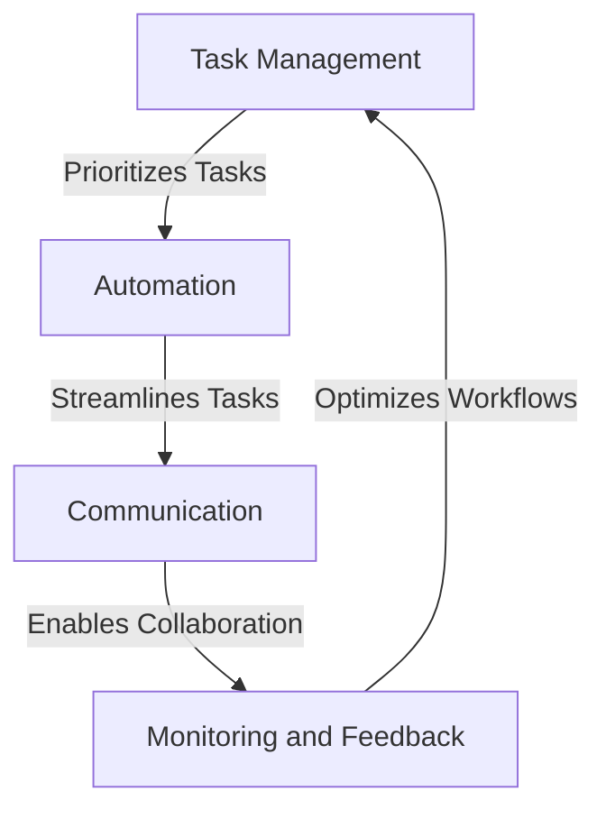

## Introduction to Advanced Uninterrupted Productivity Loop Concepts

In the first part of this series, we explored the basics of uninterrupted productivity loops and their importance in modern products. In this article, we will delve deeper into the architecture and edge cases of uninterrupted productivity loops, exploring real-world applications and future trends. We will examine the role of automation, artificial intelligence, and machine learning in enhancing productivity loops, as well as the challenges and limitations of implementing these concepts in real-world scenarios.

## Architecture of Uninterrupted Productivity Loops
The architecture of uninterrupted productivity loops involves several key components, including:
* **Task Management**: A system for managing and prioritizing tasks, ensuring that teams focus on high-priority tasks and minimize distractions.
* **Automation**: Automated tools and workflows that streamline tasks, reduce manual labor, and enhance productivity.
* **Communication**: Seamless communication channels that enable teams to collaborate, share information, and stay informed.
* **Monitoring and Feedback**: Real-time monitoring and feedback mechanisms that help teams track progress, identify bottlenecks, and optimize workflows.

## Edge Cases and Challenges
While uninterrupted productivity loops offer numerous benefits, there are several edge cases and challenges to consider, including:
* **Remote Work**: Managing remote teams and ensuring uninterrupted productivity loops can be challenging, requiring robust communication and collaboration tools.
* **Automation Limitations**: Automated tools and workflows can be limited by data quality, algorithms, and integration issues, requiring careful planning and implementation.
* **Human Factors**: Uninterrupted productivity loops can be affected by human factors, such as motivation, fatigue, and burnout, requiring strategies to maintain team well-being and engagement.

## Real-World Applications and Case Studies
Several companies have successfully implemented uninterrupted productivity loops, achieving significant improvements in productivity, quality, and innovation. For example:
* **Amazon**: Amazon's use of automated workflows and artificial intelligence has enabled the company to streamline its logistics and supply chain operations, reducing costs and enhancing customer satisfaction.
* **Google**: Google's implementation of uninterrupted productivity loops has enabled the company to focus on high-priority tasks, such as developing new products and services, while minimizing distractions and maximizing output.

## Future Trends and Opportunities
The future of uninterrupted productivity loops looks promising, with emerging trends and technologies offering new opportunities for enhancement and optimization. Some of the most significant trends include:
* **Artificial Intelligence**: AI-powered tools and workflows can enhance productivity loops, automating tasks, predicting outcomes, and optimizing workflows.
* **Internet of Things (IoT)**: IoT devices and sensors can provide real-time data and feedback, enabling teams to track progress, identify bottlenecks, and optimize workflows.

## Visual Insights Gallery
### Image 1: Uninterrupted Productivity Loop Architecture

### Image 2: Automation and Artificial Intelligence in Uninterrupted Productivity Loops

### Image 3: Real-World Applications and Case Studies
