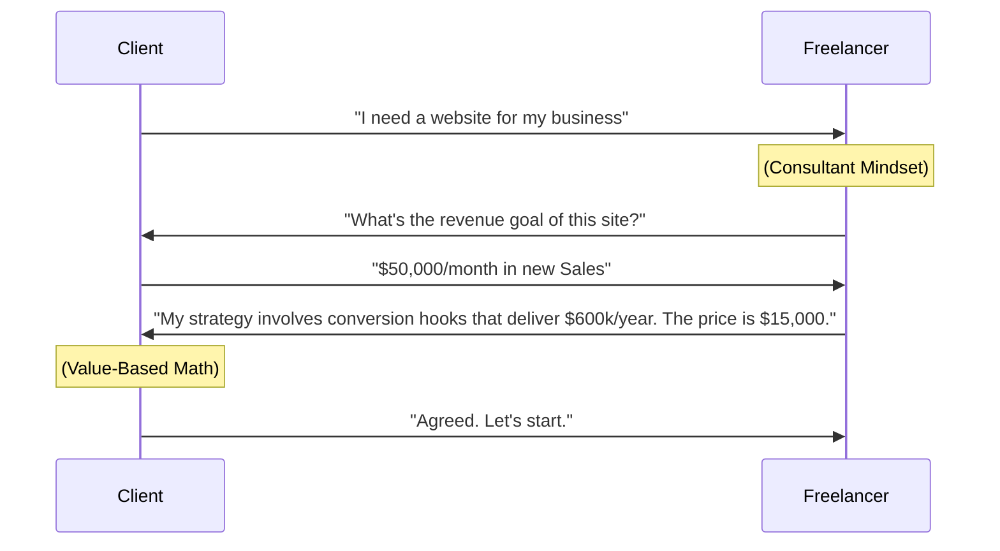

# The Freelance Revolution: Why $100k/year is the New Normal

The traditional 9-to-5 is no longer the safest path. In a world of remote work and specialized skill demand, a high-performing freelancer can out-earn many mid-career corporate managers while working half the hours.

## The Problem: The "$20/Hour" Trap

Most new freelancers start by competing on price. They join platforms like Upwork or Fiverr and race to the bottom. This is the surest way to burnout.

### The Shift: Time-Based vs. Value-Based Pricing

Value-based pricing is the key to breaking the $100k ceiling. Instead of charging for your time, you charge for the **outcome**.

[IMAGE: A professional business visual showing a scale: Time on one side, Value on the other, with Value weighing more]

## Strategies for Growth

To reach the high-income tier, you must implement three core strategies:

1.  **Specialization**: Don't be a "Web Developer." Be a "Next.js Specialist for SaaS Startups." You become the go-to authority.
2.  **Productization**: Package your services into clear, fixed-price "products" (e.g., A fixed $2,500 SEO audit).
3.  **Outreach**: Stop waiting for jobs. Use LinkedIn and direct email to solve business problems proactively.

---

> [!WARNING]
> **Warning:** Avoid client dependency. No single client should ever represent more than 40% of your total income. Diversity is security.

---

## The Economics of Success

| Milestone | Strategy | Average Income |
| :--- | :--- | :---: |
| **The Beginner** | Hourly, Marketplace | $2k - $5k/mo |
| **The Pro** | Specialized, Retainers | $6k - $12k/mo |
| **The Consultant** | Value-based, Strategic | $15k - $30k/mo |

## Frequently Asked Questions

### Do I need a professional website?
Yes. Your website at LaunchYourConcept or Agrazia is your digital storefront. It should showcase your case studies, not just your skills.

### How do I handle taxes?
As you approach $100k, consult an accountant about forming an LLC or S-Corp to optimize your tax liability and protect your assets.

---

[IMAGE: A high-end visualization of a professional freelancer dashboard showing growing revenue charts and active project nodes]

**Summary**: The freelance revolution is about more than just "working for yourself." It's about building a specialized business that delivers high-value outcomes to clients who respect your expertise.
