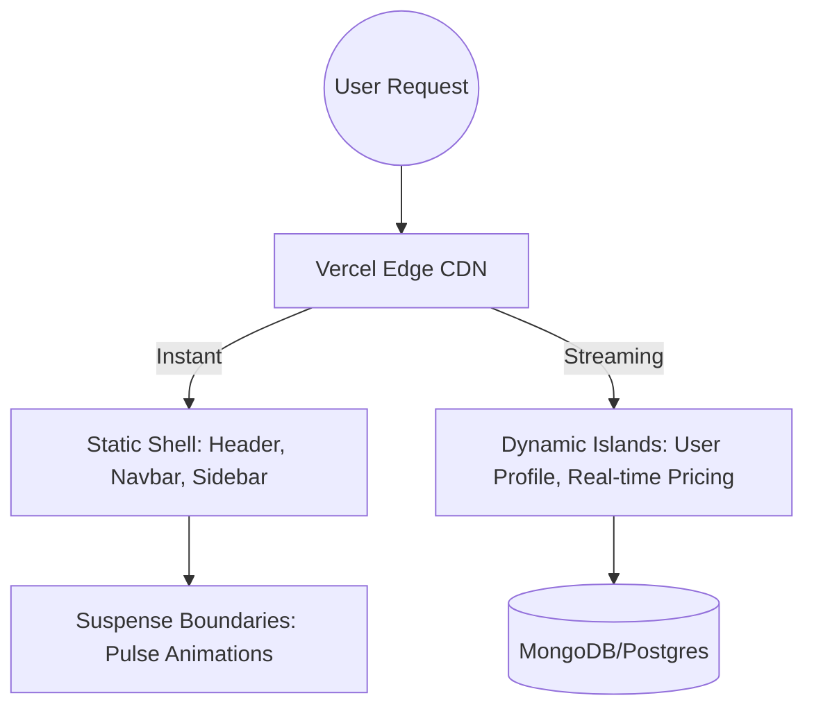

# The Future of Web Performance: Moving Beyond Next.js 14

The web is at a turning point. For years, we've optimized for "Static First" or "Server First," but the gap between these two worlds is finally closing. With the release of Next.js 15 and the internal mechanics of React 19, we are entering the era of **Partial Prerendering (PPR)**.

## The Architecture of Tomorrow

Traditional rendering models always forced a compromise. Static Site Generation (SSG) was lightning fast but lacked real-time data. Server-Side Rendering (SSR) was dynamic but incurred a TTFB (Time to First Byte) penalty.

**Partial Prerendering** solves this by allowing a single page to be both static and dynamic simultaneously.



[IMAGE: A professional diagram comparing SSG, SSR, and PPR side-by-side with horizontal flow arrows]

### Why Partial Prerendering?

1.  **Instant Gratification**: The static shell loads in milliseconds.
2.  **Reduced Server Load**: Only the dynamic "islands" require server compute.
3.  **SEO Mastery**: Search engines see a fully populated page, while users get an interactive, app-like experience.

---

> [!TIP]
> **Pro Tip:** When using Next.js 15, ensure you wrap your dynamic components in `<Suspense>` boundaries. This is the "on-switch" for the PPR engine.

---

## Code Example: Implementing a Dynamic Island

Here is how you can implement a high-performance dynamic component within a static shell using React 19 actions.

```tsx
// components/DynamicPricing.tsx
import { Suspense } from 'react';

const PricingSkeleton = () => <div className="h-20 w-full animate-pulse bg-gray-100 rounded-lg" />;

export default function PricingSection() {
  return (
    <section className="p-8 bg-white shadow-xl rounded-2xl">
      <h2 className="text-2xl font-bold mb-4">Current Pricing</h2>
      <Suspense fallback={<PricingSkeleton />}>
        <RealTimeData />
      </Suspense>
    </section>
  );
}

async function RealTimeData() {
  const data = await fetch('https://api.launchyourconcept.com/pricing', { cache: 'no-store' });
  const pricing = await data.json();
  
  return (
    <div className="text-4xl text-blue-600 font-extrabold">
      ${pricing.current} <span className="text-sm text-gray-500">/mo</span>
    </div>
  );
}
```

## Comparisons: The New Standard

| Feature | SSG | SSR | PPR |
| :--- | :---: | :---: | :---: |
| **Speed** | 🚀 Ultra | 🐢 Moderate | ⚡ Instant Shell |
| **Dynamic Data** | ❌ No | ✅ Yes | ✅ Yes |
| **Edge Compatibility**| ✅ Full | ⚠️ Partial | ✅ Full |
| **Best For** | Blogs | Dashboards | E-commerce |

## Frequently Asked Questions

### Is React 19 stable for production?
Yes, React 19 is now the recommended standard for new projects, offering better error handling and simplified state management via `useFormStatus` and `useActionState`.

### How does this affect SEO?
Positively. Because the static shell includes the main page headings (H1, H2), search engines index the content faster than traditional client-side apps.

---

[IMAGE: A high-end office setting with professional developer tools, highlighting a clean, high-performance UI on an iMac screen]

**Summary**: The future of the web isn't about choosing between static and dynamic; it's about blending them seamlessly. At LaunchYourConcept, we use these architectures to build websites that feel like native apps.
