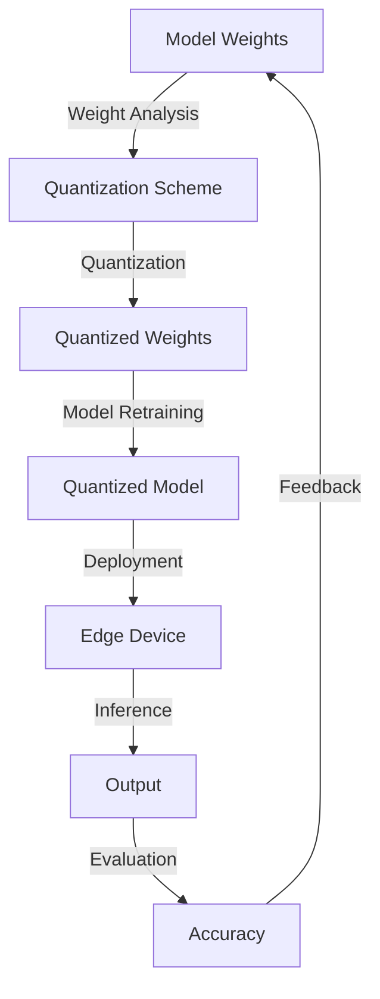

## Introduction
**Model Quantization** is a technique used to reduce the precision of model weights from floating-point numbers to integers, resulting in significant reductions in model size and computational requirements. This is crucial for high-performance applications, such as real-time object detection, speech recognition, and natural language processing, where models need to be deployed on edge devices or in resource-constrained environments. Every engineer working on AI/ML projects needs to understand model quantization to ensure their models are optimized for production.

> **Note:** Model quantization is not the same as model pruning, although both techniques are used to reduce model size. Model pruning involves removing unnecessary neurons and connections, while model quantization reduces the precision of the remaining weights.

## Core Concepts
* **Quantization**: The process of mapping a continuous range of values to a finite set of discrete values.
* **Model weights**: The learned parameters of a neural network, which are typically represented as floating-point numbers.
* **Integer representation**: The representation of model weights as integers, which can be either signed or unsigned.
* **Quantization error**: The difference between the original floating-point value and its quantized integer representation.

> **Warning:** Quantization error can lead to reduced model accuracy if not managed properly. It's essential to balance the trade-off between model size and accuracy.

## How It Works Internally
The model quantization process involves the following steps:
1. **Weight analysis**: Analyze the distribution of model weights to determine the optimal quantization scheme.
2. **Quantization scheme selection**: Choose a suitable quantization scheme, such as uniform or non-uniform quantization.
3. **Weight quantization**: Apply the selected quantization scheme to the model weights.
4. **Model retraining**: Retrain the model using the quantized weights to recover any lost accuracy.

> **Tip:** Use techniques like knowledge distillation to transfer knowledge from the full-precision model to the quantized model, which can help recover lost accuracy.

## Code Examples
### Example 1: Basic Quantization using PyTorch
```python
import torch
import torch.nn as nn

# Define a simple neural network
class Net(nn.Module):
    def __init__(self):
        super(Net, self).__init__()
        self.fc1 = nn.Linear(5, 10)
        self.fc2 = nn.Linear(10, 5)

    def forward(self, x):
        x = torch.relu(self.fc1(x))
        x = self.fc2(x)
        return x

# Initialize the network and quantize the weights
net = Net()
for param in net.parameters():
    param.data = torch.quantize_per_tensor(param.data, scale=1.0, zero_point=0, dtype=torch.qint8)

# Verify the quantized weights
for param in net.parameters():
    print(param.data.dtype)
```

### Example 2: Quantization-aware Training using TensorFlow
```python
import tensorflow as tf

# Define a simple neural network
model = tf.keras.models.Sequential([
    tf.keras.layers.Dense(10, input_shape=(5,)),
    tf.keras.layers.ReLU(),
    tf.keras.layers.Dense(5)
])

# Compile the model with quantization-aware training
model.compile(optimizer='adam', loss='mean_squared_error')

# Train the model with quantization-aware training
model.fit(tf.random.normal([100, 5]), tf.random.normal([100, 5]), epochs=10)

# Verify the quantized weights
for layer in model.layers:
    if isinstance(layer, tf.keras.layers.Dense):
        print(layer.kernel.dtype)
```

### Example 3: Post-training Quantization using OpenVINO
```python
from openvino.inference_engine import IECore

# Load the pre-trained model
ie = IECore()
net = ie.read_network(model='model.xml', weights='model.bin')

# Perform post-training quantization
quantized_net = ie.quantize_network(net, target_device='CPU')

# Verify the quantized weights
for layer in quantized_net.layers:
    if layer.type == 'Convolution':
        print(layer.params['weights'].dtype)
```

## Visual Diagram

The diagram illustrates the model quantization process, from weight analysis to deployment on an edge device.

## Comparison
| Approach | Time Complexity | Space Complexity | Pros | Cons | Best For |
| --- | --- | --- | --- | --- | --- |
| Post-training Quantization | O(1) | O(1) | Fast and simple | May lose accuracy | Models with simple architectures |
| Quantization-aware Training | O(n) | O(n) | Can recover lost accuracy | Requires retraining | Models with complex architectures |
| Knowledge Distillation | O(n) | O(n) | Can transfer knowledge from full-precision model | Requires additional training data | Models with limited training data |
| Pruning | O(n) | O(1) | Can reduce model size | May lose accuracy | Models with redundant connections |

## Real-world Use Cases
* **Google's TensorFlow Lite**: Uses post-training quantization to deploy models on edge devices.
* **Facebook's FairScale**: Uses quantization-aware training to deploy models on datacenter-scale hardware.
* **Microsoft's Azure Machine Learning**: Uses knowledge distillation to transfer knowledge from full-precision models to quantized models.

## Common Pitfalls
* **Insufficient weight analysis**: Failing to analyze the distribution of model weights can lead to suboptimal quantization schemes.
* **Inadequate quantization scheme selection**: Choosing a quantization scheme that is not suitable for the model can lead to reduced accuracy.
* **Inadequate model retraining**: Failing to retrain the model using the quantized weights can lead to reduced accuracy.
* **Ignoring quantization error**: Failing to account for quantization error can lead to reduced model accuracy.

> **Interview:** What are some common pitfalls when implementing model quantization, and how can they be avoided?

## Interview Tips
* **What is model quantization, and why is it important?**: A weak answer might focus on the technical details of quantization, while a strong answer would emphasize the importance of model quantization for high-performance applications.
* **How do you choose a quantization scheme?**: A weak answer might rely on trial and error, while a strong answer would involve analyzing the distribution of model weights and selecting a suitable scheme.
* **What are some common mistakes when implementing model quantization?**: A weak answer might focus on technical details, while a strong answer would emphasize the importance of weight analysis, quantization scheme selection, and model retraining.

## Key Takeaways
* Model quantization is a technique used to reduce the precision of model weights from floating-point numbers to integers.
* Quantization error can lead to reduced model accuracy if not managed properly.
* Weight analysis is crucial for selecting a suitable quantization scheme.
* Quantization-aware training can help recover lost accuracy.
* Knowledge distillation can transfer knowledge from full-precision models to quantized models.
* Post-training quantization is fast and simple but may lose accuracy.
* Pruning can reduce model size but may lose accuracy.
* Time complexity: O(1) for post-training quantization, O(n) for quantization-aware training and knowledge distillation.
* Space complexity: O(1) for post-training quantization, O(n) for quantization-aware training and knowledge distillation.