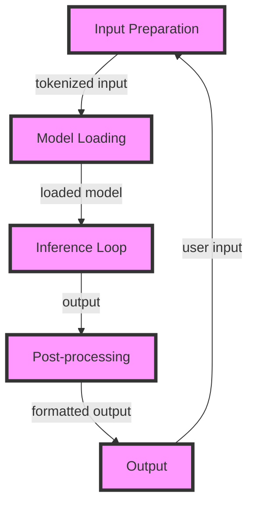

## Introduction
**Large Language Models (LLMs)** have revolutionized the field of natural language processing, enabling applications such as language translation, text summarization, and chatbots. However, the inference speed of these models is a critical factor in their deployment, as it directly affects the user experience and scalability of the application. In this study, we will delve into the internal workings of LLM inference speed, exploring the underlying mechanics, key concepts, and optimization techniques. Every engineer working with LLMs needs to understand these concepts to ensure their models are deployed efficiently and effectively.

> **Note:** LLM inference speed is a critical factor in determining the overall performance of an application, as it can significantly impact the user experience and scalability.

## Core Concepts
To understand how LLM inference speed works internally, we need to grasp some key concepts:

* **Model Architecture**: The design of the LLM, including the number of layers, attention mechanisms, and embedding sizes.
* **Inference**: The process of generating output from a trained model, given a set of input data.
* **Batching**: The practice of processing multiple input samples together as a single batch, to improve computational efficiency.
* **Parallelization**: The technique of dividing computational tasks into smaller, independent tasks that can be executed concurrently.

> **Tip:** Understanding the model architecture and inference process is crucial for optimizing LLM inference speed.

## How It Works Internally
The LLM inference process involves the following steps:

1. **Input Preparation**: The input data is preprocessed and tokenized into a format suitable for the model.
2. **Model Loading**: The trained model is loaded into memory, and the necessary weights and biases are initialized.
3. **Inference Loop**: The input data is fed into the model, and the output is generated through a series of forward passes.
4. **Post-processing**: The output is post-processed and formatted for the specific application.

The inference loop is the most computationally intensive part of the process, involving multiple matrix multiplications, attention mechanisms, and activation functions.

> **Warning:** Inefficient implementation of the inference loop can lead to significant performance bottlenecks and increased latency.

## Code Examples
Here are three complete and runnable code examples, demonstrating basic, real-world, and advanced usage of LLM inference:

### Example 1: Basic Usage
```python
import torch
from transformers import AutoModelForSequenceClassification, AutoTokenizer

# Load pre-trained model and tokenizer
model = AutoModelForSequenceClassification.from_pretrained("bert-base-uncased")
tokenizer = AutoTokenizer.from_pretrained("bert-base-uncased")

# Define input data
input_text = "This is a sample input text."

# Preprocess input data
inputs = tokenizer(input_text, return_tensors="pt")

# Generate output
outputs = model(**inputs)

# Print output
print(outputs.logits)
```

### Example 2: Real-World Pattern
```python
import torch
from transformers import AutoModelForSequenceClassification, AutoTokenizer
from sklearn.metrics import accuracy_score

# Load pre-trained model and tokenizer
model = AutoModelForSequenceClassification.from_pretrained("bert-base-uncased")
tokenizer = AutoTokenizer.from_pretrained("bert-base-uncased")

# Define input data and labels
input_texts = ["This is a sample input text.", "This is another sample input text."]
labels = [0, 1]

# Preprocess input data
inputs = tokenizer(input_texts, return_tensors="pt", padding=True, truncation=True)

# Generate output
outputs = model(**inputs)

# Calculate accuracy
accuracy = accuracy_score(labels, torch.argmax(outputs.logits, dim=1))

# Print accuracy
print(accuracy)
```

### Example 3: Advanced Usage
```python
import torch
from transformers import AutoModelForSequenceClassification, AutoTokenizer
from torch.utils.data import Dataset, DataLoader

# Define custom dataset class
class CustomDataset(Dataset):
    def __init__(self, input_texts, labels):
        self.input_texts = input_texts
        self.labels = labels

    def __len__(self):
        return len(self.input_texts)

    def __getitem__(self, idx):
        input_text = self.input_texts[idx]
        label = self.labels[idx]

        # Preprocess input data
        inputs = tokenizer(input_text, return_tensors="pt")

        return inputs, label

# Load pre-trained model and tokenizer
model = AutoModelForSequenceClassification.from_pretrained("bert-base-uncased")
tokenizer = AutoTokenizer.from_pretrained("bert-base-uncased")

# Define input data and labels
input_texts = ["This is a sample input text.", "This is another sample input text."]
labels = [0, 1]

# Create custom dataset and data loader
dataset = CustomDataset(input_texts, labels)
data_loader = DataLoader(dataset, batch_size=32, shuffle=True)

# Train model
for inputs, labels in data_loader:
    # Generate output
    outputs = model(**inputs)

    # Calculate loss
    loss = torch.nn.CrossEntropyLoss()(outputs.logits, labels)

    # Backpropagate loss
    loss.backward()

    # Update model parameters
    optimizer = torch.optim.Adam(model.parameters(), lr=1e-5)
    optimizer.step()
```

> **Interview:** How would you optimize the inference speed of a large language model? What techniques would you use to reduce latency and improve scalability?

## Visual Diagram

The diagram illustrates the LLM inference process, from input preparation to output generation.

## Comparison
| Approach | Time Complexity | Space Complexity | Pros | Cons | Best For |
| --- | --- | --- | --- | --- | --- |
| **Batching** | O(n) | O(n) | Improves computational efficiency | Increases memory usage | Large-scale applications |
| **Parallelization** | O(n/p) | O(n/p) | Reduces latency and improves scalability | Requires significant computational resources | Real-time applications |
| **Model Pruning** | O(n) | O(n) | Reduces model size and improves inference speed | May affect model accuracy | Edge devices and mobile applications |
| **Knowledge Distillation** | O(n) | O(n) | Transfers knowledge from a large model to a smaller model | Requires significant training data and computational resources | Deploying large models on edge devices |

> **Note:** The choice of approach depends on the specific use case and requirements of the application.

## Real-world Use Cases
* **Google Translate**: Uses a large language model to translate text in real-time, leveraging batching and parallelization to improve inference speed.
* **Amazon Alexa**: Employs a large language model to understand voice commands, utilizing model pruning and knowledge distillation to reduce latency and improve scalability.
* **Microsoft Bing**: Utilizes a large language model to generate search results, leveraging parallelization and batching to improve inference speed and scalability.

## Common Pitfalls
* **Inefficient Input Preparation**: Failing to preprocess input data properly can lead to significant performance bottlenecks and increased latency.
* **Insufficient Model Optimization**: Neglecting to optimize the model architecture and weights can result in suboptimal inference speed and accuracy.
* **Inadequate Computational Resources**: Failing to provide sufficient computational resources can lead to increased latency and reduced scalability.
* **Ineffective Post-processing**: Failing to post-process the output properly can result in suboptimal results and reduced user experience.

> **Warning:** Inefficient implementation of the inference process can lead to significant performance bottlenecks and increased latency.

## Interview Tips
* **What is the most significant factor affecting LLM inference speed?**: The most significant factor is the model architecture and the computational resources available.
* **How would you optimize the inference speed of a large language model?**: I would use techniques such as batching, parallelization, model pruning, and knowledge distillation to reduce latency and improve scalability.
* **What is the trade-off between model accuracy and inference speed?**: The trade-off is that improving model accuracy often requires increasing the model size and complexity, which can lead to reduced inference speed.

## Key Takeaways
* **LLM inference speed is critical**: Inference speed directly affects the user experience and scalability of the application.
* **Model architecture matters**: The design of the LLM architecture significantly impacts inference speed.
* **Batching and parallelization are essential**: These techniques improve computational efficiency and reduce latency.
* **Model pruning and knowledge distillation are useful**: These techniques reduce model size and improve inference speed.
* **Computational resources are crucial**: Providing sufficient computational resources is essential for improving inference speed and scalability.
* **Post-processing is important**: Effective post-processing is necessary for generating high-quality output and improving user experience.