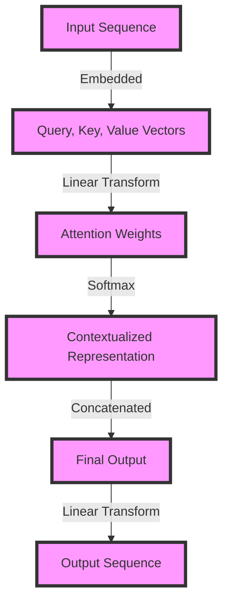

## Introduction
The **Transformer** architecture, introduced in the paper "Attention is All You Need" by Vaswani et al., has revolutionized the field of natural language processing (NLP) and beyond. At its core, the Transformer relies on **self-attention mechanisms**, which enable the model to weigh the importance of different input elements relative to each other. In this study guide, we'll delve into the internal workings of **Transformer attention heads**, exploring what they are, why they matter, and how they're used in real-world applications. Every engineer working with AI and machine learning should understand this concept, as it has become a fundamental building block of many state-of-the-art models.

## Core Concepts
To grasp the Transformer attention mechanism, it's essential to understand the following key concepts:
- **Self-Attention**: The ability of a model to attend to different parts of the input sequence simultaneously and weigh their importance.
- **Query (Q)**, **Key (K)**, and **Value (V)**: These are the three vectors used in the attention mechanism. The query vector represents the context in which the attention is being computed, the key vector represents the information being attended to, and the value vector represents the importance of that information.
- **Attention Weights**: These are the weights assigned to each element in the input sequence, indicating their relative importance.
- **Multi-Head Attention**: This refers to the use of multiple attention heads in parallel, each with its own set of weights, to jointly attend to information from different representation subspaces.

> **Note:** The Transformer architecture is primarily designed for sequence-to-sequence tasks, such as machine translation, where the input and output sequences are of different lengths.

## How It Works Internally
The Transformer attention mechanism works as follows:
1. **Input Embeddings**: The input sequence is first embedded into a higher-dimensional space using an embedding layer.
2. **Query, Key, and Value Vectors**: The embedded input sequence is then linearly transformed into query, key, and value vectors using different learnable weight matrices.
3. **Attention Weights**: The attention weights are computed by taking the dot product of the query and key vectors and applying a softmax function to obtain a probability distribution over the input sequence.
4. **Contextualized Representations**: The attention weights are then used to compute a weighted sum of the value vectors, resulting in a contextualized representation of the input sequence.
5. **Multi-Head Attention**: This process is repeated for each attention head, and the resulting contextualized representations are concatenated and linearly transformed to produce the final output.

> **Warning:** The Transformer attention mechanism can be computationally expensive, especially for long input sequences. This is because the attention weights are computed using a dot product, which has a time complexity of O(n^2), where n is the length of the input sequence.

## Code Examples
### Example 1: Basic Attention Mechanism
```python
import torch
import torch.nn as nn
import torch.nn.functional as F

class AttentionMechanism(nn.Module):
    def __init__(self, hidden_size):
        super(AttentionMechanism, self).__init__()
        self.query_linear = nn.Linear(hidden_size, hidden_size)
        self.key_linear = nn.Linear(hidden_size, hidden_size)
        self.value_linear = nn.Linear(hidden_size, hidden_size)

    def forward(self, query, key, value):
        # Compute attention weights
        attention_weights = torch.matmul(query, key.T) / math.sqrt(query.size(-1))
        attention_weights = F.softmax(attention_weights, dim=-1)

        # Compute contextualized representation
        contextualized_representation = torch.matmul(attention_weights, value)

        return contextualized_representation

# Initialize attention mechanism
attention_mechanism = AttentionMechanism(hidden_size=128)

# Initialize input tensors
query = torch.randn(1, 10, 128)
key = torch.randn(1, 10, 128)
value = torch.randn(1, 10, 128)

# Compute attention
contextualized_representation = attention_mechanism(query, key, value)
```

### Example 2: Multi-Head Attention
```python
import torch
import torch.nn as nn
import torch.nn.functional as F

class MultiHeadAttention(nn.Module):
    def __init__(self, hidden_size, num_heads):
        super(MultiHeadAttention, self).__init__()
        self.num_heads = num_heads
        self.hidden_size = hidden_size
        self.query_linear = nn.Linear(hidden_size, hidden_size)
        self.key_linear = nn.Linear(hidden_size, hidden_size)
        self.value_linear = nn.Linear(hidden_size, hidden_size)

    def forward(self, query, key, value):
        # Compute attention weights for each head
        attention_weights = []
        for i in range(self.num_heads):
            query_head = self.query_linear(query)
            key_head = self.key_linear(key)
            value_head = self.value_linear(value)

            attention_weights_head = torch.matmul(query_head, key_head.T) / math.sqrt(query_head.size(-1))
            attention_weights_head = F.softmax(attention_weights_head, dim=-1)

            attention_weights.append(attention_weights_head)

        # Compute contextualized representation for each head
        contextualized_representations = []
        for i in range(self.num_heads):
            contextualized_representation = torch.matmul(attention_weights[i], value)
            contextualized_representations.append(contextualized_representation)

        # Concatenate and linearly transform contextualized representations
        contextualized_representation = torch.cat(contextualized_representations, dim=-1)
        contextualized_representation = nn.Linear(contextualized_representation.size(-1), self.hidden_size)(contextualized_representation)

        return contextualized_representation

# Initialize multi-head attention
multi_head_attention = MultiHeadAttention(hidden_size=128, num_heads=8)

# Initialize input tensors
query = torch.randn(1, 10, 128)
key = torch.randn(1, 10, 128)
value = torch.randn(1, 10, 128)

# Compute attention
contextualized_representation = multi_head_attention(query, key, value)
```

### Example 3: Transformer Encoder Layer
```python
import torch
import torch.nn as nn
import torch.nn.functional as F

class TransformerEncoderLayer(nn.Module):
    def __init__(self, hidden_size, num_heads):
        super(TransformerEncoderLayer, self).__init__()
        self.self_attention = MultiHeadAttention(hidden_size, num_heads)
        self.feed_forward = nn.Linear(hidden_size, hidden_size)

    def forward(self, input_sequence):
        # Compute self-attention
        attention_output = self.self_attention(input_sequence, input_sequence, input_sequence)

        # Compute feed-forward output
        feed_forward_output = F.relu(self.feed_forward(attention_output))

        return feed_forward_output

# Initialize transformer encoder layer
transformer_encoder_layer = TransformerEncoderLayer(hidden_size=128, num_heads=8)

# Initialize input tensor
input_sequence = torch.randn(1, 10, 128)

# Compute output
output = transformer_encoder_layer(input_sequence)
```

> **Tip:** The Transformer encoder layer can be stacked multiple times to form a deep neural network. This allows the model to capture complex patterns in the input sequence.

## Visual Diagram

The above diagram illustrates the Transformer attention mechanism, including the embedding layer, linear transformations, attention weights computation, and the final output.

## Comparison
| Approach | Time Complexity | Space Complexity | Pros | Cons | Best For |
| --- | --- | --- | --- | --- | --- |
| Self-Attention | O(n^2) | O(n^2) | Captures long-range dependencies, parallelizable | Computationally expensive | Sequence-to-sequence tasks, machine translation |
| Local Attention | O(n) | O(n) | Fast, efficient | Limited contextual understanding | Text classification, sentiment analysis |
| Hierarchical Attention | O(n log n) | O(n log n) | Balances efficiency and contextual understanding | More complex to implement | Document summarization, question answering |
| Graph Attention | O(n^2) | O(n^2) | Handles graph-structured data, flexible | Computationally expensive | Graph classification, graph regression |

> **Interview:** Can you explain the difference between self-attention and local attention? How would you choose between the two for a given task?

## Real-world Use Cases
1. **Machine Translation**: The Transformer attention mechanism has been widely adopted in machine translation tasks, such as Google Translate, due to its ability to capture long-range dependencies in input sequences.
2. **Text Summarization**: The attention mechanism can be used to summarize long documents by attending to the most important sentences or phrases.
3. **Question Answering**: The attention mechanism can be used to attend to relevant parts of a passage when answering a question.

## Common Pitfalls
1. **Insufficient Contextual Understanding**: The attention mechanism may not capture sufficient contextual information, leading to poor performance on tasks that require a deep understanding of the input sequence.
2. **Overfitting**: The attention mechanism can overfit to the training data, especially when the input sequences are long.
3. **Computational Expense**: The attention mechanism can be computationally expensive, especially for long input sequences.

> **Warning:** The attention mechanism can be sensitive to the choice of hyperparameters, such as the number of attention heads and the hidden size.

## Interview Tips
1. **Explain the Attention Mechanism**: Be prepared to explain the Transformer attention mechanism, including the self-attention and multi-head attention variants.
2. **Discuss the Time and Space Complexity**: Be prepared to discuss the time and space complexity of the attention mechanism, including the trade-offs between different approaches.
3. **Provide Real-world Examples**: Be prepared to provide real-world examples of the attention mechanism, including its applications in machine translation, text summarization, and question answering.

## Key Takeaways
* The Transformer attention mechanism is a powerful tool for capturing long-range dependencies in input sequences.
* The self-attention and multi-head attention variants have different strengths and weaknesses, and the choice of approach depends on the specific task and dataset.
* The attention mechanism can be computationally expensive, and careful consideration must be given to the choice of hyperparameters and the design of the model architecture.
* The attention mechanism has many real-world applications, including machine translation, text summarization, and question answering.
* The attention mechanism can be sensitive to the choice of hyperparameters, and careful tuning is required to achieve optimal performance.
* The attention mechanism can be used in combination with other techniques, such as convolutional neural networks and recurrent neural networks, to achieve state-of-the-art results on a wide range of tasks.