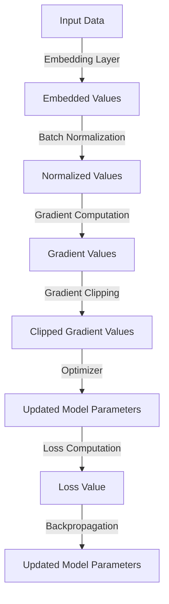

## Introduction
Optimizing embeddings-based PyTorch tensor operations is crucial for achieving high-performance and efficient processing of large-scale machine learning models, particularly in production environments. **Embeddings** are a fundamental component of many natural language processing (NLP) and computer vision models, allowing the representation of categorical variables as dense vectors. However, as the size of the input data and the complexity of the models increase, the computational costs associated with embeddings-based operations can become a significant bottleneck. In this study, we will delve into the best practices for optimizing embeddings-based PyTorch tensor operations, exploring the core concepts, internal mechanics, and practical examples that can help senior engineers and researchers improve the performance of their models.

> **Note:** Optimizing embeddings-based PyTorch tensor operations is essential for achieving high-performance and efficient processing of large-scale machine learning models.

## Core Concepts
To optimize embeddings-based PyTorch tensor operations, it is essential to understand the core concepts involved. **PyTorch** is a popular open-source machine learning library that provides a dynamic computation graph and automatic differentiation. **Tensors** are multi-dimensional arrays that are used to represent the input and output data of machine learning models. **Embeddings** are a type of tensor that represents categorical variables as dense vectors.

* **Embedding Layer**: An embedding layer is a type of neural network layer that maps categorical variables to dense vectors. The embedding layer is typically represented as a matrix, where each row corresponds to a unique categorical value, and each column corresponds to a dimension of the embedding space.
* **Tensor Operations**: Tensor operations are the basic building blocks of machine learning computations. Common tensor operations include matrix multiplication, convolution, and pooling.
* **Optimization Techniques**: Optimization techniques are methods used to improve the performance of machine learning models. Common optimization techniques include gradient descent, stochastic gradient descent, and batch normalization.

> **Tip:** Understanding the core concepts of PyTorch, tensors, and embeddings is essential for optimizing embeddings-based PyTorch tensor operations.

## How It Works Internally
To optimize embeddings-based PyTorch tensor operations, it is essential to understand how the computations are performed internally. PyTorch uses a dynamic computation graph to represent the dependencies between tensors. When a tensor operation is performed, PyTorch creates a new tensor that represents the output of the operation.

The following steps illustrate how PyTorch performs tensor operations internally:

1. **Tensor Creation**: PyTorch creates a new tensor to represent the output of the operation.
2. **Dependency Graph**: PyTorch creates a dependency graph to represent the dependencies between the input tensors and the output tensor.
3. **Computation**: PyTorch performs the computation by iterating over the input tensors and applying the operation to each element.
4. **Gradient Computation**: PyTorch computes the gradient of the loss with respect to the input tensors using automatic differentiation.

> **Warning:** Understanding the internal mechanics of PyTorch tensor operations is essential for optimizing embeddings-based PyTorch tensor operations.

## Code Examples
The following code examples illustrate how to optimize embeddings-based PyTorch tensor operations.

### Example 1: Basic Embedding Layer
```python
import torch
import torch.nn as nn

# Define the embedding layer
embedding_layer = nn.Embedding(num_embeddings=10, embedding_dim=5)

# Create a tensor to represent the input data
input_data = torch.tensor([1, 2, 3, 4, 5])

# Perform the embedding operation
output = embedding_layer(input_data)

print(output.shape)
```
This code example defines a basic embedding layer with 10 categorical values and an embedding dimension of 5. The input data is a tensor representing the categorical values, and the output is a tensor representing the embedded values.

### Example 2: Optimizing Embedding Layer with Batch Normalization
```python
import torch
import torch.nn as nn

# Define the embedding layer with batch normalization
class EmbeddingLayer(nn.Module):
    def __init__(self, num_embeddings, embedding_dim):
        super(EmbeddingLayer, self).__init__()
        self.embedding = nn.Embedding(num_embeddings, embedding_dim)
        self.batch_norm = nn.BatchNorm1d(embedding_dim)

    def forward(self, x):
        x = self.embedding(x)
        x = self.batch_norm(x)
        return x

# Create a tensor to represent the input data
input_data = torch.tensor([1, 2, 3, 4, 5])

# Create an instance of the embedding layer
embedding_layer = EmbeddingLayer(num_embeddings=10, embedding_dim=5)

# Perform the embedding operation
output = embedding_layer(input_data)

print(output.shape)
```
This code example defines an embedding layer with batch normalization. The batch normalization layer is applied after the embedding layer to normalize the embedded values.

### Example 3: Optimizing Embedding Layer with Gradient Clipping
```python
import torch
import torch.nn as nn

# Define the embedding layer with gradient clipping
class EmbeddingLayer(nn.Module):
    def __init__(self, num_embeddings, embedding_dim):
        super(EmbeddingLayer, self).__init__()
        self.embedding = nn.Embedding(num_embeddings, embedding_dim)

    def forward(self, x):
        x = self.embedding(x)
        return x

# Create a tensor to represent the input data
input_data = torch.tensor([1, 2, 3, 4, 5])

# Create an instance of the embedding layer
embedding_layer = EmbeddingLayer(num_embeddings=10, embedding_dim=5)

# Define the loss function and optimizer
criterion = nn.MSELoss()
optimizer = torch.optim.Adam(embedding_layer.parameters(), lr=0.01)

# Perform the embedding operation and compute the loss
output = embedding_layer(input_data)
loss = criterion(output, torch.randn_like(output))

# Perform gradient clipping
optimizer.zero_grad()
loss.backward()
torch.nn.utils.clip_grad_norm_(embedding_layer.parameters(), max_norm=1.0)
optimizer.step()

print(loss.item())
```
This code example defines an embedding layer with gradient clipping. The gradient clipping is applied after computing the loss and before updating the model parameters.

## Visual Diagram

This diagram illustrates the flow of computations involved in optimizing embeddings-based PyTorch tensor operations. The input data is first embedded using an embedding layer, followed by batch normalization and gradient computation. The gradient values are then clipped using gradient clipping, and the model parameters are updated using an optimizer. The loss value is computed using a loss function, and the model parameters are updated using backpropagation.

> **Interview:** Can you explain how PyTorch performs tensor operations internally? How does the dynamic computation graph work?

## Comparison
The following table compares the different optimization techniques for embeddings-based PyTorch tensor operations.

| Optimization Technique | Time Complexity | Space Complexity | Pros | Cons |
| --- | --- | --- | --- | --- |
| Batch Normalization | O(1) | O(1) | Improves stability and convergence | May not work well with small batch sizes |
| Gradient Clipping | O(1) | O(1) | Prevents exploding gradients | May affect the convergence of the model |
| Weight Decay | O(1) | O(1) | Regularizes the model parameters | May affect the convergence of the model |
| Dropout | O(1) | O(1) | Regularizes the model parameters | May affect the convergence of the model |

> **Warning:** Choosing the right optimization technique depends on the specific problem and model architecture.

## Real-world Use Cases
The following are some real-world use cases of optimizing embeddings-based PyTorch tensor operations.

* **Natural Language Processing**: Optimizing embeddings-based PyTorch tensor operations is essential for achieving high-performance and efficient processing of large-scale NLP models.
* **Computer Vision**: Optimizing embeddings-based PyTorch tensor operations is essential for achieving high-performance and efficient processing of large-scale computer vision models.
* **Recommendation Systems**: Optimizing embeddings-based PyTorch tensor operations is essential for achieving high-performance and efficient processing of large-scale recommendation systems.

> **Tip:** Optimizing embeddings-based PyTorch tensor operations can improve the performance of a wide range of machine learning models.

## Common Pitfalls
The following are some common pitfalls to avoid when optimizing embeddings-based PyTorch tensor operations.

* **Overfitting**: Overfitting occurs when the model is too complex and fits the training data too well. To avoid overfitting, use regularization techniques such as dropout and weight decay.
* **Underfitting**: Underfitting occurs when the model is too simple and does not fit the training data well. To avoid underfitting, use a more complex model or increase the number of training iterations.
* **Vanishing Gradients**: Vanishing gradients occur when the gradients of the loss with respect to the model parameters become too small. To avoid vanishing gradients, use gradient clipping or batch normalization.

> **Warning:** Avoiding common pitfalls is essential for achieving high-performance and efficient processing of large-scale machine learning models.

## Interview Tips
The following are some interview tips for optimizing embeddings-based PyTorch tensor operations.

* **Explain the concept of embeddings**: Explain how embeddings work and how they are used in machine learning models.
* **Explain the concept of batch normalization**: Explain how batch normalization works and how it is used to improve the stability and convergence of machine learning models.
* **Explain the concept of gradient clipping**: Explain how gradient clipping works and how it is used to prevent exploding gradients.

> **Interview:** Can you explain how to optimize embeddings-based PyTorch tensor operations? What are some common pitfalls to avoid?

## Key Takeaways
The following are some key takeaways for optimizing embeddings-based PyTorch tensor operations.

* **Use batch normalization to improve stability and convergence**: Batch normalization is a technique that normalizes the input data to a layer, which can improve the stability and convergence of the model.
* **Use gradient clipping to prevent exploding gradients**: Gradient clipping is a technique that clips the gradients of the loss with respect to the model parameters, which can prevent exploding gradients.
* **Use weight decay to regularize the model parameters**: Weight decay is a technique that adds a penalty term to the loss function to regularize the model parameters.
* **Use dropout to regularize the model parameters**: Dropout is a technique that randomly drops out a fraction of the model parameters during training, which can regularize the model parameters.
* **Avoid overfitting by using regularization techniques**: Overfitting occurs when the model is too complex and fits the training data too well. To avoid overfitting, use regularization techniques such as dropout and weight decay.
* **Avoid underfitting by using a more complex model or increasing the number of training iterations**: Underfitting occurs when the model is too simple and does not fit the training data well. To avoid underfitting, use a more complex model or increase the number of training iterations.
* **Avoid vanishing gradients by using gradient clipping or batch normalization**: Vanishing gradients occur when the gradients of the loss with respect to the model parameters become too small. To avoid vanishing gradients, use gradient clipping or batch normalization.

> **Note:** Optimizing embeddings-based PyTorch tensor operations is essential for achieving high-performance and efficient processing of large-scale machine learning models.