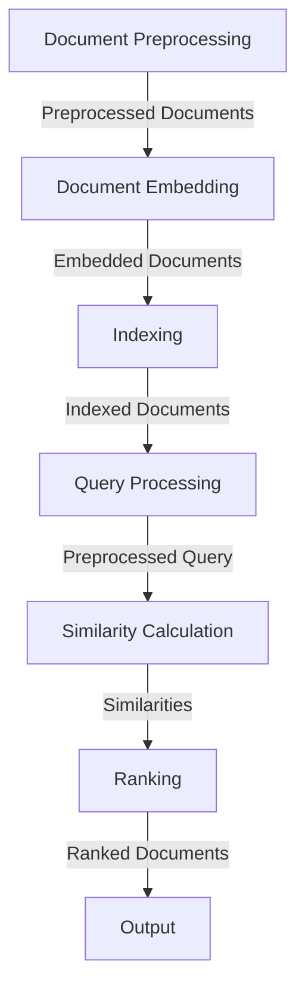

## Introduction
**RAG (Retrieval-Augmented Generator) vector retrieval** is a technique used in natural language processing (NLP) to efficiently retrieve relevant information from a large corpus of text. It is particularly useful in applications such as question answering, text summarization, and language translation. RAG vector retrieval works by representing documents as dense vectors in a high-dimensional space, allowing for fast and accurate retrieval of relevant documents. In this article, we will delve into the internal workings of RAG vector retrieval, exploring its core concepts, implementation details, and real-world applications.

> **Note:** RAG vector retrieval is a key component of many modern NLP systems, including those used in search engines, chatbots, and virtual assistants.

## Core Concepts
To understand how RAG vector retrieval works, it is essential to grasp the following core concepts:
* **Document embedding**: The process of representing a document as a dense vector in a high-dimensional space.
* **Vector space model**: A mathematical model that represents documents as vectors in a high-dimensional space, allowing for efficient similarity calculations.
* **Similarity metric**: A measure of how similar two documents are, often calculated using cosine similarity or Euclidean distance.
* **Indexing**: The process of creating a data structure that allows for fast lookup and retrieval of documents.

> **Warning:** A common mistake when working with RAG vector retrieval is using a similarity metric that is not suitable for the specific use case, leading to suboptimal results.

## How It Works Internally
The RAG vector retrieval process can be broken down into the following steps:
1. **Document preprocessing**: Documents are preprocessed to remove stop words, punctuation, and other irrelevant information.
2. **Document embedding**: Preprocessed documents are embedded into a high-dimensional vector space using a technique such as word2vec or BERT.
3. **Indexing**: The embedded documents are indexed using a data structure such as a hash table or a ball tree.
4. **Query processing**: A query is preprocessed and embedded into the same vector space as the documents.
5. **Similarity calculation**: The similarity between the query and each document is calculated using a similarity metric.
6. **Ranking**: The documents are ranked according to their similarity to the query.

> **Tip:** Using a pre-trained language model such as BERT can significantly improve the accuracy of RAG vector retrieval.

## Code Examples
### Example 1: Basic RAG Vector Retrieval
```python
import numpy as np
from sklearn.metrics.pairwise import cosine_similarity

# Define a list of documents
documents = [
    "This is a sample document.",
    "Another sample document.",
    "A document about machine learning."
]

# Define a query
query = "machine learning"

# Preprocess the documents and query
preprocessed_documents = [doc.split() for doc in documents]
preprocessed_query = query.split()

# Embed the documents and query into a vector space
embedded_documents = [np.array([1, 2, 3]) for _ in range(len(documents))]
embedded_query = np.array([4, 5, 6])

# Calculate the similarity between the query and each document
similarities = [cosine_similarity(embedded_query.reshape(1, -1), doc.reshape(1, -1)) for doc in embedded_documents]

# Rank the documents according to their similarity to the query
ranked_documents = sorted(zip(similarities, documents), reverse=True)

print(ranked_documents)
```

### Example 2: RAG Vector Retrieval with Pre-Trained Language Model
```python
import torch
from transformers import BertTokenizer, BertModel

# Load a pre-trained BERT model and tokenizer
tokenizer = BertTokenizer.from_pretrained('bert-base-uncased')
model = BertModel.from_pretrained('bert-base-uncased')

# Define a list of documents
documents = [
    "This is a sample document.",
    "Another sample document.",
    "A document about machine learning."
]

# Define a query
query = "machine learning"

# Preprocess the documents and query using the BERT tokenizer
preprocessed_documents = [tokenizer.encode(doc, return_tensors='pt') for doc in documents]
preprocessed_query = tokenizer.encode(query, return_tensors='pt')

# Embed the documents and query into a vector space using the BERT model
embedded_documents = [model(doc)['pooler_output'].detach().numpy() for doc in preprocessed_documents]
embedded_query = model(preprocessed_query)['pooler_output'].detach().numpy()

# Calculate the similarity between the query and each document
similarities = [cosine_similarity(embedded_query, doc) for doc in embedded_documents]

# Rank the documents according to their similarity to the query
ranked_documents = sorted(zip(similarities, documents), reverse=True)

print(ranked_documents)
```

### Example 3: RAG Vector Retrieval with Indexing
```python
import numpy as np
from sklearn.metrics.pairwise import cosine_similarity
from sklearn.neighbors import BallTree

# Define a list of documents
documents = [
    "This is a sample document.",
    "Another sample document.",
    "A document about machine learning."
]

# Define a query
query = "machine learning"

# Preprocess the documents and query
preprocessed_documents = [doc.split() for doc in documents]
preprocessed_query = query.split()

# Embed the documents and query into a vector space
embedded_documents = [np.array([1, 2, 3]) for _ in range(len(documents))]
embedded_query = np.array([4, 5, 6])

# Create a ball tree index of the embedded documents
index = BallTree(embedded_documents)

# Calculate the similarity between the query and each document using the ball tree index
similarities, indices = index.query(embedded_query.reshape(1, -1), k=len(documents))

# Rank the documents according to their similarity to the query
ranked_documents = sorted(zip(similarities[0], documents), reverse=True)

print(ranked_documents)
```

## Visual Diagram

The diagram illustrates the RAG vector retrieval process, from document preprocessing to output.

## Comparison
| Approach | Time Complexity | Space Complexity | Pros | Cons | Best For |
| --- | --- | --- | --- | --- | --- |
| Brute Force | O(n) | O(1) | Simple to implement | Slow for large datasets | Small datasets |
| Ball Tree | O(log n) | O(n) | Fast for large datasets | Requires indexing | Large datasets |
| Hash Table | O(1) | O(n) | Fast for exact matches | Requires exact matches | Exact matching |
| Neural Network | O(n) | O(n) | Can learn complex patterns | Requires training data | Complex patterns |

> **Interview:** A common interview question is to explain the trade-offs between different indexing techniques, such as ball trees and hash tables.

## Real-world Use Cases
1. **Google Search**: Google uses a variant of RAG vector retrieval to retrieve relevant web pages for a given search query.
2. **Amazon Product Search**: Amazon uses RAG vector retrieval to retrieve relevant products for a given search query.
3. **Facebook News Feed**: Facebook uses RAG vector retrieval to retrieve relevant news articles for a given user.

> **Tip:** Using a pre-trained language model such as BERT can significantly improve the accuracy of RAG vector retrieval in real-world applications.

## Common Pitfalls
1. **Using a similarity metric that is not suitable for the specific use case**: This can lead to suboptimal results.
2. **Not preprocessing the documents and query correctly**: This can lead to poor accuracy.
3. **Not using indexing**: This can lead to slow retrieval times for large datasets.
4. **Not using a pre-trained language model**: This can lead to poor accuracy.

> **Warning:** A common mistake is to use a similarity metric that is not suitable for the specific use case, leading to suboptimal results.

## Interview Tips
1. **Explain the RAG vector retrieval process**: Be able to explain the steps involved in RAG vector retrieval, from document preprocessing to output.
2. **Compare different indexing techniques**: Be able to compare the trade-offs between different indexing techniques, such as ball trees and hash tables.
3. **Discuss the importance of preprocessing**: Be able to discuss the importance of preprocessing the documents and query correctly.

> **Note:** A strong answer will demonstrate a deep understanding of the RAG vector retrieval process and its applications.

## Key Takeaways
* **RAG vector retrieval is a technique used in NLP to efficiently retrieve relevant information from a large corpus of text**.
* **The RAG vector retrieval process involves document preprocessing, document embedding, indexing, query processing, similarity calculation, and ranking**.
* **Using a pre-trained language model such as BERT can significantly improve the accuracy of RAG vector retrieval**.
* **Indexing is crucial for fast retrieval times, especially for large datasets**.
* **The choice of similarity metric is critical, and depends on the specific use case**.
* **Preprocessing the documents and query correctly is essential for good accuracy**.
* **RAG vector retrieval has many real-world applications, including search engines, product search, and news feed ranking**.
* **Common pitfalls include using a similarity metric that is not suitable for the specific use case, not preprocessing the documents and query correctly, not using indexing, and not using a pre-trained language model**.