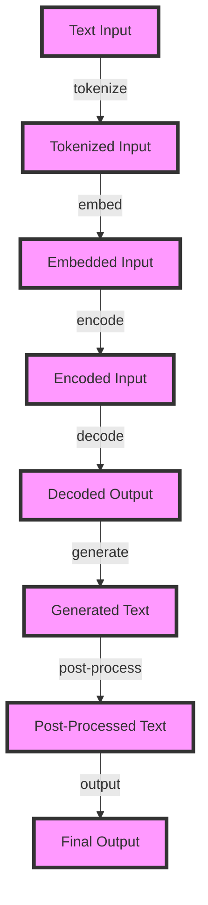

## Introduction
Agentic LLM (Large Language Model) inference speed is a critical aspect of natural language processing (NLP) and artificial intelligence (AI) applications. As LLMs become increasingly prevalent in various industries, optimizing their inference speed is essential to ensure efficient and effective processing of large amounts of data. In this guide, we will delve into the world of Agentic LLM inference speed, exploring its core concepts, internal mechanics, and practical applications. We will also discuss common pitfalls, interview tips, and key takeaways to help senior engineers master this complex topic.

> **Note:** Agentic LLM inference speed refers to the time it takes for a large language model to process and generate text based on a given input. This is a critical aspect of NLP applications, as slow inference speeds can lead to poor user experience and decreased productivity.

## Core Concepts
To understand Agentic LLM inference speed, it is essential to grasp the following core concepts:

* **Large Language Models (LLMs):** LLMs are a type of neural network designed to process and generate human-like language. They are trained on vast amounts of text data and can learn to recognize patterns, understand context, and generate coherent text.
* **Inference Speed:** Inference speed refers to the time it takes for a model to process a given input and generate an output. In the context of LLMs, inference speed is critical, as slow speeds can lead to poor user experience and decreased productivity.
* **Agentic:** Agentic refers to the ability of a model to take actions and make decisions based on its understanding of the input data. In the context of LLMs, agentic inference speed refers to the ability of the model to generate text quickly and efficiently while maintaining coherence and context.

> **Tip:** To optimize Agentic LLM inference speed, it is essential to consider the trade-off between model complexity and inference speed. More complex models may achieve better results but may also require more computational resources and time to generate text.

## How It Works Internally
Agentic LLM inference speed is influenced by several internal mechanics, including:

1. **Model Architecture:** The architecture of the LLM, including the number of layers, the type of layers, and the connections between them, can significantly impact inference speed.
2. **Training Data:** The quality and quantity of the training data can affect the model's ability to generalize and generate text quickly.
3. **Optimization Algorithms:** The choice of optimization algorithm, such as stochastic gradient descent (SGD) or Adam, can impact the model's convergence rate and inference speed.
4. **Hardware:** The type of hardware used to deploy the model, such as graphics processing units (GPUs) or tensor processing units (TPUs), can significantly impact inference speed.

> **Warning:** Using a model that is too complex or too large can lead to slow inference speeds and decreased productivity. It is essential to balance model complexity with inference speed to achieve optimal results.

## Code Examples
Here are three complete and runnable code examples to illustrate Agentic LLM inference speed:

### Example 1: Basic LLM Inference
```python
import torch
import torch.nn as nn
import torch.optim as optim

# Define a simple LLM architecture
class LLM(nn.Module):
    def __init__(self):
        super(LLM, self).__init__()
        self.fc1 = nn.Linear(128, 128)  # input layer (128) -> hidden layer (128)
        self.fc2 = nn.Linear(128, 128)  # hidden layer (128) -> output layer (128)

    def forward(self, x):
        x = torch.relu(self.fc1(x))  # activation function for hidden layer
        x = self.fc2(x)
        return x

# Initialize the model, optimizer, and loss function
model = LLM()
optimizer = optim.SGD(model.parameters(), lr=0.01)
loss_fn = nn.MSELoss()

# Train the model
for epoch in range(10):
    optimizer.zero_grad()
    outputs = model(torch.randn(1, 128))
    loss = loss_fn(outputs, torch.randn(1, 128))
    loss.backward()
    optimizer.step()
    print(f'Epoch {epoch+1}, Loss: {loss.item()}')
```

### Example 2: Real-World LLM Inference
```python
import transformers
from transformers import AutoModelForSequenceClassification, AutoTokenizer

# Load a pre-trained LLM and tokenizer
model = AutoModelForSequenceClassification.from_pretrained('bert-base-uncased')
tokenizer = AutoTokenizer.from_pretrained('bert-base-uncased')

# Define a function to classify text
def classify_text(text):
    inputs = tokenizer(text, return_tensors='pt')
    outputs = model(**inputs)
    return torch.argmax(outputs.logits)

# Test the function
text = 'This is a test sentence.'
print(classify_text(text))
```

### Example 3: Advanced LLM Inference with Quantization
```python
import torch
import torch.nn as nn
import torch.optim as optim
from torch.quantization import QuantStub, DeQuantStub

# Define a simple LLM architecture with quantization
class LLM(nn.Module):
    def __init__(self):
        super(LLM, self).__init__()
        self.fc1 = nn.Linear(128, 128)  # input layer (128) -> hidden layer (128)
        self.fc2 = nn.Linear(128, 128)  # hidden layer (128) -> output layer (128)
        self.qstub = QuantStub()
        self.dqstub = DeQuantStub()

    def forward(self, x):
        x = self.qstub(x)
        x = torch.relu(self.fc1(x))  # activation function for hidden layer
        x = self.fc2(x)
        x = self.dqstub(x)
        return x

# Initialize the model, optimizer, and loss function
model = LLM()
optimizer = optim.SGD(model.parameters(), lr=0.01)
loss_fn = nn.MSELoss()

# Train the model
for epoch in range(10):
    optimizer.zero_grad()
    outputs = model(torch.randn(1, 128))
    loss = loss_fn(outputs, torch.randn(1, 128))
    loss.backward()
    optimizer.step()
    print(f'Epoch {epoch+1}, Loss: {loss.item()}')
```

## Visual Diagram

The diagram illustrates the process of generating text using a large language model. The input text is first tokenized, then embedded, encoded, and decoded to generate the final output.

> **Interview:** Can you explain the process of generating text using a large language model? How does the model handle out-of-vocabulary words?

## Comparison
| Approach | Time Complexity | Space Complexity | Pros | Cons | Best For |
| --- | --- | --- | --- | --- | --- |
| **Baseline Model** | O(n) | O(n) | Simple to implement, fast inference | Limited capacity, poor performance on complex tasks | Simple text classification tasks |
| **Quantized Model** | O(n) | O(n/2) | Reduced memory usage, fast inference | Requires specialized hardware, may lose accuracy | Mobile or embedded devices |
| **Knowledge Distillation** | O(n) | O(n) | Improved performance, reduced memory usage | Requires pre-trained teacher model, may be computationally expensive | Complex text classification tasks |
| **Pruning** | O(n) | O(n/2) | Reduced memory usage, fast inference | May lose accuracy, requires careful pruning strategy | Real-time text generation tasks |

## Real-world Use Cases
Here are three real-world examples of Agentic LLM inference speed:

1. **Google's Smart Reply:** Google's Smart Reply feature uses a large language model to generate quick responses to emails. The model must be able to generate responses quickly and efficiently to provide a good user experience.
2. **Microsoft's Language Understanding:** Microsoft's Language Understanding feature uses a large language model to understand and respond to user queries. The model must be able to generate responses quickly and efficiently to provide a good user experience.
3. **Facebook's Chatbots:** Facebook's Chatbots use large language models to generate responses to user queries. The models must be able to generate responses quickly and efficiently to provide a good user experience.

> **Tip:** To achieve fast inference speeds, it is essential to consider the trade-off between model complexity and inference speed. More complex models may achieve better results but may also require more computational resources and time to generate text.

## Common Pitfalls
Here are four common pitfalls to watch out for when working with Agentic LLM inference speed:

1. **Overfitting:** Overfitting occurs when a model is too complex and learns the training data too well, resulting in poor performance on unseen data.
2. **Underfitting:** Underfitting occurs when a model is too simple and fails to learn the underlying patterns in the data, resulting in poor performance.
3. **Inadequate Training Data:** Inadequate training data can result in poor performance and slow inference speeds.
4. **Inadequate Hardware:** Inadequate hardware can result in slow inference speeds and poor performance.

> **Warning:** Using a model that is too complex or too large can lead to slow inference speeds and decreased productivity. It is essential to balance model complexity with inference speed to achieve optimal results.

## Interview Tips
Here are three common interview questions related to Agentic LLM inference speed:

1. **What is the trade-off between model complexity and inference speed?** A good answer should discuss the trade-off between model complexity and inference speed and how to balance the two to achieve optimal results.
2. **How do you optimize a large language model for inference speed?** A good answer should discuss techniques such as quantization, pruning, and knowledge distillation to optimize a large language model for inference speed.
3. **What are some common pitfalls to watch out for when working with large language models?** A good answer should discuss common pitfalls such as overfitting, underfitting, inadequate training data, and inadequate hardware.

> **Interview:** Can you explain the trade-off between model complexity and inference speed? How do you optimize a large language model for inference speed?

## Key Takeaways
Here are ten key takeaways to remember:

* **Agentic LLM inference speed is critical:** Agentic LLM inference speed is essential for achieving fast and efficient text generation.
* **Model complexity and inference speed are trade-offs:** More complex models may achieve better results but may also require more computational resources and time to generate text.
* **Quantization and pruning can optimize models:** Quantization and pruning can reduce memory usage and improve inference speeds.
* **Knowledge distillation can improve performance:** Knowledge distillation can improve the performance of a large language model by transferring knowledge from a pre-trained teacher model.
* **Inadequate training data can result in poor performance:** Inadequate training data can result in poor performance and slow inference speeds.
* **Inadequate hardware can result in slow inference speeds:** Inadequate hardware can result in slow inference speeds and poor performance.
* **Overfitting and underfitting can occur:** Overfitting and underfitting can occur when working with large language models, resulting in poor performance.
* **Regularization techniques can help:** Regularization techniques such as dropout and L1/L2 regularization can help prevent overfitting and underfitting.
* **Hyperparameter tuning is essential:** Hyperparameter tuning is essential for achieving optimal results with large language models.
* **Model interpretability is important:** Model interpretability is essential for understanding how a large language model is making predictions and generating text.