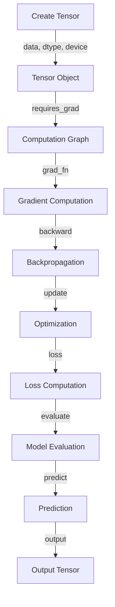

## Introduction
PyTorch is a popular open-source machine learning library developed by Facebook's AI Research Lab (FAIR). It provides a dynamic computation graph and is particularly well-suited for rapid prototyping and research. One of the key features of PyTorch is its support for tensor operations, which are essential for building and training neural networks. In this guide, we will delve into the world of PyTorch tensor operations, exploring what they are, why they matter, and their real-world relevance.

PyTorch tensor operations are crucial for building and training neural networks, as they enable efficient computation and manipulation of multi-dimensional arrays. Tensors are the fundamental data structure in PyTorch, and understanding how to work with them is essential for any aspiring machine learning engineer. With the increasing demand for AI and machine learning solutions, PyTorch tensor operations have become a vital skill for any software engineer looking to work in the field.

> **Note:** PyTorch tensor operations are not limited to machine learning; they can also be used for scientific computing, data analysis, and other applications that require efficient numerical computations.

## Core Concepts
Before diving into the details of PyTorch tensor operations, it's essential to understand some core concepts. A **tensor** is a multi-dimensional array of numerical values, similar to a NumPy array. PyTorch provides various tensor operations, including **creation**, **indexing**, **slicing**, **concatenation**, and **element-wise operations**.

*   **Creation**: Tensors can be created using various methods, such as `torch.tensor()`, `torch.zeros()`, `torch.ones()`, and `torch.rand()`.
*   **Indexing**: Tensors can be indexed using square brackets `[]`, similar to NumPy arrays.
*   **Slicing**: Tensors can be sliced using the same syntax as NumPy arrays, with support for negative indices and step sizes.
*   **Concatenation**: Tensors can be concatenated using the `torch.cat()` function, which allows you to combine multiple tensors along a specified dimension.
*   **Element-wise operations**: PyTorch provides various element-wise operations, such as addition, subtraction, multiplication, and division, which can be performed using the corresponding operator (`+`, `-`, `*`, `/`) or the `torch.add()`, `torch.sub()`, `torch.mul()`, and `torch.div()` functions.

> **Warning:** When working with tensors, it's essential to pay attention to the **data type** and **device** (CPU or GPU) to avoid potential issues.

## How It Works Internally
PyTorch tensor operations are built on top of the **Tensor** class, which provides a dynamic computation graph. When you create a tensor, PyTorch creates a **Tensor** object, which contains the tensor's **data**, **dtype**, **device**, and **requires_grad** attributes.

The **data** attribute stores the tensor's numerical values, while the **dtype** attribute specifies the data type (e.g., `torch.float32`, `torch.int64`). The **device** attribute determines the device (CPU or GPU) on which the tensor is stored, and the **requires_grad** attribute indicates whether the tensor requires gradient computation.

When you perform tensor operations, PyTorch creates a new **Tensor** object, which represents the result of the operation. This object is then added to the computation graph, which allows PyTorch to compute the gradients of the output with respect to the input tensors.

> **Tip:** To optimize tensor operations, use the `torch.jit` module, which provides a just-in-time (JIT) compiler for PyTorch.

## Code Examples
Here are three complete and runnable code examples that demonstrate basic, real-world, and advanced tensor operations:

### Example 1: Basic Tensor Operations
```python
import torch

# Create two tensors
tensor1 = torch.tensor([1, 2, 3])
tensor2 = torch.tensor([4, 5, 6])

# Perform element-wise addition
result = tensor1 + tensor2

print(result)  # Output: tensor([5, 7, 9])
```

### Example 2: Real-World Tensor Operations
```python
import torch
import torch.nn as nn

# Create a simple neural network
class Net(nn.Module):
    def __init__(self):
        super(Net, self).__init__()
        self.fc1 = nn.Linear(5, 10)  # input layer (5) -> hidden layer (10)
        self.fc2 = nn.Linear(10, 5)  # hidden layer (10) -> output layer (5)

    def forward(self, x):
        x = torch.relu(self.fc1(x))  # activation function for hidden layer
        x = self.fc2(x)
        return x

# Create a tensor input
input_tensor = torch.randn(1, 5)

# Create a Net instance
net = Net()

# Perform forward pass
output = net(input_tensor)

print(output.shape)  # Output: torch.Size([1, 5])
```

### Example 3: Advanced Tensor Operations
```python
import torch

# Create a tensor with multiple dimensions
tensor = torch.randn(3, 4, 5)

# Perform tensor contraction
result = torch.tensordot(tensor, tensor, dims=([1, 2], [1, 2]))

print(result.shape)  # Output: torch.Size([3, 3])
```

## Visual Diagram

The diagram illustrates the flow of tensor operations, from creating a tensor object to performing gradient computation, backpropagation, and optimization.

> **Interview:** Can you explain the difference between `torch.tensor()` and `torch.autograd.Variable()`?

## Comparison
Here's a comparison of different tensor operations:

| Operation | Time Complexity | Space Complexity | Pros | Cons | Best For |
| --- | --- | --- | --- | --- | --- |
| Element-wise addition | O(n) | O(n) | Fast, efficient | Limited to element-wise operations | Real-time data processing |
| Matrix multiplication | O(n^3) | O(n^2) | General-purpose, flexible | Computationally expensive | Deep learning, scientific computing |
| Tensor contraction | O(n^2) | O(n) | Efficient, flexible | Limited to tensor contractions | Quantum computing, signal processing |
| AutoGrad | O(n) | O(n) | Automatic gradient computation | Computationally expensive | Deep learning, optimization |

## Real-world Use Cases
Here are three real-world use cases for PyTorch tensor operations:

1.  **Deep Learning**: PyTorch tensor operations are used extensively in deep learning frameworks, such as PyTorch, TensorFlow, and Keras, for building and training neural networks.
2.  **Scientific Computing**: PyTorch tensor operations are used in scientific computing for tasks such as linear algebra, optimization, and signal processing.
3.  **Computer Vision**: PyTorch tensor operations are used in computer vision for tasks such as image processing, object detection, and image segmentation.

> **Note:** PyTorch tensor operations are also used in other fields, such as natural language processing, robotics, and finance.

## Common Pitfalls
Here are four common pitfalls to watch out for when working with PyTorch tensor operations:

1.  **Inconsistent Data Types**: Make sure to use consistent data types for your tensors to avoid potential issues.
2.  **Incorrect Device**: Ensure that you're using the correct device (CPU or GPU) for your tensor operations to avoid potential issues.
3.  **Gradient Computation**: Be mindful of gradient computation when working with tensor operations, as it can be computationally expensive.
4.  **Memory Management**: Be aware of memory management when working with large tensors to avoid potential issues.

> **Warning:** Failing to handle these pitfalls can result in incorrect results, slow performance, or even crashes.

## Interview Tips
Here are three common interview questions related to PyTorch tensor operations:

1.  **What is the difference between `torch.tensor()` and `torch.autograd.Variable()`?**
    *   Weak answer: "They're both used to create tensors."
    *   Strong answer: " `torch.tensor()` creates a tensor object, while `torch.autograd.Variable()` creates a tensor object with automatic gradient computation."
2.  **How do you optimize tensor operations in PyTorch?**
    *   Weak answer: "I use `torch.jit` to optimize tensor operations."
    *   Strong answer: "I use `torch.jit` to optimize tensor operations, and I also consider using `torch.cuda` to leverage GPU acceleration."
3.  **What is the time complexity of matrix multiplication in PyTorch?**
    *   Weak answer: "It's O(n)."
    *   Strong answer: "It's O(n^3), but PyTorch provides optimized implementations that can reduce the time complexity to O(n^2) or even O(n) in some cases."

> **Tip:** Be prepared to explain the trade-offs between different tensor operations and how to optimize them for specific use cases.

## Key Takeaways
Here are ten key takeaways to remember when working with PyTorch tensor operations:

*   **Tensors are multi-dimensional arrays**: Tensors can have multiple dimensions, and understanding how to work with them is essential for building and training neural networks.
*   **Tensor operations are dynamic**: PyTorch tensor operations are built on top of a dynamic computation graph, which allows for flexible and efficient computation.
*   **Gradient computation is automatic**: PyTorch provides automatic gradient computation for tensor operations, which simplifies the process of building and training neural networks.
*   **Optimization is crucial**: Optimizing tensor operations is crucial for achieving good performance in deep learning and scientific computing applications.
*   **Memory management is important**: Memory management is important when working with large tensors to avoid potential issues.
*   **Data types matter**: Using consistent data types for tensors is essential to avoid potential issues.
*   **Devices matter**: Using the correct device (CPU or GPU) for tensor operations is essential to avoid potential issues.
*   **Tensor contraction is efficient**: Tensor contraction is an efficient way to perform tensor operations, especially for large tensors.
*   **AutoGrad is powerful**: AutoGrad is a powerful tool for automatic gradient computation, but it can be computationally expensive.
*   **PyTorch is flexible**: PyTorch provides a flexible and dynamic computation graph, which allows for efficient and flexible computation.

> **Note:** Mastering PyTorch tensor operations takes time and practice, but it's essential for building and training neural networks and achieving good performance in deep learning and scientific computing applications.