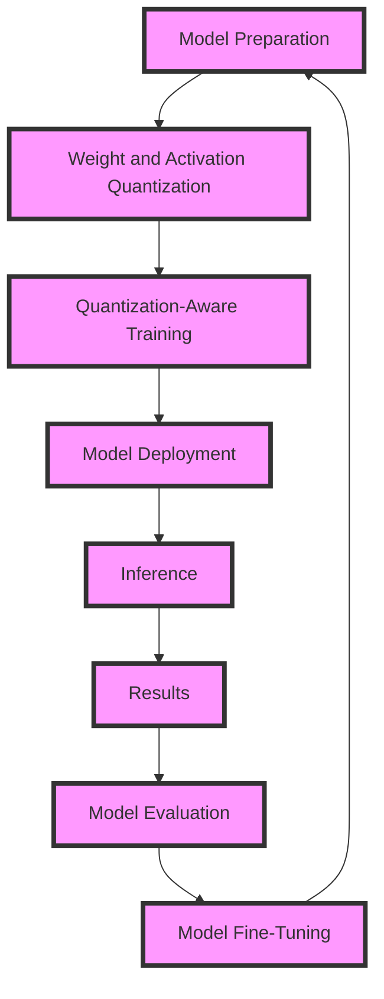

## Introduction
Cognitive model quantization is a technique used to reduce the computational requirements of artificial intelligence (AI) models, making them more efficient and scalable for deployment on edge devices or in resource-constrained environments. This is particularly important for **retrieval-augmented generation** models, which rely on complex neural networks to generate text or other data. In this guide, we will delve into the world of cognitive model quantization, exploring its core concepts, internal mechanics, and practical applications.

> **Note:** Cognitive model quantization is a crucial step in deploying AI models in real-world applications, as it enables the efficient use of computational resources and reduces the carbon footprint of AI systems.

## Core Concepts
Cognitive model quantization involves the reduction of the numerical precision of model weights and activations, typically from 32-bit floating-point numbers to 8-bit or 16-bit integers. This process, known as **quantization**, reduces the memory footprint and computational requirements of the model, making it more suitable for deployment on edge devices or in resource-constrained environments.

* **Weight quantization**: The process of reducing the precision of model weights, which are the learned parameters that define the relationships between inputs and outputs.
* **Activation quantization**: The process of reducing the precision of model activations, which are the outputs of each layer in the neural network.
* **Quantization-aware training**: A training procedure that takes into account the quantization process, allowing the model to adapt to the reduced precision and minimize the loss of accuracy.

> **Warning:** Quantization can lead to a loss of accuracy if not done properly, as the reduced precision can introduce errors in the model's calculations.

## How It Works Internally
The quantization process involves several steps:

1. **Model preparation**: The model is prepared for quantization by converting it to a format that supports quantization, such as TensorFlow Lite or OpenVINO.
2. **Weight and activation quantization**: The model weights and activations are quantized using a quantization scheme, such as uniform quantization or logarithmic quantization.
3. **Quantization-aware training**: The model is trained using a quantization-aware training procedure, which adapts the model to the reduced precision and minimizes the loss of accuracy.
4. **Model deployment**: The quantized model is deployed on the target device or platform, where it can be used for inference.

> **Tip:** Using a quantization-aware training procedure can help minimize the loss of accuracy and improve the overall performance of the model.

## Code Examples
### Example 1: Basic Quantization using TensorFlow
```python
import tensorflow as tf

# Load the model
model = tf.keras.models.load_model('model.h5')

# Quantize the model
quantized_model = tf.keras.models.load_model('model.h5', compile=False)
quantized_model = tf.quantization.quantize_model(quantized_model, num_bits=8)

# Save the quantized model
quantized_model.save('quantized_model.h5')
```
### Example 2: Quantization-Aware Training using PyTorch
```python
import torch
import torch.nn as nn

# Define the model
class Net(nn.Module):
    def __init__(self):
        super(Net, self).__init__()
        self.fc1 = nn.Linear(784, 128)
        self.fc2 = nn.Linear(128, 10)

    def forward(self, x):
        x = torch.relu(self.fc1(x))
        x = self.fc2(x)
        return x

# Initialize the model and optimizer
model = Net()
optimizer = torch.optim.SGD(model.parameters(), lr=0.01)

# Quantize the model
quantized_model = torch.quantization.quantize_dynamic(model, {torch.nn.Linear}, dtype=torch.qint8)

# Train the quantized model
for epoch in range(10):
    optimizer.zero_grad()
    outputs = quantized_model(inputs)
    loss = nn.CrossEntropyLoss()(outputs, labels)
    loss.backward()
    optimizer.step()
```
### Example 3: Advanced Quantization using OpenVINO
```python
from openvino.inference_engine import IECore

# Load the model
ie = IECore()
net = ie.read_network(model='model.xml', weights='model.bin')

# Quantize the model
quantized_net = ie.quantize_network(net, target_device='CPU', num_bits=8)

# Save the quantized model
ie.save_network(quantized_net, 'quantized_model.xml', 'quantized_model.bin')
```
## Visual Diagram

The diagram illustrates the cognitive model quantization process, from model preparation to model deployment and inference.

## Comparison
| Approach | Time Complexity | Space Complexity | Pros | Cons | Best For |
| --- | --- | --- | --- | --- | --- |
| Uniform Quantization | O(1) | O(1) | Simple to implement, fast | Limited precision, may introduce errors | Simple models, low-precision requirements |
| Logarithmic Quantization | O(log n) | O(log n) | Better precision than uniform quantization, flexible | More complex to implement, slower | Complex models, high-precision requirements |
| Quantization-Aware Training | O(n) | O(n) | Adapts model to reduced precision, minimizes loss of accuracy | Requires additional training data, computationally expensive | Large models, high-accuracy requirements |
| Knowledge Distillation | O(n) | O(n) | Transfers knowledge from teacher model to student model, improves accuracy | Requires additional training data, computationally expensive | Large models, high-accuracy requirements |

## Real-world Use Cases
* **Google's TensorFlow Lite**: Uses cognitive model quantization to deploy AI models on edge devices, such as smartphones and smart home devices.
* **Amazon's SageMaker**: Provides a platform for building, training, and deploying AI models, including cognitive model quantization.
* **Microsoft's Azure Machine Learning**: Offers a cloud-based platform for building, training, and deploying AI models, including cognitive model quantization.

> **Interview:** What is cognitive model quantization, and how does it improve the efficiency of AI models?

## Common Pitfalls
* **Insufficient quantization-aware training**: Failing to adapt the model to the reduced precision can lead to a significant loss of accuracy.
* **Inadequate hyperparameter tuning**: Failing to tune hyperparameters, such as the learning rate and batch size, can lead to suboptimal performance.
* **Inadequate model evaluation**: Failing to evaluate the model's performance on a diverse range of datasets and scenarios can lead to overfitting or underfitting.
* **Inadequate model deployment**: Failing to deploy the model on the target device or platform can lead to compatibility issues or performance degradation.

## Interview Tips
* **What is cognitive model quantization, and how does it improve the efficiency of AI models?**: A strong answer should describe the quantization process, its benefits, and its applications.
* **How do you implement quantization-aware training in PyTorch?**: A strong answer should provide a code example and explain the process of adapting the model to the reduced precision.
* **What are the trade-offs between uniform quantization and logarithmic quantization?**: A strong answer should discuss the pros and cons of each approach and provide examples of when to use each.

## Key Takeaways
* Cognitive model quantization reduces the computational requirements of AI models, making them more efficient and scalable.
* Quantization-aware training adapts the model to the reduced precision, minimizing the loss of accuracy.
* Uniform quantization and logarithmic quantization are two common approaches to quantization, each with its pros and cons.
* Cognitive model quantization is crucial for deploying AI models on edge devices or in resource-constrained environments.
* Insufficient quantization-aware training, inadequate hyperparameter tuning, inadequate model evaluation, and inadequate model deployment are common pitfalls to avoid.
* Cognitive model quantization has numerous applications in real-world scenarios, including Google's TensorFlow Lite, Amazon's SageMaker, and Microsoft's Azure Machine Learning.