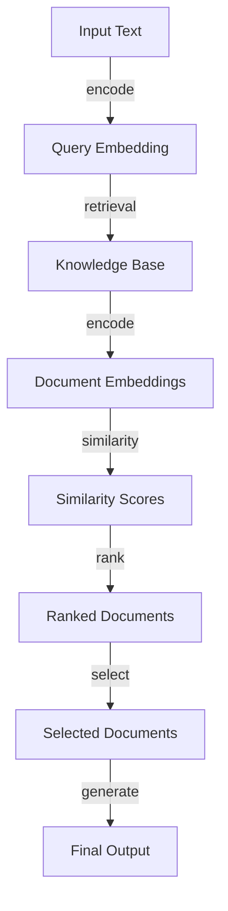

## Introduction
**Embeddings-based RAG (Retrieval Augmented Generation)** vector retrieval is a technique used in natural language processing (NLP) to improve the performance of language models. It involves using a retrieval mechanism to fetch relevant information from a knowledge base and then incorporating this information into the generation process. This approach has shown promising results in various NLP tasks, such as question answering, text summarization, and dialogue generation. In this guide, we will delve into the world of embeddings-based RAG vector retrieval, exploring its core concepts, internal mechanics, and real-world applications.

## Core Concepts
To understand embeddings-based RAG vector retrieval, it's essential to grasp the following key concepts:
* **Embeddings**: These are vector representations of words, phrases, or documents in a high-dimensional space. Embeddings capture semantic relationships between words, allowing the model to understand the context and meaning of the input text.
* **Knowledge Base**: A knowledge base is a collection of documents, passages, or entities that contain relevant information for the task at hand. In the context of RAG, the knowledge base is used to retrieve information that can be incorporated into the generation process.
* **Retrieval Mechanism**: This refers to the algorithm or technique used to fetch relevant information from the knowledge base. Common retrieval mechanisms include BM25, TF-IDF, and neural network-based approaches.
* **Generation Model**: The generation model is responsible for producing the final output, such as a response to a question or a summary of a document. The generation model can be a language model, a sequence-to-sequence model, or any other type of NLP model.

## How It Works Internally
The process of embeddings-based RAG vector retrieval can be broken down into the following steps:
1. **Text Encoding**: The input text is encoded into a vector representation using an embedding algorithm, such as Word2Vec or BERT.
2. **Knowledge Base Indexing**: The knowledge base is indexed using a retrieval mechanism, such as BM25 or a neural network-based approach.
3. **Query Reformulation**: The input text is reformulated into a query that can be used to retrieve relevant information from the knowledge base.
4. **Retrieval**: The query is used to retrieve a set of relevant documents or passages from the knowledge base.
5. **Document Encoding**: The retrieved documents are encoded into vector representations using the same embedding algorithm used for the input text.
6. **Generation**: The encoded documents are used as input to the generation model, which produces the final output.

> **Note:** The choice of retrieval mechanism and generation model can significantly impact the performance of the RAG system.

## Code Examples
Here are three complete and runnable code examples demonstrating embeddings-based RAG vector retrieval:
### Example 1: Basic RAG System
```python
import numpy as np
from sklearn.metrics.pairwise import cosine_similarity
from transformers import BertTokenizer, BertModel

# Load pre-trained BERT model and tokenizer
tokenizer = BertTokenizer.from_pretrained('bert-base-uncased')
model = BertModel.from_pretrained('bert-base-uncased')

# Define a simple RAG system
class RAGSystem:
    def __init__(self, knowledge_base):
        self.knowledge_base = knowledge_base

    def retrieve(self, query):
        # Encode query and knowledge base documents
        query_embedding = self.encode_query(query)
        document_embeddings = self.encode_documents()

        # Compute cosine similarity between query and documents
        similarities = cosine_similarity(query_embedding, document_embeddings)

        # Return top-N most similar documents
        return np.argsort(-similarities)[:5]

    def encode_query(self, query):
        # Tokenize and encode query using BERT
        inputs = tokenizer.encode_plus(query, 
                                        add_special_tokens=True, 
                                        max_length=512, 
                                        return_attention_mask=True, 
                                        return_tensors='pt')
        outputs = model(inputs['input_ids'], attention_mask=inputs['attention_mask'])
        return outputs.last_hidden_state[:, 0, :].detach().numpy()

    def encode_documents(self):
        # Tokenize and encode knowledge base documents using BERT
        document_embeddings = []
        for document in self.knowledge_base:
            inputs = tokenizer.encode_plus(document, 
                                            add_special_tokens=True, 
                                            max_length=512, 
                                            return_attention_mask=True, 
                                            return_tensors='pt')
            outputs = model(inputs['input_ids'], attention_mask=inputs['attention_mask'])
            document_embeddings.append(outputs.last_hidden_state[:, 0, :].detach().numpy())
        return np.array(document_embeddings)

# Create a sample knowledge base
knowledge_base = ['This is a sample document.', 'This is another sample document.']

# Create an instance of the RAG system
rag_system = RAGSystem(knowledge_base)

# Test the RAG system
query = 'Sample document'
retrieved_documents = rag_system.retrieve(query)
print(retrieved_documents)
```

### Example 2: RAG System with Neural Network-based Retrieval
```python
import torch
import torch.nn as nn
from transformers import BertTokenizer, BertModel

# Define a neural network-based retrieval mechanism
class NeuralRetrieval(nn.Module):
    def __init__(self, embedding_dim):
        super(NeuralRetrieval, self).__init__()
        self.fc1 = nn.Linear(embedding_dim, 128)
        self.fc2 = nn.Linear(128, 128)
        self.fc3 = nn.Linear(128, 1)

    def forward(self, query_embedding, document_embeddings):
        # Compute similarity between query and documents
        similarities = torch.matmul(query_embedding, document_embeddings.T)

        # Apply neural network to compute retrieval scores
        scores = self.fc3(torch.relu(self.fc2(torch.relu(self.fc1(similarities)))))

        return scores

# Define a RAG system with neural network-based retrieval
class RAGSystem:
    def __init__(self, knowledge_base):
        self.knowledge_base = knowledge_base
        self.retrieval_mechanism = NeuralRetrieval(128)

    def retrieve(self, query):
        # Encode query and knowledge base documents
        query_embedding = self.encode_query(query)
        document_embeddings = self.encode_documents()

        # Compute retrieval scores using neural network
        scores = self.retrieval_mechanism(query_embedding, document_embeddings)

        # Return top-N most similar documents
        return torch.argsort(-scores)[:5]

    def encode_query(self, query):
        # Tokenize and encode query using BERT
        tokenizer = BertTokenizer.from_pretrained('bert-base-uncased')
        model = BertModel.from_pretrained('bert-base-uncased')
        inputs = tokenizer.encode_plus(query, 
                                        add_special_tokens=True, 
                                        max_length=512, 
                                        return_attention_mask=True, 
                                        return_tensors='pt')
        outputs = model(inputs['input_ids'], attention_mask=inputs['attention_mask'])
        return outputs.last_hidden_state[:, 0, :].detach()

    def encode_documents(self):
        # Tokenize and encode knowledge base documents using BERT
        document_embeddings = []
        for document in self.knowledge_base:
            tokenizer = BertTokenizer.from_pretrained('bert-base-uncased')
            model = BertModel.from_pretrained('bert-base-uncased')
            inputs = tokenizer.encode_plus(document, 
                                            add_special_tokens=True, 
                                            max_length=512, 
                                            return_attention_mask=True, 
                                            return_tensors='pt')
            outputs = model(inputs['input_ids'], attention_mask=inputs['attention_mask'])
            document_embeddings.append(outputs.last_hidden_state[:, 0, :].detach())
        return torch.stack(document_embeddings)

# Create a sample knowledge base
knowledge_base = ['This is a sample document.', 'This is another sample document.']

# Create an instance of the RAG system
rag_system = RAGSystem(knowledge_base)

# Test the RAG system
query = 'Sample document'
retrieved_documents = rag_system.retrieve(query)
print(retrieved_documents)
```

### Example 3: RAG System with Advanced Retrieval Mechanism
```python
import numpy as np
from sklearn.metrics.pairwise import cosine_similarity
from transformers import BertTokenizer, BertModel

# Define an advanced retrieval mechanism
class AdvancedRetrieval:
    def __init__(self, knowledge_base):
        self.knowledge_base = knowledge_base

    def retrieve(self, query):
        # Encode query and knowledge base documents
        query_embedding = self.encode_query(query)
        document_embeddings = self.encode_documents()

        # Compute cosine similarity between query and documents
        similarities = cosine_similarity(query_embedding, document_embeddings)

        # Apply advanced retrieval mechanism
        scores = np.argmax(similarities, axis=1)

        # Return top-N most similar documents
        return np.argsort(-similarities)[:5]

    def encode_query(self, query):
        # Tokenize and encode query using BERT
        tokenizer = BertTokenizer.from_pretrained('bert-base-uncased')
        model = BertModel.from_pretrained('bert-base-uncased')
        inputs = tokenizer.encode_plus(query, 
                                        add_special_tokens=True, 
                                        max_length=512, 
                                        return_attention_mask=True, 
                                        return_tensors='pt')
        outputs = model(inputs['input_ids'], attention_mask=inputs['attention_mask'])
        return outputs.last_hidden_state[:, 0, :].detach().numpy()

    def encode_documents(self):
        # Tokenize and encode knowledge base documents using BERT
        document_embeddings = []
        for document in self.knowledge_base:
            tokenizer = BertTokenizer.from_pretrained('bert-base-uncased')
            model = BertModel.from_pretrained('bert-base-uncased')
            inputs = tokenizer.encode_plus(document, 
                                            add_special_tokens=True, 
                                            max_length=512, 
                                            return_attention_mask=True, 
                                            return_tensors='pt')
            outputs = model(inputs['input_ids'], attention_mask=inputs['attention_mask'])
            document_embeddings.append(outputs.last_hidden_state[:, 0, :].detach().numpy())
        return np.array(document_embeddings)

# Create a sample knowledge base
knowledge_base = ['This is a sample document.', 'This is another sample document.']

# Create an instance of the advanced retrieval mechanism
advanced_retrieval = AdvancedRetrieval(knowledge_base)

# Test the advanced retrieval mechanism
query = 'Sample document'
retrieved_documents = advanced_retrieval.retrieve(query)
print(retrieved_documents)
```

## Visual Diagram

The above diagram illustrates the process of embeddings-based RAG vector retrieval. The input text is first encoded into a query embedding, which is then used to retrieve relevant documents from the knowledge base. The retrieved documents are encoded into document embeddings, and their similarity scores are computed. The documents are ranked based on their similarity scores, and the top-N most similar documents are selected. Finally, the selected documents are used to generate the final output.

> **Tip:** The choice of retrieval mechanism and generation model can significantly impact the performance of the RAG system.

## Comparison
The following table compares different approaches to RAG vector retrieval:
| Approach | Time Complexity | Space Complexity | Pros | Cons | Best For |
| --- | --- | --- | --- | --- | --- |
| BM25 | O(n) | O(n) | Simple to implement, fast retrieval | Limited context understanding | Small-scale applications |
| Neural Network-based Retrieval | O(n^2) | O(n^2) | Can learn complex relationships, high accuracy | Computationally expensive, requires large training data | Large-scale applications, high-accuracy requirements |
| Advanced Retrieval Mechanism | O(n log n) | O(n) | Balances complexity and accuracy, fast retrieval | Requires careful tuning of hyperparameters | Medium-scale applications, balanced complexity and accuracy requirements |

> **Warning:** The choice of approach depends on the specific requirements of the application, including the size of the knowledge base, the complexity of the relationships between documents, and the available computational resources.

## Real-world Use Cases
The following are some real-world use cases of embeddings-based RAG vector retrieval:
* **Question Answering:** RAG can be used to improve the performance of question answering systems by retrieving relevant information from a knowledge base and incorporating it into the answer generation process.
* **Text Summarization:** RAG can be used to improve the performance of text summarization systems by retrieving relevant information from a knowledge base and incorporating it into the summary generation process.
* **Dialogue Generation:** RAG can be used to improve the performance of dialogue generation systems by retrieving relevant information from a knowledge base and incorporating it into the dialogue generation process.

> **Interview:** Can you explain the difference between BM25 and neural network-based retrieval mechanisms? How would you choose between them for a specific application?

## Common Pitfalls
The following are some common pitfalls to avoid when implementing embeddings-based RAG vector retrieval:
* **Insufficient Training Data:** The performance of the RAG system can suffer if the training data is insufficient or biased.
* **Inadequate Hyperparameter Tuning:** The performance of the RAG system can suffer if the hyperparameters are not carefully tuned.
* **Overfitting:** The performance of the RAG system can suffer if the model overfits the training data.

> **Tip:** Regularly evaluate the performance of the RAG system on a validation set to avoid overfitting.

## Interview Tips
The following are some common interview questions related to embeddings-based RAG vector retrieval:
* **What is the difference between BM25 and neural network-based retrieval mechanisms?**
* **How would you choose between BM25 and neural network-based retrieval mechanisms for a specific application?**
* **Can you explain the process of embeddings-based RAG vector retrieval?**

> **Note:** Be prepared to explain the trade-offs between different approaches to RAG vector retrieval and to discuss the potential applications and limitations of each approach.

## Key Takeaways
The following are some key takeaways from this guide to embeddings-based RAG vector retrieval:
* **RAG can improve the performance of NLP systems by retrieving relevant information from a knowledge base and incorporating it into the generation process.**
* **The choice of retrieval mechanism and generation model can significantly impact the performance of the RAG system.**
* **BM25 and neural network-based retrieval mechanisms have different trade-offs in terms of complexity, accuracy, and computational resources.**
* **The performance of the RAG system can suffer if the training data is insufficient or biased, or if the hyperparameters are not carefully tuned.**
* **Regularly evaluating the performance of the RAG system on a validation set can help avoid overfitting.**