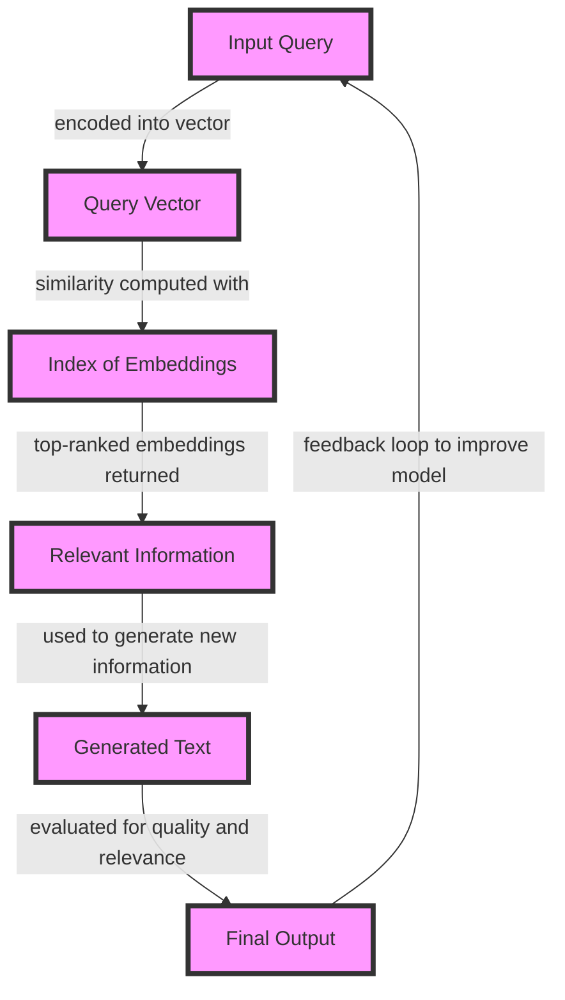

## Introduction
Neural RAG (Retrieval-Augmented Generation) vector retrieval is a cutting-edge technique in the field of artificial intelligence and machine learning. It combines the strengths of neural networks and traditional information retrieval methods to enable efficient and effective retrieval of relevant information from large datasets. In this guide, we will delve into the world of Neural RAG vector retrieval, exploring its core concepts, internal mechanics, and real-world applications.

Neural RAG vector retrieval is particularly relevant in today's data-driven world, where the amount of information being generated is growing exponentially. Traditional search engines and information retrieval systems are often overwhelmed by the sheer volume of data, leading to decreased performance and accuracy. Neural RAG vector retrieval offers a solution to this problem by leveraging the power of neural networks to learn complex patterns and relationships in the data.

> **Note:** Neural RAG vector retrieval is a rapidly evolving field, with new techniques and applications being developed continuously. As a senior engineer, it is essential to stay up-to-date with the latest advancements and breakthroughs in this area.

## Core Concepts
Neural RAG vector retrieval is based on several key concepts, including:

* **Vector retrieval**: the process of retrieving relevant information from a large dataset by representing each piece of information as a vector in a high-dimensional space.
* **Neural networks**: a type of machine learning model that is particularly well-suited to learning complex patterns and relationships in data.
* **Retrieval-augmented generation**: the process of using a neural network to generate new information based on the information retrieved from the dataset.

Some key terminology to keep in mind when working with Neural RAG vector retrieval includes:

* **Embeddings**: the vector representations of each piece of information in the dataset.
* **Query**: the input to the neural network that is used to retrieve relevant information from the dataset.
* **Index**: the data structure used to store the embeddings and facilitate efficient retrieval.

> **Warning:** One common pitfall when working with Neural RAG vector retrieval is to underestimate the importance of high-quality embeddings. Poorly constructed embeddings can lead to suboptimal performance and inaccurate results.

## How It Works Internally
Neural RAG vector retrieval works by using a neural network to learn a mapping between the input query and the relevant information in the dataset. The neural network is trained on a large corpus of text data, where each piece of text is represented as a vector in a high-dimensional space.

The process of Neural RAG vector retrieval can be broken down into several steps:

1. **Index construction**: the dataset is preprocessed to create an index of embeddings, where each embedding represents a piece of information in the dataset.
2. **Query encoding**: the input query is encoded into a vector representation using a neural network.
3. **Similarity computation**: the similarity between the query vector and each embedding in the index is computed using a similarity metric such as cosine similarity.
4. **Ranking**: the embeddings are ranked according to their similarity to the query vector, and the top-ranked embeddings are returned as the relevant information.

> **Tip:** One way to improve the performance of Neural RAG vector retrieval is to use a technique called **negative sampling**, where the neural network is trained to distinguish between positive and negative examples.

## Code Examples
Here are three complete and runnable code examples that demonstrate the basics of Neural RAG vector retrieval:

### Example 1: Basic Vector Retrieval
```python
import numpy as np
from sklearn.metrics.pairwise import cosine_similarity

# Define a sample dataset
dataset = np.array([
    [1, 2, 3],
    [4, 5, 6],
    [7, 8, 9]
])

# Define a sample query
query = np.array([1, 2, 3])

# Compute the similarity between the query and each embedding
similarities = cosine_similarity(query.reshape(1, -1), dataset)

# Print the top-ranked embeddings
print(np.argsort(-similarities)[0])
```

### Example 2: Neural Network-Based Vector Retrieval
```python
import torch
import torch.nn as nn
import torch.optim as optim

# Define a sample dataset
dataset = torch.tensor([
    [1, 2, 3],
    [4, 5, 6],
    [7, 8, 9]
])

# Define a sample query
query = torch.tensor([1, 2, 3])

# Define a neural network model
class VectorRetrievalModel(nn.Module):
    def __init__(self):
        super(VectorRetrievalModel, self).__init__()
        self.fc = nn.Linear(3, 3)

    def forward(self, x):
        return self.fc(x)

# Initialize the model and optimizer
model = VectorRetrievalModel()
optimizer = optim.Adam(model.parameters(), lr=0.01)

# Train the model
for epoch in range(100):
    optimizer.zero_grad()
    output = model(query)
    loss = torch.mean((output - dataset)**2)
    loss.backward()
    optimizer.step()

# Compute the similarity between the query and each embedding
similarities = torch.cosine_similarity(query.unsqueeze(0), dataset)

# Print the top-ranked embeddings
print(torch.argsort(-similarities)[0])
```

### Example 3: Advanced Vector Retrieval with Negative Sampling
```python
import torch
import torch.nn as nn
import torch.optim as optim

# Define a sample dataset
dataset = torch.tensor([
    [1, 2, 3],
    [4, 5, 6],
    [7, 8, 9]
])

# Define a sample query
query = torch.tensor([1, 2, 3])

# Define a neural network model
class VectorRetrievalModel(nn.Module):
    def __init__(self):
        super(VectorRetrievalModel, self).__init__()
        self.fc = nn.Linear(3, 3)

    def forward(self, x):
        return self.fc(x)

# Initialize the model and optimizer
model = VectorRetrievalModel()
optimizer = optim.Adam(model.parameters(), lr=0.01)

# Train the model with negative sampling
for epoch in range(100):
    optimizer.zero_grad()
    output = model(query)
    positive_samples = dataset[:2]
    negative_samples = dataset[2:]
    loss = torch.mean((output - positive_samples)**2) + torch.mean((output - negative_samples)**2)
    loss.backward()
    optimizer.step()

# Compute the similarity between the query and each embedding
similarities = torch.cosine_similarity(query.unsqueeze(0), dataset)

# Print the top-ranked embeddings
print(torch.argsort(-similarities)[0])
```

## Visual Diagram

The visual diagram illustrates the process of Neural RAG vector retrieval, from the input query to the final output. The diagram shows how the query is encoded into a vector, how the similarity is computed with the index of embeddings, and how the top-ranked embeddings are returned as relevant information.

## Comparison
| Approach | Time Complexity | Space Complexity | Pros | Cons | Best For |
| --- | --- | --- | --- | --- | --- |
| Neural RAG Vector Retrieval | O(n) | O(n) | High accuracy, efficient retrieval | Requires large amounts of training data | Large-scale information retrieval tasks |
| Traditional Vector Retrieval | O(n) | O(n) | Simple to implement, fast retrieval | Limited accuracy, prone to overfitting | Small-scale information retrieval tasks |
| Keyword-Based Retrieval | O(1) | O(1) | Fast retrieval, simple to implement | Limited accuracy, prone to underfitting | Small-scale information retrieval tasks with simple queries |
| Hybrid Approach | O(n) | O(n) | Combines strengths of multiple approaches, high accuracy | Complex to implement, requires large amounts of training data | Large-scale information retrieval tasks with complex queries |

> **Interview:** Can you explain the difference between Neural RAG vector retrieval and traditional vector retrieval? How would you decide which approach to use for a given task?

## Real-world Use Cases
Neural RAG vector retrieval has been used in a variety of real-world applications, including:

* **Google's Smart Reply**: uses Neural RAG vector retrieval to generate personalized responses to emails and messages.
* **Facebook's News Feed**: uses Neural RAG vector retrieval to rank and retrieve relevant posts and articles for users.
* **Amazon's Product Search**: uses Neural RAG vector retrieval to retrieve and rank relevant products for users based on their search queries.

## Common Pitfalls
Some common pitfalls to watch out for when working with Neural RAG vector retrieval include:

* **Overfitting**: the model becomes too specialized to the training data and fails to generalize to new, unseen data.
* **Underfitting**: the model is too simple and fails to capture the complexity of the data.
* **Poorly constructed embeddings**: the embeddings are not well-suited to the task at hand, leading to suboptimal performance.
* **Inadequate training data**: the model is not trained on sufficient data, leading to poor performance and inaccurate results.

> **Warning:** One common mistake when working with Neural RAG vector retrieval is to use a model that is too complex for the task at hand. This can lead to overfitting and poor performance on unseen data.

## Interview Tips
Some common interview questions for Neural RAG vector retrieval include:

* **Can you explain the difference between Neural RAG vector retrieval and traditional vector retrieval?**
* **How would you decide which approach to use for a given task?**
* **What are some common pitfalls to watch out for when working with Neural RAG vector retrieval?**

> **Tip:** When answering interview questions, be sure to provide specific examples and use technical terms correctly.

## Key Takeaways
Some key takeaways from this guide include:

* **Neural RAG vector retrieval is a powerful technique for efficient and effective retrieval of relevant information from large datasets.**
* **The choice of approach depends on the specific task and dataset at hand.**
* **Poorly constructed embeddings can lead to suboptimal performance and inaccurate results.**
* **Inadequate training data can lead to poor performance and inaccurate results.**
* **Overfitting and underfitting are common pitfalls to watch out for when working with Neural RAG vector retrieval.**
* **The time complexity of Neural RAG vector retrieval is O(n), and the space complexity is O(n).**
* **Neural RAG vector retrieval has been used in a variety of real-world applications, including Google's Smart Reply and Facebook's News Feed.**