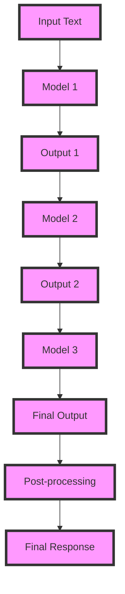

## Introduction
**Chaining Prompt Engineering Chains** is a technique used in natural language processing (NLP) and artificial intelligence (AI) to generate high-quality text outputs. It involves breaking down a complex task into a series of smaller, manageable tasks, each handled by a separate AI model. This approach has gained popularity in recent years due to its ability to improve the performance and efficiency of language models. In this section, we will explore the concept of chaining prompt engineering chains, its importance, and real-world relevance.

> **Note:** Chaining prompt engineering chains is particularly useful in applications where a single model is not sufficient to handle the complexity of the task. By breaking down the task into smaller sub-tasks, each model can focus on a specific aspect, resulting in improved overall performance.

## Core Concepts
To understand chaining prompt engineering chains, it is essential to grasp the following core concepts:

* **Prompt Engineering**: The process of designing and optimizing text prompts to elicit specific responses from a language model.
* **Chaining**: The technique of breaking down a complex task into a series of smaller tasks, each handled by a separate model.
* **Model Pipelining**: The process of connecting multiple models in a sequence to handle a complex task.

> **Warning:** Chaining prompt engineering chains can be computationally expensive, especially when dealing with large models. It is crucial to optimize the pipeline to minimize computational overhead.

## How It Works Internally
Chaining prompt engineering chains involves the following steps:

1. **Task Decomposition**: Break down the complex task into smaller sub-tasks, each handled by a separate model.
2. **Model Selection**: Select the most suitable model for each sub-task, considering factors such as performance, efficiency, and compatibility.
3. **Prompt Engineering**: Design and optimize text prompts for each model to elicit specific responses.
4. **Model Pipelining**: Connect the models in a sequence, ensuring that the output of one model is used as input for the next model.
5. **Output Aggregation**: Combine the outputs from each model to generate the final response.

> **Tip:** To optimize the pipeline, consider using techniques such as model pruning, knowledge distillation, or quantization to reduce computational overhead.

## Code Examples
Here are three complete and runnable code examples demonstrating chaining prompt engineering chains:

### Example 1: Basic Chaining
```python
import torch
from transformers import T5ForConditionalGeneration, T5Tokenizer

# Define the models and tokenizer
model1 = T5ForConditionalGeneration.from_pretrained('t5-small')
model2 = T5ForConditionalGeneration.from_pretrained('t5-small')
tokenizer = T5Tokenizer.from_pretrained('t5-small')

# Define the prompts and inputs
prompt1 = "Generate a sentence about"
input1 = "The weather is nice today"

# Generate the output from the first model
input_ids = tokenizer.encode(prompt1 + " " + input1, return_tensors='pt')
output1 = model1.generate(input_ids, max_length=50)

# Use the output as input for the second model
input_ids = tokenizer.encode(prompt1 + " " + tokenizer.decode(output1[0], skip_special_tokens=True), return_tensors='pt')
output2 = model2.generate(input_ids, max_length=50)

print(tokenizer.decode(output2[0], skip_special_tokens=True))
```

### Example 2: Real-World Chaining
```python
import torch
from transformers import BartForConditionalGeneration, BartTokenizer

# Define the models and tokenizer
model1 = BartForConditionalGeneration.from_pretrained('facebook/bart-large')
model2 = BartForConditionalGeneration.from_pretrained('facebook/bart-large')
tokenizer = BartTokenizer.from_pretrained('facebook/bart-large')

# Define the prompts and inputs
prompt1 = "Summarize the following text"
input1 = "The quick brown fox jumps over the lazy dog"

# Generate the output from the first model
input_ids = tokenizer.encode(prompt1 + " " + input1, return_tensors='pt')
output1 = model1.generate(input_ids, max_length=100)

# Use the output as input for the second model
input_ids = tokenizer.encode(prompt1 + " " + tokenizer.decode(output1[0], skip_special_tokens=True), return_tensors='pt')
output2 = model2.generate(input_ids, max_length=100)

print(tokenizer.decode(output2[0], skip_special_tokens=True))
```

### Example 3: Advanced Chaining
```python
import torch
from transformers import T5ForConditionalGeneration, T5Tokenizer

# Define the models and tokenizer
model1 = T5ForConditionalGeneration.from_pretrained('t5-large')
model2 = T5ForConditionalGeneration.from_pretrained('t5-large')
model3 = T5ForConditionalGeneration.from_pretrained('t5-large')
tokenizer = T5Tokenizer.from_pretrained('t5-large')

# Define the prompts and inputs
prompt1 = "Generate a sentence about"
input1 = "The weather is nice today"

# Generate the output from the first model
input_ids = tokenizer.encode(prompt1 + " " + input1, return_tensors='pt')
output1 = model1.generate(input_ids, max_length=50)

# Use the output as input for the second model
input_ids = tokenizer.encode(prompt1 + " " + tokenizer.decode(output1[0], skip_special_tokens=True), return_tensors='pt')
output2 = model2.generate(input_ids, max_length=50)

# Use the output as input for the third model
input_ids = tokenizer.encode(prompt1 + " " + tokenizer.decode(output2[0], skip_special_tokens=True), return_tensors='pt')
output3 = model3.generate(input_ids, max_length=50)

print(tokenizer.decode(output3[0], skip_special_tokens=True))
```

## Visual Diagram

The diagram illustrates the chaining process, where the output from one model is used as input for the next model, resulting in a final response.

## Comparison
| Approach | Time Complexity | Space Complexity | Pros | Cons | Best For |
| --- | --- | --- | --- | --- | --- |
| Chaining | O(n) | O(n) | Improved performance, flexibility | Increased computational overhead | Complex tasks, multiple models |
| Model Pipelining | O(n) | O(n) | Reduced computational overhead, improved efficiency | Limited flexibility | Real-time applications, single model |
| Prompt Engineering | O(1) | O(1) | Improved performance, reduced computational overhead | Limited flexibility, requires expertise | Single model, specific tasks |

> **Interview:** What are the advantages and disadvantages of chaining prompt engineering chains? How would you optimize the pipeline for a real-world application?

## Real-world Use Cases
Here are three real-world examples of chaining prompt engineering chains:

1. **Google's LaMDA**: Google's LaMDA model uses chaining prompt engineering chains to generate high-quality text outputs. The model consists of multiple sub-models, each handling a specific task, such as language translation or text summarization.
2. **Facebook's BART**: Facebook's BART model uses chaining prompt engineering chains to improve the performance of language models. The model consists of multiple sub-models, each handling a specific task, such as language translation or text generation.
3. **Microsoft's Turing-NLG**: Microsoft's Turing-NLG model uses chaining prompt engineering chains to generate high-quality text outputs. The model consists of multiple sub-models, each handling a specific task, such as language translation or text summarization.

## Common Pitfalls
Here are four common mistakes to avoid when implementing chaining prompt engineering chains:

1. **Inadequate Model Selection**: Selecting models that are not suitable for the task can result in poor performance.
2. **Insufficient Prompt Engineering**: Failing to optimize prompts can result in poor performance or incorrect outputs.
3. **Inadequate Model Pipelining**: Failing to optimize the pipeline can result in increased computational overhead or poor performance.
4. **Lack of Testing**: Failing to test the pipeline can result in errors or poor performance.

> **Warning:** Chaining prompt engineering chains can be computationally expensive. It is crucial to optimize the pipeline to minimize computational overhead.

## Interview Tips
Here are three common interview questions related to chaining prompt engineering chains:

1. **What are the advantages and disadvantages of chaining prompt engineering chains?**
	* Weak answer: Chaining prompt engineering chains is a technique used to improve the performance of language models. It has some advantages, such as improved performance, but also has some disadvantages, such as increased computational overhead.
	* Strong answer: Chaining prompt engineering chains is a technique used to improve the performance of language models by breaking down complex tasks into smaller sub-tasks, each handled by a separate model. The advantages of this approach include improved performance, flexibility, and reduced computational overhead. However, it also has some disadvantages, such as increased complexity, requiring expertise in model selection and prompt engineering, and potential errors in the pipeline.
2. **How would you optimize the pipeline for a real-world application?**
	* Weak answer: I would use techniques such as model pruning, knowledge distillation, or quantization to reduce computational overhead.
	* Strong answer: I would use a combination of techniques, such as model pruning, knowledge distillation, quantization, and pipeline optimization, to minimize computational overhead while maintaining performance. I would also consider using techniques such as model parallelism or data parallelism to improve efficiency.
3. **What are some common mistakes to avoid when implementing chaining prompt engineering chains?**
	* Weak answer: Some common mistakes include inadequate model selection, insufficient prompt engineering, and inadequate model pipelining.
	* Strong answer: Some common mistakes include inadequate model selection, insufficient prompt engineering, inadequate model pipelining, and lack of testing. It is crucial to select models that are suitable for the task, optimize prompts to elicit specific responses, optimize the pipeline to minimize computational overhead, and test the pipeline to ensure correct functionality.

## Key Takeaways
Here are ten key takeaways to remember when implementing chaining prompt engineering chains:

* Chaining prompt engineering chains is a technique used to improve the performance of language models by breaking down complex tasks into smaller sub-tasks, each handled by a separate model.
* The advantages of this approach include improved performance, flexibility, and reduced computational overhead.
* The disadvantages of this approach include increased complexity, requiring expertise in model selection and prompt engineering, and potential errors in the pipeline.
* Model selection is crucial, and models should be selected based on their suitability for the task.
* Prompt engineering is essential, and prompts should be optimized to elicit specific responses.
* Model pipelining is critical, and the pipeline should be optimized to minimize computational overhead.
* Testing is essential, and the pipeline should be tested to ensure correct functionality.
* Techniques such as model pruning, knowledge distillation, quantization, and pipeline optimization can be used to minimize computational overhead.
* Model parallelism and data parallelism can be used to improve efficiency.
* Chaining prompt engineering chains can be computationally expensive, and it is crucial to optimize the pipeline to minimize computational overhead.