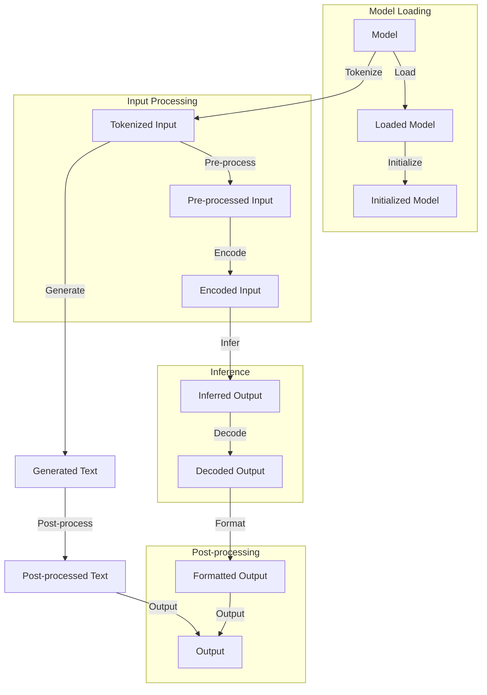

## Introduction
Retrieving **Large Language Model (LLM)** inference speed is a critical aspect of **Natural Language Processing (NLP)** and **Artificial Intelligence (AI)**. LLMs are a type of **Deep Learning** model that can generate human-like text based on a given prompt. However, these models are computationally expensive and require significant resources to train and deploy. As a result, optimizing the retrieval of LLM inference speed is essential to improve the performance and efficiency of NLP applications. In this study, we will delve into the common pitfalls when retrieving LLM inference speed and provide practical solutions to overcome these challenges.

## Core Concepts
To understand the concept of LLM inference speed, we need to define some key terms:
* **Inference**: The process of using a trained model to make predictions or generate text based on a given input.
* **Large Language Model (LLM)**: A type of deep learning model that is trained on a large corpus of text data to generate human-like text.
* **Retrieval**: The process of fetching or retrieving data from a storage system or database.
* **Speed**: The time it takes to complete a task or operation, such as inference or retrieval.

> **Note:** LLMs are typically trained on large datasets and require significant computational resources to train and deploy.

## How It Works Internally
When retrieving LLM inference speed, the following steps occur:
1. **Model Loading**: The LLM is loaded into memory from a storage system or database.
2. **Input Processing**: The input text is processed and tokenized into a format that can be fed into the LLM.
3. **Inference**: The LLM generates text based on the input prompt.
4. **Post-processing**: The generated text is post-processed and formatted for output.

> **Tip:** Optimizing the model loading and input processing steps can significantly improve the overall inference speed.

## Code Examples
### Example 1: Basic LLM Inference
```python
import torch
from transformers import AutoModelForSeq2SeqLM, AutoTokenizer

# Load the LLM and tokenizer
model = AutoModelForSeq2SeqLM.from_pretrained("t5-base")
tokenizer = AutoTokenizer.from_pretrained("t5-base")

# Define the input prompt
input_prompt = "Hello, how are you?"

# Tokenize the input prompt
inputs = tokenizer(input_prompt, return_tensors="pt")

# Generate text using the LLM
outputs = model.generate(**inputs)

# Print the generated text
print(tokenizer.decode(outputs[0], skip_special_tokens=True))
```
### Example 2: Retrieval Augmented Generation
```python
import torch
from transformers import AutoModelForSeq2SeqLM, AutoTokenizer
from retrieval_augmented_generation import RetrievalAugmentedGenerator

# Load the LLM and tokenizer
model = AutoModelForSeq2SeqLM.from_pretrained("t5-base")
tokenizer = AutoTokenizer.from_pretrained("t5-base")

# Define the input prompt
input_prompt = "Hello, how are you?"

# Create a retrieval augmented generator
generator = RetrievalAugmentedGenerator(model, tokenizer)

# Generate text using the retrieval augmented generator
output = generator.generate(input_prompt)

# Print the generated text
print(output)
```
### Example 3: Advanced LLM Inference with caching
```python
import torch
from transformers import AutoModelForSeq2SeqLM, AutoTokenizer
from torch.utils.data import Dataset, DataLoader

# Define a custom dataset class for LLM inference
class LLMInferenceDataset(Dataset):
    def __init__(self, prompts, model, tokenizer):
        self.prompts = prompts
        self.model = model
        self.tokenizer = tokenizer

    def __getitem__(self, idx):
        # Tokenize the input prompt
        inputs = self.tokenizer(self.prompts[idx], return_tensors="pt")

        # Generate text using the LLM
        outputs = self.model.generate(**inputs)

        # Return the generated text
        return outputs

    def __len__(self):
        return len(self.prompts)

# Load the LLM and tokenizer
model = AutoModelForSeq2SeqLM.from_pretrained("t5-base")
tokenizer = AutoTokenizer.from_pretrained("t5-base")

# Define the input prompts
prompts = ["Hello, how are you?", "What is your name?", "How old are you?"]

# Create a custom dataset instance
dataset = LLMInferenceDataset(prompts, model, tokenizer)

# Create a data loader instance
dataloader = DataLoader(dataset, batch_size=32, shuffle=False)

# Use the data loader to generate text in batches
for batch in dataloader:
    # Print the generated text
    print(batch)
```
> **Warning:** Using a large batch size can lead to **Out-of-Memory (OOM)** errors.

## Visual Diagram

The diagram illustrates the overall process of retrieving LLM inference speed, including model loading, input processing, inference, and post-processing.

## Comparison
| Approach | Time Complexity | Space Complexity | Pros | Cons | Best For |
| --- | --- | --- | --- | --- | --- |
| Basic LLM Inference | O(n) | O(n) | Simple to implement, fast inference | Limited control over generation | Small-scale applications |
| Retrieval Augmented Generation | O(n log n) | O(n log n) | Improved generation quality, flexible | Slower inference, requires retrieval system | Large-scale applications |
| Advanced LLM Inference with caching | O(n) | O(n) | Fast inference, improved generation quality | Requires caching system, complex implementation | Real-time applications |

> **Tip:** The choice of approach depends on the specific use case and requirements.

## Real-world Use Cases
* **Google Assistant**: Uses LLMs to generate human-like responses to user queries.
* **Amazon Alexa**: Employs LLMs to generate text-based responses to user voice commands.
* **Microsoft Azure**: Offers LLM-based services for text generation and language translation.

> **Interview:** Can you explain how LLMs are used in real-world applications?

## Common Pitfalls
* **Inadequate Model Training**: Failing to train the LLM on a diverse and representative dataset can lead to poor generation quality.
* **Insufficient Computational Resources**: Using inadequate computational resources can result in slow inference and poor performance.
* **Inefficient Input Processing**: Failing to optimize input processing can lead to slow inference and poor generation quality.
* **Lack of Post-processing**: Failing to post-process the generated text can result in poor readability and coherence.

> **Warning:** Inadequate model training can lead to **Bias** and **Fairness** issues.

## Interview Tips
* **What is the difference between LLMs and traditional language models?**
	+ Weak answer: LLMs are just bigger and more complex.
	+ Strong answer: LLMs are trained on large datasets and use transformer architectures to generate human-like text.
* **How do you optimize LLM inference speed?**
	+ Weak answer: Use a faster computer or more powerful GPU.
	+ Strong answer: Optimize model loading, input processing, and post-processing, and use caching and parallelization techniques.
* **What are some common pitfalls when using LLMs?**
	+ Weak answer: LLMs are perfect and never fail.
	+ Strong answer: Inadequate model training, insufficient computational resources, inefficient input processing, and lack of post-processing can all lead to poor performance.

## Key Takeaways
* LLMs are a type of deep learning model that can generate human-like text based on a given prompt.
* Retrieving LLM inference speed is critical to improve the performance and efficiency of NLP applications.
* Optimizing model loading, input processing, and post-processing can significantly improve inference speed.
* Using caching and parallelization techniques can further improve performance.
* Inadequate model training, insufficient computational resources, inefficient input processing, and lack of post-processing can all lead to poor performance.
* LLMs are widely used in real-world applications, including virtual assistants and language translation services.
* The choice of approach depends on the specific use case and requirements.