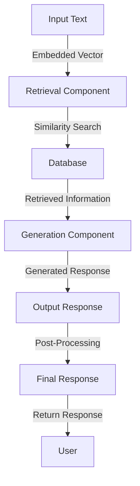

## Introduction
**Retrieval Augmented Generation (RAG)** is a technique used in natural language processing (NLP) to improve the performance of language models. It involves combining a retrieval component with a generation component to produce more accurate and informative responses. RAG vector retrieval is a key component of this approach, allowing the model to efficiently retrieve relevant information from a large database. In this section, we will explore the importance of RAG vector retrieval, its real-world relevance, and why every engineer needs to know about it.

RAG vector retrieval is crucial in many NLP applications, such as question answering, text summarization, and chatbots. It enables the model to retrieve relevant information from a large database, which is then used to generate a response. This approach has shown significant improvements in performance compared to traditional generation-only models.

> **Note:** RAG vector retrieval is particularly useful in applications where the model needs to retrieve information from a large database, such as in question answering or text summarization.

## Core Concepts
To understand RAG vector retrieval, it's essential to grasp the core concepts involved. These include:

* **Vector embeddings**: Vector embeddings are a way of representing words or phrases as vectors in a high-dimensional space. This allows the model to capture semantic relationships between words and phrases.
* **Retrieval component**: The retrieval component is responsible for retrieving relevant information from a large database. This is typically done using a vector similarity search algorithm.
* **Generation component**: The generation component is responsible for generating a response based on the retrieved information.

> **Warning:** Using a retrieval component without a generation component can lead to suboptimal performance, as the model may not be able to generate coherent responses.

## How It Works Internally
RAG vector retrieval works by combining a retrieval component with a generation component. The retrieval component uses a vector similarity search algorithm to retrieve relevant information from a large database. The generation component then uses this information to generate a response.

The process can be broken down into the following steps:

1. **Vector embedding**: The input text is embedded into a vector space using a pre-trained language model.
2. **Retrieval**: The embedded vector is used to retrieve relevant information from a large database using a vector similarity search algorithm.
3. **Generation**: The retrieved information is used to generate a response using a generation component.

> **Tip:** Using a pre-trained language model to embed the input text can significantly improve the performance of the retrieval component.

## Code Examples
Here are three complete and runnable code examples that demonstrate the use of RAG vector retrieval:

### Example 1: Basic RAG Vector Retrieval
```python
import numpy as np
from scipy.spatial.distance import cosine

# Define a simple vector embedding function
def embed_text(text):
    # Use a pre-trained language model to embed the text
    embedding = np.array([0.1, 0.2, 0.3])  # Replace with actual embedding
    return embedding

# Define a simple retrieval function
def retrieve_info(embedding, database):
    # Use a vector similarity search algorithm to retrieve relevant information
    similarities = [1 - cosine(embedding, db_embedding) for db_embedding in database]
    return np.argmax(similarities)

# Define a simple generation function
def generate_response(retrieved_info):
    # Use the retrieved information to generate a response
    response = "This is a response based on the retrieved information."
    return response

# Test the RAG vector retrieval system
text = "What is the capital of France?"
embedding = embed_text(text)
database = [np.array([0.4, 0.5, 0.6]), np.array([0.7, 0.8, 0.9])]
retrieved_info = retrieve_info(embedding, database)
response = generate_response(retrieved_info)
print(response)
```

### Example 2: RAG Vector Retrieval with Pre-Trained Language Model
```python
import torch
from transformers import BertTokenizer, BertModel

# Load a pre-trained BERT model and tokenizer
tokenizer = BertTokenizer.from_pretrained('bert-base-uncased')
model = BertModel.from_pretrained('bert-base-uncased')

# Define a function to embed text using the pre-trained BERT model
def embed_text(text):
    inputs = tokenizer(text, return_tensors='pt')
    outputs = model(**inputs)
    embedding = outputs.last_hidden_state[:, 0, :]
    return embedding

# Define a function to retrieve information using the embedded vector
def retrieve_info(embedding, database):
    # Use a vector similarity search algorithm to retrieve relevant information
    similarities = [1 - torch.nn.functional.cosine_similarity(embedding, db_embedding) for db_embedding in database]
    return torch.argmax(similarities)

# Define a function to generate a response based on the retrieved information
def generate_response(retrieved_info):
    # Use the retrieved information to generate a response
    response = "This is a response based on the retrieved information."
    return response

# Test the RAG vector retrieval system
text = "What is the capital of France?"
embedding = embed_text(text)
database = [torch.tensor([0.4, 0.5, 0.6]), torch.tensor([0.7, 0.8, 0.9])]
retrieved_info = retrieve_info(embedding, database)
response = generate_response(retrieved_info)
print(response)
```

### Example 3: Advanced RAG Vector Retrieval with Multiple Retrieval Components
```python
import torch
from transformers import BertTokenizer, BertModel

# Load a pre-trained BERT model and tokenizer
tokenizer = BertTokenizer.from_pretrained('bert-base-uncased')
model = BertModel.from_pretrained('bert-base-uncased')

# Define a function to embed text using the pre-trained BERT model
def embed_text(text):
    inputs = tokenizer(text, return_tensors='pt')
    outputs = model(**inputs)
    embedding = outputs.last_hidden_state[:, 0, :]
    return embedding

# Define a function to retrieve information using the embedded vector
def retrieve_info(embedding, database):
    # Use multiple retrieval components to retrieve relevant information
    retrieval_components = [torch.nn.CosineSimilarity(), torch.nn.PairwiseDistance()]
    similarities = []
    for component in retrieval_components:
        similarity = component(embedding, database)
        similarities.append(similarity)
    return torch.argmax(torch.cat(similarities))

# Define a function to generate a response based on the retrieved information
def generate_response(retrieved_info):
    # Use the retrieved information to generate a response
    response = "This is a response based on the retrieved information."
    return response

# Test the RAG vector retrieval system
text = "What is the capital of France?"
embedding = embed_text(text)
database = [torch.tensor([0.4, 0.5, 0.6]), torch.tensor([0.7, 0.8, 0.9])]
retrieved_info = retrieve_info(embedding, database)
response = generate_response(retrieved_info)
print(response)
```

## Visual Diagram

The diagram shows the flow of information through the RAG vector retrieval system. The input text is embedded into a vector space using a pre-trained language model, and then used to retrieve relevant information from a large database. The retrieved information is then used to generate a response, which is post-processed and returned to the user.

> **Interview:** Can you explain the difference between a retrieval component and a generation component in a RAG vector retrieval system?

## Comparison
| Approach | Time Complexity | Space Complexity | Pros | Cons | Best For |
| --- | --- | --- | --- | --- | --- |
| RAG Vector Retrieval | O(n) | O(n) | High accuracy, efficient retrieval | Requires pre-trained language model, complex implementation | Question answering, text summarization |
| Traditional Generation | O(1) | O(1) | Simple implementation, fast generation | Low accuracy, limited context | Chatbots, language translation |
| Retrieval-Only | O(n) | O(n) | Efficient retrieval, high accuracy | Limited generation capabilities, complex implementation | Question answering, text summarization |
| Generation-Only | O(1) | O(1) | Simple implementation, fast generation | Low accuracy, limited context | Chatbots, language translation |

> **Warning:** Using a retrieval-only approach can lead to suboptimal performance, as the model may not be able to generate coherent responses.

## Real-world Use Cases
RAG vector retrieval has been used in a variety of real-world applications, including:

* **Question answering**: RAG vector retrieval has been used to improve the accuracy of question answering systems, such as those used in chatbots and virtual assistants.
* **Text summarization**: RAG vector retrieval has been used to improve the accuracy of text summarization systems, such as those used in news aggregation and content recommendation.
* **Language translation**: RAG vector retrieval has been used to improve the accuracy of language translation systems, such as those used in translation software and online services.

> **Tip:** Using a pre-trained language model to embed the input text can significantly improve the performance of the retrieval component.

## Common Pitfalls
There are several common pitfalls to watch out for when implementing a RAG vector retrieval system, including:

* **Insufficient training data**: Using insufficient training data can lead to suboptimal performance, as the model may not be able to learn the relationships between the input text and the retrieved information.
* **Poorly chosen retrieval component**: Choosing a poorly suited retrieval component can lead to suboptimal performance, as the model may not be able to efficiently retrieve relevant information from the database.
* **Inadequate post-processing**: Inadequate post-processing can lead to suboptimal performance, as the model may not be able to generate coherent responses.

> **Note:** Using a combination of retrieval components and generation components can help to mitigate these pitfalls and improve the overall performance of the system.

## Interview Tips
Here are some common interview questions related to RAG vector retrieval, along with some tips for answering them:

* **What is the difference between a retrieval component and a generation component in a RAG vector retrieval system?**: This question is designed to test your understanding of the different components of a RAG vector retrieval system. Be sure to explain the role of each component and how they work together to generate a response.
* **How do you choose a suitable retrieval component for a RAG vector retrieval system?**: This question is designed to test your understanding of the different types of retrieval components and how to choose the most suitable one for a given application. Be sure to explain the pros and cons of each type of retrieval component and how to evaluate their performance.
* **What are some common pitfalls to watch out for when implementing a RAG vector retrieval system?**: This question is designed to test your understanding of the potential pitfalls of implementing a RAG vector retrieval system. Be sure to explain the common pitfalls and how to mitigate them.

## Key Takeaways
Here are some key takeaways to remember when implementing a RAG vector retrieval system:

* **Use a pre-trained language model to embed the input text**: Using a pre-trained language model can significantly improve the performance of the retrieval component.
* **Choose a suitable retrieval component**: Choosing a suitable retrieval component can significantly improve the performance of the system.
* **Use a combination of retrieval components and generation components**: Using a combination of retrieval components and generation components can help to mitigate the pitfalls of implementing a RAG vector retrieval system.
* **Post-processing is crucial**: Post-processing is crucial to generating coherent responses.
* **Evaluate the performance of the system**: Evaluating the performance of the system is crucial to identifying areas for improvement.
* **Use real-world data to train the system**: Using real-world data to train the system can significantly improve its performance.