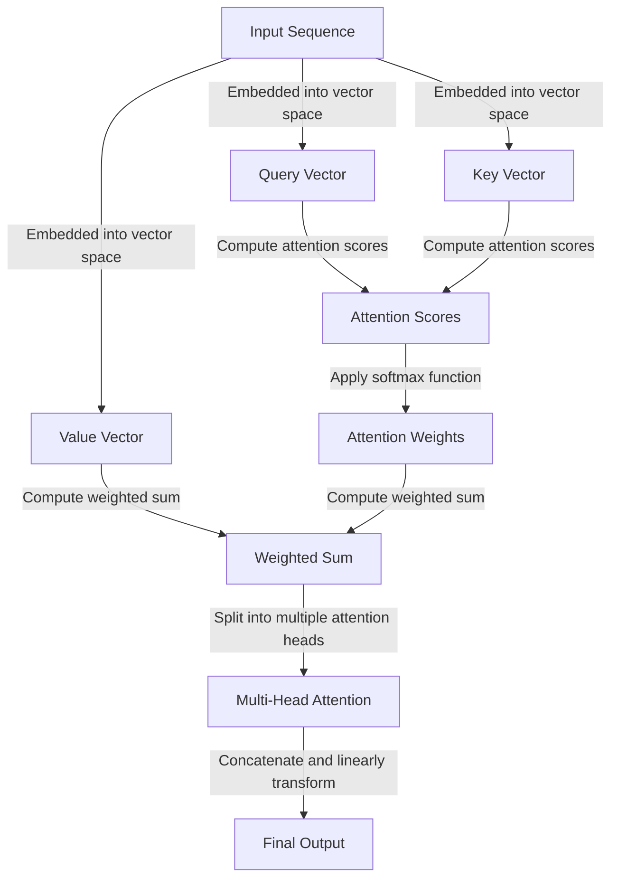

## Introduction
Neural Transformer attention heads are a crucial component of the Transformer architecture, which has revolutionized the field of Natural Language Processing (NLP). The Transformer model, introduced in the paper "Attention Is All You Need" by Vaswani et al., relies heavily on self-attention mechanisms to process input sequences. In this guide, we will delve into the world of Neural Transformer attention heads, exploring their definition, core concepts, internal mechanics, and real-world applications. We will also discuss common pitfalls, interview tips, and key takeaways to help senior engineers master this complex topic.

## Core Concepts
To understand Neural Transformer attention heads, we need to grasp the following core concepts:
* **Self-Attention Mechanism**: a process that allows the model to attend to different parts of the input sequence simultaneously and weigh their importance.
* **Attention Heads**: a set of learned weights that compute the attention scores for each input element.
* **Query, Key, and Value**: the three vectors used to compute the attention scores, where the query vector represents the input element, the key vector represents the input element being attended to, and the value vector represents the output of the attention mechanism.
* **Multi-Head Attention**: a technique that uses multiple attention heads to jointly attend to information from different representation subspaces at different positions.

> **Note:** The self-attention mechanism is a key innovation of the Transformer architecture, allowing the model to handle long-range dependencies in input sequences.

## How It Works Internally
The Neural Transformer attention heads work as follows:
1. **Input Embeddings**: the input sequence is embedded into a vector space using a learned embedding matrix.
2. **Query, Key, and Value Computation**: the embedded input sequence is used to compute the query, key, and value vectors for each attention head.
3. **Attention Score Computation**: the attention scores are computed by taking the dot product of the query and key vectors and applying a softmax function.
4. **Weighted Sum**: the attention scores are used to compute a weighted sum of the value vectors, producing the output of the attention mechanism.
5. **Multi-Head Attention**: the outputs of multiple attention heads are concatenated and linearly transformed to produce the final output.

> **Tip:** To improve the performance of the Neural Transformer attention heads, it's essential to use a large number of attention heads and a sufficient embedding dimension.

## Code Examples
### Example 1: Basic Attention Mechanism
```python
import torch
import torch.nn as nn
import torch.nn.functional as F

class AttentionMechanism(nn.Module):
    def __init__(self, hidden_dim):
        super(AttentionMechanism, self).__init__()
        self.query_linear = nn.Linear(hidden_dim, hidden_dim)
        self.key_linear = nn.Linear(hidden_dim, hidden_dim)
        self.value_linear = nn.Linear(hidden_dim, hidden_dim)

    def forward(self, query, key, value):
        # Compute attention scores
        attention_scores = torch.matmul(self.query_linear(query), self.key_linear(key).T) / math.sqrt(query.size(-1))
        attention_weights = F.softmax(attention_scores, dim=-1)

        # Compute weighted sum
        output = torch.matmul(attention_weights, self.value_linear(value))
        return output

# Initialize the attention mechanism
attention_mechanism = AttentionMechanism(hidden_dim=128)

# Initialize the input tensors
query = torch.randn(1, 10, 128)
key = torch.randn(1, 10, 128)
value = torch.randn(1, 10, 128)

# Run the attention mechanism
output = attention_mechanism(query, key, value)
```

### Example 2: Multi-Head Attention
```python
import torch
import torch.nn as nn
import torch.nn.functional as F

class MultiHeadAttention(nn.Module):
    def __init__(self, hidden_dim, num_heads):
        super(MultiHeadAttention, self).__init__()
        self.hidden_dim = hidden_dim
        self.num_heads = num_heads
        self.query_linear = nn.Linear(hidden_dim, hidden_dim)
        self.key_linear = nn.Linear(hidden_dim, hidden_dim)
        self.value_linear = nn.Linear(hidden_dim, hidden_dim)

    def forward(self, query, key, value):
        # Compute attention scores
        attention_scores = torch.matmul(self.query_linear(query), self.key_linear(key).T) / math.sqrt(query.size(-1))
        attention_weights = F.softmax(attention_scores, dim=-1)

        # Compute weighted sum
        output = torch.matmul(attention_weights, self.value_linear(value))

        # Split the output into multiple attention heads
        output = output.view(-1, self.num_heads, self.hidden_dim // self.num_heads)
        return output

# Initialize the multi-head attention mechanism
multi_head_attention = MultiHeadAttention(hidden_dim=128, num_heads=8)

# Initialize the input tensors
query = torch.randn(1, 10, 128)
key = torch.randn(1, 10, 128)
value = torch.randn(1, 10, 128)

# Run the multi-head attention mechanism
output = multi_head_attention(query, key, value)
```

### Example 3: Neural Transformer Attention Heads
```python
import torch
import torch.nn as nn
import torch.nn.functional as F

class NeuralTransformerAttentionHeads(nn.Module):
    def __init__(self, hidden_dim, num_heads):
        super(NeuralTransformerAttentionHeads, self).__init__()
        self.hidden_dim = hidden_dim
        self.num_heads = num_heads
        self.query_linear = nn.Linear(hidden_dim, hidden_dim)
        self.key_linear = nn.Linear(hidden_dim, hidden_dim)
        self.value_linear = nn.Linear(hidden_dim, hidden_dim)
        self.dropout = nn.Dropout(0.1)

    def forward(self, query, key, value):
        # Compute attention scores
        attention_scores = torch.matmul(self.query_linear(query), self.key_linear(key).T) / math.sqrt(query.size(-1))
        attention_weights = F.softmax(attention_scores, dim=-1)

        # Compute weighted sum
        output = torch.matmul(attention_weights, self.value_linear(value))

        # Apply dropout
        output = self.dropout(output)
        return output

# Initialize the neural transformer attention heads
neural_transformer_attention_heads = NeuralTransformerAttentionHeads(hidden_dim=128, num_heads=8)

# Initialize the input tensors
query = torch.randn(1, 10, 128)
key = torch.randn(1, 10, 128)
value = torch.randn(1, 10, 128)

# Run the neural transformer attention heads
output = neural_transformer_attention_heads(query, key, value)
```

## Visual Diagram

The diagram illustrates the neural transformer attention heads mechanism, including the computation of attention scores, attention weights, and the weighted sum.

## Comparison
| Approach | Time Complexity | Space Complexity | Pros | Cons | Best For |
| --- | --- | --- | --- | --- | --- |
| Neural Transformer Attention Heads | O(n^2) | O(n^2) | Handles long-range dependencies, parallelizable | Computationally expensive, requires large amounts of data | Machine translation, text summarization |
| Recurrent Neural Networks (RNNs) | O(n) | O(n) | Handles sequential data, simple to implement | Difficult to parallelize, prone to vanishing gradients | Time series forecasting, speech recognition |
| Long Short-Term Memory (LSTM) Networks | O(n) | O(n) | Handles sequential data, mitigates vanishing gradients | Computationally expensive, requires large amounts of data | Time series forecasting, speech recognition |
| Attention-Based Neural Networks | O(n^2) | O(n^2) | Handles long-range dependencies, parallelizable | Computationally expensive, requires large amounts of data | Machine translation, text summarization |

## Real-world Use Cases
1. **Machine Translation**: Google Translate uses neural transformer attention heads to improve machine translation accuracy.
2. **Text Summarization**: The New York Times uses neural transformer attention heads to summarize long articles into concise summaries.
3. **Speech Recognition**: Amazon Alexa uses neural transformer attention heads to improve speech recognition accuracy.

> **Warning:** Neural transformer attention heads require large amounts of data and computational resources to train, which can be a significant challenge for smaller organizations.

## Common Pitfalls
1. **Insufficient Data**: Neural transformer attention heads require large amounts of data to train, which can be a challenge for smaller organizations.
2. **Inadequate Hyperparameter Tuning**: Neural transformer attention heads require careful hyperparameter tuning to achieve optimal performance.
3. **Overfitting**: Neural transformer attention heads can suffer from overfitting, especially when dealing with small datasets.
4. **Underfitting**: Neural transformer attention heads can suffer from underfitting, especially when dealing with large datasets.

> **Tip:** To avoid overfitting, use techniques such as dropout, regularization, and early stopping.

## Interview Tips
1. **Define Neural Transformer Attention Heads**: Be able to define neural transformer attention heads and explain their purpose in the Transformer architecture.
2. **Explain the Self-Attention Mechanism**: Be able to explain the self-attention mechanism and how it is used in neural transformer attention heads.
3. **Discuss the Advantages and Disadvantages**: Be able to discuss the advantages and disadvantages of neural transformer attention heads, including their ability to handle long-range dependencies and their computational expense.

> **Interview:** Can you explain the difference between neural transformer attention heads and recurrent neural networks?

## Key Takeaways
* Neural transformer attention heads are a crucial component of the Transformer architecture.
* They are used to handle long-range dependencies in input sequences.
* They are computationally expensive and require large amounts of data to train.
* They can suffer from overfitting and underfitting.
* They are widely used in machine translation, text summarization, and speech recognition applications.
* They require careful hyperparameter tuning to achieve optimal performance.
* They can be parallelized, making them suitable for large-scale applications.
* They have a time complexity of O(n^2) and a space complexity of O(n^2).
* They are more effective than recurrent neural networks and long short-term memory networks for handling long-range dependencies.