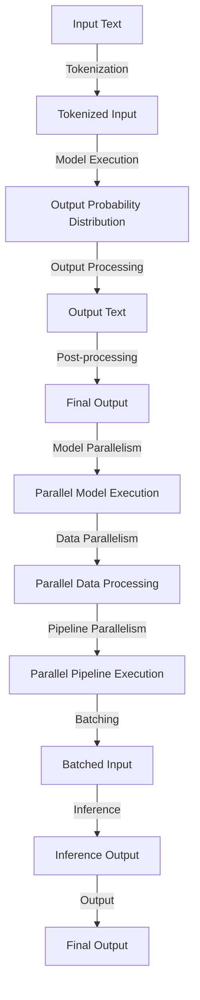

## Introduction
**Large Language Models (LLMs)** have revolutionized the field of Natural Language Processing (NLP) with their ability to generate human-like text. However, as the complexity of these models increases, so does the computational cost of inference. **Inference speed** is a critical factor in many applications, such as chatbots, language translation, and text summarization. In this section, we will explore the importance of optimizing LLM inference speed and the common pitfalls that engineers face when chaining LLM inference.

> **Note:** LLMs are computationally expensive due to their massive size and complex architecture. Optimizing inference speed is crucial for real-time applications.

Real-world relevance: Many companies, such as Google, Facebook, and Microsoft, use LLMs in their production systems. For instance, Google's **BERT** model is used for search query understanding, while Facebook's **RoBERTa** model is used for text classification.

## Core Concepts
To understand the challenges of optimizing LLM inference speed, we need to define some key concepts:

* **Model parallelism**: splitting the model into smaller components and processing them in parallel.
* **Data parallelism**: splitting the input data into smaller batches and processing them in parallel.
* **Pipeline parallelism**: splitting the model into a series of stages and processing them in a pipeline fashion.
* **Batching**: grouping multiple input samples into a single batch to reduce overhead.

> **Tip:** Model parallelism and data parallelism can be combined to achieve better performance.

## How It Works Internally
When chaining LLM inference, the following steps occur:

1. **Input processing**: the input text is tokenized and embedded into a numerical representation.
2. **Model execution**: the embedded input is passed through the LLM, which generates a probability distribution over the possible output tokens.
3. **Output processing**: the output probability distribution is converted back into text.
4. **Post-processing**: the output text may undergo additional processing, such as spell checking or fluency evaluation.

> **Warning:** Inefficient input processing and post-processing can significantly slow down the overall inference speed.

## Code Examples
### Example 1: Basic LLM Inference
```python
import torch
from transformers import AutoModelForSequenceClassification, AutoTokenizer

# Load pre-trained LLM and tokenizer
model = AutoModelForSequenceClassification.from_pretrained("bert-base-uncased")
tokenizer = AutoTokenizer.from_pretrained("bert-base-uncased")

# Define input text and batch size
input_text = "This is a sample input text."
batch_size = 32

# Tokenize input text and create batch
inputs = tokenizer(input_text, return_tensors="pt", max_length=512, padding="max_length", truncation=True)
batch = torch.cat([inputs] * batch_size, dim=0)

# Perform inference
outputs = model(batch)

# Print output
print(outputs.logits)
```

### Example 2: Model Parallelism
```python
import torch
from transformers import AutoModelForSequenceClassification, AutoTokenizer
from torch.nn.parallel import DataParallel

# Load pre-trained LLM and tokenizer
model = AutoModelForSequenceClassification.from_pretrained("bert-base-uncased")
tokenizer = AutoTokenizer.from_pretrained("bert-base-uncased")

# Define input text and batch size
input_text = "This is a sample input text."
batch_size = 32

# Tokenize input text and create batch
inputs = tokenizer(input_text, return_tensors="pt", max_length=512, padding="max_length", truncation=True)
batch = torch.cat([inputs] * batch_size, dim=0)

# Create data parallel model
model_parallel = DataParallel(model, device_ids=[0, 1])

# Perform inference
outputs = model_parallel(batch)

# Print output
print(outputs.logits)
```

### Example 3: Pipeline Parallelism
```python
import torch
from transformers import AutoModelForSequenceClassification, AutoTokenizer
from torch.nn.parallel import PipelineParallel

# Load pre-trained LLM and tokenizer
model = AutoModelForSequenceClassification.from_pretrained("bert-base-uncased")
tokenizer = AutoTokenizer.from_pretrained("bert-base-uncased")

# Define input text and batch size
input_text = "This is a sample input text."
batch_size = 32

# Tokenize input text and create batch
inputs = tokenizer(input_text, return_tensors="pt", max_length=512, padding="max_length", truncation=True)
batch = torch.cat([inputs] * batch_size, dim=0)

# Create pipeline parallel model
model_pipeline = PipelineParallel(model, device_ids=[0, 1], split_size=128)

# Perform inference
outputs = model_pipeline(batch)

# Print output
print(outputs.logits)
```

## Visual Diagram

The diagram illustrates the different stages of LLM inference, including input processing, model execution, output processing, and post-processing. It also shows how model parallelism, data parallelism, and pipeline parallelism can be used to speed up inference.

> **Interview:** Can you explain the difference between model parallelism and data parallelism in LLM inference?

## Comparison
| Approach | Time Complexity | Space Complexity | Pros | Cons | Best For |
| --- | --- | --- | --- | --- | --- |
| Model Parallelism | O(n/p) | O(n/p) | Better performance for large models | Requires multiple GPUs | Large-scale LLMs |
| Data Parallelism | O(n/b) | O(n/b) | Better performance for large batches | Requires multiple GPUs | Large-scale data processing |
| Pipeline Parallelism | O(n/p) | O(n/p) | Better performance for long sequences | Requires multiple GPUs | Long-range dependencies |
| Batching | O(n/b) | O(n/b) | Better performance for small batches | Requires careful tuning | Small-scale data processing |

## Real-world Use Cases
1. **Google's BERT**: uses model parallelism to speed up inference for search query understanding.
2. **Facebook's RoBERTa**: uses data parallelism to speed up inference for text classification.
3. **Microsoft's Turing-NLG**: uses pipeline parallelism to speed up inference for long-range language generation.

> **Tip:** Batching can be used to improve performance for small-scale data processing.

## Common Pitfalls
1. **Inefficient input processing**: using slow tokenization algorithms or not utilizing GPU acceleration.
2. **Inefficient model execution**: not using model parallelism or data parallelism.
3. **Inefficient output processing**: using slow output processing algorithms or not utilizing GPU acceleration.
4. **Inadequate batching**: not using batching or using incorrect batch sizes.

> **Warning:** Inefficient input processing and output processing can significantly slow down the overall inference speed.

## Interview Tips
1. **What is the difference between model parallelism and data parallelism?**: Model parallelism splits the model into smaller components, while data parallelism splits the input data into smaller batches.
2. **How can you speed up LLM inference?**: Use model parallelism, data parallelism, pipeline parallelism, and batching to speed up inference.
3. **What is the importance of batching in LLM inference?**: Batching can improve performance for small-scale data processing by reducing overhead.

> **Note:** The interviewer is looking for a deep understanding of LLM inference and the ability to optimize performance.

## Key Takeaways
* **Model parallelism** can be used to speed up inference for large models.
* **Data parallelism** can be used to speed up inference for large batches.
* **Pipeline parallelism** can be used to speed up inference for long sequences.
* **Batching** can improve performance for small-scale data processing.
* **Inefficient input processing and output processing** can significantly slow down the overall inference speed.
* **Inadequate batching** can lead to poor performance.
* **Model parallelism and data parallelism** can be combined to achieve better performance.
* **Pipeline parallelism and batching** can be used to improve performance for long-range dependencies and small-scale data processing.