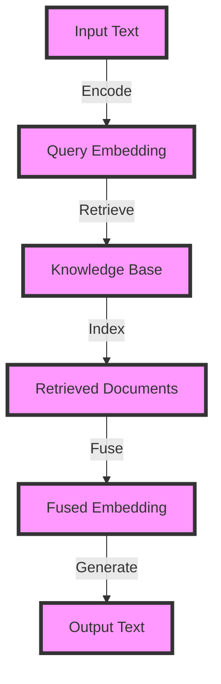

## Introduction
**RAG (Retrieval-Augmented Generator) vector retrieval** is a technique used in natural language processing (NLP) to improve the performance of language models by augmenting them with a retrieval mechanism. This allows the model to retrieve relevant information from a knowledge base and incorporate it into its responses. RAG has been shown to improve the accuracy and fluency of language models, especially in tasks that require the generation of long-form text. In this article, we will delve into the internal workings of RAG vector retrieval, exploring its core concepts, under-the-hood mechanics, and providing code examples and visual diagrams to illustrate its functionality.

## Core Concepts
RAG vector retrieval relies on several key concepts:
* **Embeddings**: dense vector representations of words, phrases, or documents that capture their semantic meaning.
* **Knowledge base**: a database of documents or texts that contain relevant information.
* **Retrieval mechanism**: a component that retrieves relevant information from the knowledge base based on a given query.
* **Generator**: a language model that generates text based on the retrieved information.

> **Note:** The quality of the embeddings and the knowledge base are crucial to the performance of RAG vector retrieval.

## How It Works Internally
The RAG vector retrieval process can be broken down into the following steps:
1. **Text encoding**: the input text is encoded into a dense vector representation using a pre-trained language model.
2. **Knowledge base indexing**: the knowledge base is indexed using a technique such as faiss or annoy to enable efficient nearest neighbor search.
3. **Query retrieval**: the encoded input text is used as a query to retrieve relevant information from the knowledge base.
4. **Information fusion**: the retrieved information is fused with the input text to generate a new representation.
5. **Text generation**: the new representation is used as input to a language model to generate the final response.

> **Warning:** The choice of indexing technique and retrieval algorithm can significantly impact the performance of RAG vector retrieval.

## Code Examples
### Example 1: Basic RAG Vector Retrieval
```python
import torch
from transformers import AutoModel, AutoTokenizer
from faiss import IndexFlatL2

# Load pre-trained language model and tokenizer
model = AutoModel.from_pretrained('distilbert-base-uncased')
tokenizer = AutoTokenizer.from_pretrained('distilbert-base-uncased')

# Create a knowledge base index
index = IndexFlatL2(768)  # 768 is the dimensionality of the embeddings

# Add documents to the knowledge base
documents = ['This is a sample document.', 'This is another sample document.']
for document in documents:
    inputs = tokenizer(document, return_tensors='pt')
    embeddings = model(**inputs)['pooler_output']
    index.add(embeddings)

# Define a retrieval function
def retrieve(query):
    inputs = tokenizer(query, return_tensors='pt')
    query_embedding = model(**inputs)['pooler_output']
    distances, indices = index.search(query_embedding)
    return documents[indices[0][0]]

# Test the retrieval function
query = 'sample document'
print(retrieve(query))
```
### Example 2: Real-World RAG Vector Retrieval
```python
import torch
from transformers import AutoModel, AutoTokenizer
from faiss import IndexFlatL2
from datasets import load_dataset

# Load a pre-trained language model and tokenizer
model = AutoModel.from_pretrained('distilbert-base-uncased')
tokenizer = AutoTokenizer.from_pretrained('distilbert-base-uncased')

# Load a dataset
dataset = load_dataset('wiki_text', split='train')

# Create a knowledge base index
index = IndexFlatL2(768)  # 768 is the dimensionality of the embeddings

# Add documents to the knowledge base
for document in dataset:
    inputs = tokenizer(document['text'], return_tensors='pt')
    embeddings = model(**inputs)['pooler_output']
    index.add(embeddings)

# Define a retrieval function
def retrieve(query):
    inputs = tokenizer(query, return_tensors='pt')
    query_embedding = model(**inputs)['pooler_output']
    distances, indices = index.search(query_embedding)
    return dataset[indices[0][0]]['text']

# Test the retrieval function
query = 'artificial intelligence'
print(retrieve(query))
```
### Example 3: Advanced RAG Vector Retrieval with Information Fusion
```python
import torch
from transformers import AutoModel, AutoTokenizer
from faiss import IndexFlatL2
from datasets import load_dataset

# Load a pre-trained language model and tokenizer
model = AutoModel.from_pretrained('distilbert-base-uncased')
tokenizer = AutoTokenizer.from_pretrained('distilbert-base-uncased')

# Load a dataset
dataset = load_dataset('wiki_text', split='train')

# Create a knowledge base index
index = IndexFlatL2(768)  # 768 is the dimensionality of the embeddings

# Add documents to the knowledge base
for document in dataset:
    inputs = tokenizer(document['text'], return_tensors='pt')
    embeddings = model(**inputs)['pooler_output']
    index.add(embeddings)

# Define a retrieval function with information fusion
def retrieve(query):
    inputs = tokenizer(query, return_tensors='pt')
    query_embedding = model(**inputs)['pooler_output']
    distances, indices = index.search(query_embedding)
    retrieved_document = dataset[indices[0][0]]['text']
    fused_embedding = torch.cat((query_embedding, model(**tokenizer(retrieved_document, return_tensors='pt'))['pooler_output']), dim=1)
    return fused_embedding

# Test the retrieval function
query = 'artificial intelligence'
print(retrieve(query))
```
> **Tip:** The choice of information fusion technique can significantly impact the performance of RAG vector retrieval.

## Visual Diagram

The diagram illustrates the RAG vector retrieval process, from input text to output text.

## Comparison
| Approach | Time Complexity | Space Complexity | Pros | Cons | Best For |
| --- | --- | --- | --- | --- | --- |
| RAG Vector Retrieval | O(n) | O(n) | Improved accuracy and fluency | Increased computational cost | Long-form text generation |
| Traditional Language Models | O(1) | O(1) | Fast and efficient | Limited context and knowledge | Short-form text generation |
| Retrieval-Based Language Models | O(n) | O(n) | Improved accuracy and fluency | Increased computational cost | Question answering and dialogue systems |
| Hybrid Language Models | O(n) | O(n) | Improved accuracy and fluency | Increased computational cost | Long-form text generation and question answering |

> **Interview:** Can you explain the difference between RAG vector retrieval and traditional language models?

## Real-world Use Cases
1. **Google's LaMDA**: uses RAG vector retrieval to improve the accuracy and fluency of its conversational AI model.
2. **Facebook's Blender**: uses RAG vector retrieval to improve the accuracy and fluency of its chatbot model.
3. **Microsoft's Turing-NLG**: uses RAG vector retrieval to improve the accuracy and fluency of its long-form text generation model.

## Common Pitfalls
1. **Insufficient knowledge base**: a small or poorly curated knowledge base can lead to poor retrieval performance.
2. **Inadequate information fusion**: a poorly designed information fusion technique can lead to poor performance.
3. **Inefficient indexing**: a poorly designed indexing technique can lead to poor retrieval performance.
4. **Overfitting**: the model can overfit to the training data, leading to poor performance on unseen data.

> **Warning:** RAG vector retrieval can be computationally expensive and require significant resources.

## Interview Tips
1. **Be prepared to explain the RAG vector retrieval process**: including the encoding, retrieval, and information fusion steps.
2. **Be prepared to discuss the pros and cons of RAG vector retrieval**: including its improved accuracy and fluency, as well as its increased computational cost.
3. **Be prepared to answer questions about the knowledge base and indexing technique**: including the size and quality of the knowledge base, and the choice of indexing technique.

## Key Takeaways
* RAG vector retrieval is a technique used to improve the performance of language models by augmenting them with a retrieval mechanism.
* The quality of the embeddings and the knowledge base are crucial to the performance of RAG vector retrieval.
* The choice of indexing technique and retrieval algorithm can significantly impact the performance of RAG vector retrieval.
* RAG vector retrieval can be computationally expensive and require significant resources.
* The technique has been shown to improve the accuracy and fluency of language models, especially in tasks that require the generation of long-form text.
* RAG vector retrieval has been used in several real-world applications, including Google's LaMDA and Facebook's Blender.
* The technique has several common pitfalls, including insufficient knowledge base, inadequate information fusion, inefficient indexing, and overfitting.