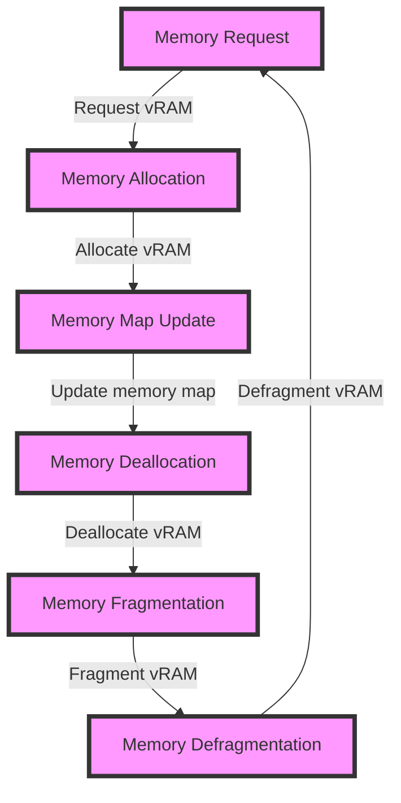

## Introduction
**GPU vRAM utilization** refers to the process of managing and optimizing the memory usage of a Graphics Processing Unit's (GPU) video Random Access Memory (vRAM). This is a critical aspect of **AI-ML engineering**, as it directly impacts the performance, efficiency, and scalability of machine learning models. In real-world scenarios, understanding GPU vRAM utilization is essential for tasks such as training large neural networks, processing massive datasets, and deploying models in production environments.

> **Note:** In the context of AI-ML engineering, GPU vRAM utilization is a key factor in determining the overall performance of a system. A thorough understanding of this concept can help engineers optimize their models and improve overall system efficiency.

## Core Concepts
To grasp the mechanics of GPU vRAM utilization, it's essential to understand the following core concepts:
* **vRAM**: The video Random Access Memory of a GPU, responsible for storing graphics data, textures, and other visual information.
* **Memory Allocation**: The process of assigning vRAM to specific tasks or applications.
* **Memory Deallocation**: The process of freeing up allocated vRAM when it's no longer needed.
* **Memory Fragmentation**: The phenomenon of vRAM becoming fragmented, leading to reduced performance and increased memory usage.

> **Warning:** Memory fragmentation can significantly impact system performance and should be addressed through proper memory management techniques.

## How It Works Internally
Internally, GPU vRAM utilization involves a complex interplay of hardware and software components. Here's a step-by-step breakdown:
1. **Memory Request**: An application or task requests a specific amount of vRAM from the GPU.
2. **Memory Allocation**: The GPU's memory management unit (MMU) allocates the requested vRAM, ensuring that the allocation is contiguous and efficient.
3. **Memory Deallocation**: When the application or task is completed, the allocated vRAM is deallocated, and the MMU updates the memory map to reflect the change.
4. **Memory Fragmentation**: Over time, repeated memory allocations and deallocations can lead to memory fragmentation, reducing the overall efficiency of the system.

## Code Examples
Here are three complete, runnable code examples demonstrating GPU vRAM utilization:
### Example 1: Basic Memory Allocation
```python
import numpy as np
import cupy as cp

# Allocate 1GB of vRAM
x = cp.zeros((1024, 1024, 1024), dtype=np.float32)

# Print vRAM usage
print(f"vRAM usage: {cp.get_mem_info()['used']} bytes")

# Deallocate vRAM
del x
cp.cuda.Stream(null).synchronize()
```
### Example 2: Real-World Memory Management
```python
import torch
import torch.cuda as cuda

# Create a PyTorch tensor
x = torch.randn(1024, 1024, dtype=torch.float32)

# Move tensor to GPU
x = x.to('cuda:0')

# Print vRAM usage
print(f"vRAM usage: {cuda.get_device_properties(0).total_memory - cuda.get_device_properties(0).free_memory} bytes")

# Deallocate vRAM
del x
cuda.empty_cache()
```
### Example 3: Advanced Memory Optimization
```cpp
#include <cuda_runtime.h>

__global__ void kernel(float* data) {
  // Perform some computation
}

int main() {
  // Allocate 1GB of vRAM
  float* data;
  cudaMalloc((void**)&data, 1024 * 1024 * 1024 * sizeof(float));

  // Launch kernel
  kernel<<<1, 1>>>(data);

  // Print vRAM usage
  size_t free, total;
  cudaMemGetInfo(&free, &total);
  printf("vRAM usage: %zu bytes\n", total - free);

  // Deallocate vRAM
  cudaFree(data);
  return 0;
}
```
## Visual Diagram

The diagram illustrates the lifecycle of GPU vRAM utilization, showcasing the various stages involved in memory management.

## Comparison
| Approach | Time Complexity | Space Complexity | Pros | Cons | Best For |
| --- | --- | --- | --- | --- | --- |
| **Manual Memory Management** | O(1) | O(n) | Fine-grained control, high performance | Error-prone, complex | Expert users, high-performance applications |
| **Automatic Memory Management** | O(log n) | O(n) | Easy to use, reduced memory leaks | Performance overhead, limited control | General users, development environments |
| **Hybrid Memory Management** | O(log n) | O(n) | Balances control and ease of use, reduced memory leaks | Increased complexity, potential performance overhead | Intermediate users, production environments |
| **Memory Pooling** | O(1) | O(n) | Reduced memory fragmentation, improved performance | Increased memory usage, complex implementation | High-performance applications, real-time systems |

## Real-world Use Cases
Here are three real-world examples of GPU vRAM utilization:
* **Deep Learning**: NVIDIA's Deep Learning SDK uses GPU vRAM to accelerate machine learning workloads, providing significant performance improvements.
* **Computer Vision**: Intel's OpenCV library utilizes GPU vRAM to accelerate computer vision tasks, such as object detection and image processing.
* **Scientific Computing**: The CUDA-accelerated version of the popular scientific computing library, NumPy, uses GPU vRAM to accelerate numerical computations.

## Common Pitfalls
Here are four common mistakes to avoid when working with GPU vRAM utilization:
* **Memory Leaks**: Failing to deallocate vRAM can lead to memory leaks, reducing system performance and increasing the risk of crashes.
* **Memory Fragmentation**: Ignoring memory fragmentation can result in reduced system performance and increased memory usage.
* **Incorrect Memory Allocation**: Allocating too little or too much vRAM can lead to performance issues or memory errors.
* **Insufficient Memory Deallocation**: Failing to deallocate vRAM in a timely manner can lead to memory leaks and reduced system performance.

## Interview Tips
Here are three common interview questions related to GPU vRAM utilization, along with sample answers:
* **What is the difference between vRAM and system RAM?**
	+ Weak answer: "vRAM is faster than system RAM."
	+ Strong answer: "vRAM is a type of memory specifically designed for graphics processing, whereas system RAM is a general-purpose memory. vRAM is typically faster and more efficient than system RAM for graphics-related tasks."
* **How do you optimize GPU vRAM utilization in a deep learning application?**
	+ Weak answer: "I use a larger GPU with more vRAM."
	+ Strong answer: "I optimize GPU vRAM utilization by using techniques such as memory pooling, reducing batch sizes, and using mixed precision training. I also monitor vRAM usage and adjust the model architecture and hyperparameters as needed."
* **What are the consequences of memory fragmentation in GPU vRAM utilization?**
	+ Weak answer: "Memory fragmentation reduces system performance."
	+ Strong answer: "Memory fragmentation can lead to reduced system performance, increased memory usage, and increased risk of crashes. It can also make it more difficult to allocate and deallocate vRAM, leading to memory leaks and other issues."

## Key Takeaways
Here are ten key takeaways to remember:
* **GPU vRAM utilization is critical for AI-ML engineering**: Understanding GPU vRAM utilization is essential for optimizing machine learning models and improving overall system efficiency.
* **Memory allocation and deallocation are crucial**: Proper memory allocation and deallocation are necessary to avoid memory leaks and reduce memory fragmentation.
* **Memory fragmentation can lead to performance issues**: Memory fragmentation can reduce system performance, increase memory usage, and increase the risk of crashes.
* **Hybrid memory management can balance control and ease of use**: Hybrid memory management approaches can provide a balance between fine-grained control and ease of use.
* **Memory pooling can reduce memory fragmentation**: Memory pooling can reduce memory fragmentation by allocating and deallocating vRAM in larger blocks.
* **Reducing batch sizes can optimize GPU vRAM utilization**: Reducing batch sizes can help optimize GPU vRAM utilization by reducing the amount of vRAM required for each batch.
* **Mixed precision training can reduce vRAM usage**: Mixed precision training can reduce vRAM usage by using lower precision data types for certain operations.
* **Monitoring vRAM usage is essential**: Monitoring vRAM usage is essential to identify potential issues and optimize GPU vRAM utilization.
* **Optimizing GPU vRAM utilization requires a holistic approach**: Optimizing GPU vRAM utilization requires a holistic approach that considers the entire system, including the GPU, memory, and software.
* **GPU vRAM utilization is a complex topic**: GPU vRAM utilization is a complex topic that requires a deep understanding of the underlying hardware and software components.