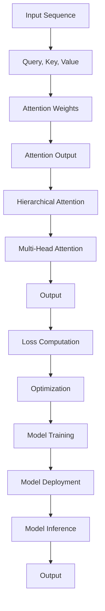

## Introduction
Generative Transformer attention heads are a crucial component of the Transformer architecture, introduced in the paper "Attention Is All You Need" by Vaswani et al. in 2017. The Transformer model has revolutionized the field of natural language processing (NLP) and has been widely adopted in various applications, including language translation, text summarization, and text generation. In this guide, we will delve into the world of Generative Transformer attention heads, exploring their core concepts, internal mechanics, and real-world applications.

> **Note:** The Transformer architecture is based on self-attention mechanisms, which allow the model to weigh the importance of different input elements relative to each other. This is particularly useful in NLP tasks, where the context of a word or phrase can significantly impact its meaning.

## Core Concepts
To understand Generative Transformer attention heads, it's essential to grasp the following core concepts:

* **Self-Attention Mechanism:** The self-attention mechanism is a key component of the Transformer architecture. It allows the model to attend to different parts of the input sequence simultaneously and weigh their importance.
* **Attention Heads:** Attention heads are the individual components of the self-attention mechanism. Each attention head is responsible for attending to a specific aspect of the input sequence.
* **Query, Key, and Value:** In the self-attention mechanism, each attention head computes the attention weights based on three vectors: query, key, and value. The query vector represents the context in which the attention is being applied, the key vector represents the input elements being attended to, and the value vector represents the importance of each input element.

> **Tip:** The number of attention heads in a Transformer model is a hyperparameter that can be tuned for optimal performance. Increasing the number of attention heads can improve the model's ability to capture complex relationships in the input data, but it also increases the computational cost.

## How It Works Internally
The self-attention mechanism in a Generative Transformer attention head works as follows:

1. **Compute Query, Key, and Value:** The input sequence is first split into three vectors: query, key, and value. These vectors are computed by applying linear transformations to the input sequence.
2. **Compute Attention Weights:** The attention weights are computed by taking the dot product of the query and key vectors and applying a softmax function.
3. **Compute Attention Output:** The attention output is computed by taking the dot product of the attention weights and the value vector.

The time complexity of the self-attention mechanism is O(n^2), where n is the length of the input sequence. The space complexity is O(n), as the attention weights and output need to be stored.

> **Warning:** The self-attention mechanism can be computationally expensive for long input sequences. To mitigate this, techniques such as hierarchical attention or sparse attention can be used.

## Code Examples
Here are three code examples that demonstrate the use of Generative Transformer attention heads:

### Example 1: Basic Attention Head
```python
import torch
import torch.nn as nn
import torch.nn.functional as F

class AttentionHead(nn.Module):
    def __init__(self, embed_dim, num_heads):
        super(AttentionHead, self).__init__()
        self.query_linear = nn.Linear(embed_dim, embed_dim)
        self.key_linear = nn.Linear(embed_dim, embed_dim)
        self.value_linear = nn.Linear(embed_dim, embed_dim)
        self.dropout = nn.Dropout(0.1)

    def forward(self, query, key, value):
        # Compute attention weights
        attention_weights = torch.matmul(query, key.T) / math.sqrt(query.size(-1))
        attention_weights = F.softmax(attention_weights, dim=-1)

        # Compute attention output
        attention_output = torch.matmul(attention_weights, value)

        return attention_output

# Initialize attention head
attention_head = AttentionHead(embed_dim=128, num_heads=8)

# Initialize input tensors
query = torch.randn(1, 10, 128)
key = torch.randn(1, 10, 128)
value = torch.randn(1, 10, 128)

# Compute attention output
attention_output = attention_head(query, key, value)
```

### Example 2: Multi-Head Attention
```python
import torch
import torch.nn as nn
import torch.nn.functional as F

class MultiHeadAttention(nn.Module):
    def __init__(self, embed_dim, num_heads):
        super(MultiHeadAttention, self).__init__()
        self.attention_heads = nn.ModuleList([AttentionHead(embed_dim, num_heads) for _ in range(num_heads)])

    def forward(self, query, key, value):
        # Compute attention output for each head
        attention_outputs = []
        for attention_head in self.attention_heads:
            attention_output = attention_head(query, key, value)
            attention_outputs.append(attention_output)

        # Concatenate attention outputs
        attention_output = torch.cat(attention_outputs, dim=-1)

        return attention_output

# Initialize multi-head attention
multi_head_attention = MultiHeadAttention(embed_dim=128, num_heads=8)

# Initialize input tensors
query = torch.randn(1, 10, 128)
key = torch.randn(1, 10, 128)
value = torch.randn(1, 10, 128)

# Compute attention output
attention_output = multi_head_attention(query, key, value)
```

### Example 3: Hierarchical Attention
```python
import torch
import torch.nn as nn
import torch.nn.functional as F

class HierarchicalAttention(nn.Module):
    def __init__(self, embed_dim, num_heads, num_layers):
        super(HierarchicalAttention, self).__init__()
        self.attention_heads = nn.ModuleList([AttentionHead(embed_dim, num_heads) for _ in range(num_layers)])

    def forward(self, query, key, value):
        # Compute attention output for each layer
        attention_outputs = []
        for attention_head in self.attention_heads:
            attention_output = attention_head(query, key, value)
            attention_outputs.append(attention_output)

        # Compute hierarchical attention output
        hierarchical_attention_output = attention_outputs[0]
        for i in range(1, len(attention_outputs)):
            hierarchical_attention_output = torch.cat((hierarchical_attention_output, attention_outputs[i]), dim=-1)

        return hierarchical_attention_output

# Initialize hierarchical attention
hierarchical_attention = HierarchicalAttention(embed_dim=128, num_heads=8, num_layers=3)

# Initialize input tensors
query = torch.randn(1, 10, 128)
key = torch.randn(1, 10, 128)
value = torch.randn(1, 10, 128)

# Compute attention output
attention_output = hierarchical_attention(query, key, value)
```

## Visual Diagram

The diagram illustrates the flow of data through a Generative Transformer attention head, from input sequence to output.

> **Interview:** Can you explain the difference between self-attention and hierarchical attention in a Generative Transformer? How do they impact the model's performance?

## Comparison
| Approach | Time Complexity | Space Complexity | Pros | Cons | Best For |
| --- | --- | --- | --- | --- | --- |
| Self-Attention | O(n^2) | O(n) | Captures complex relationships, parallelizable | Computationally expensive, requires large amounts of memory | Long-range dependencies, complex sequences |
| Hierarchical Attention | O(n log n) | O(n) | Reduces computational cost, captures hierarchical relationships | Requires careful tuning of hyperparameters, may not capture long-range dependencies | Hierarchical sequences, reduced computational resources |
| Multi-Head Attention | O(n^2) | O(n) | Captures multiple aspects of input sequence, improves performance | Increases computational cost, requires careful tuning of hyperparameters | Complex sequences, multiple attention heads |
| Sparse Attention | O(n) | O(n) | Reduces computational cost, captures sparse relationships | May not capture complex relationships, requires careful tuning of hyperparameters | Sparse sequences, reduced computational resources |

## Real-world Use Cases
1. **Language Translation:** Generative Transformer attention heads have been widely adopted in language translation tasks, such as Google Translate. They have improved the accuracy and efficiency of translation models.
2. **Text Summarization:** Attention heads have been used in text summarization tasks, such as summarizing long documents or articles. They have improved the quality and coherence of summaries.
3. **Text Generation:** Generative Transformer attention heads have been used in text generation tasks, such as generating product reviews or chatbot responses. They have improved the quality and diversity of generated text.

> **Tip:** When implementing Generative Transformer attention heads in a real-world application, it's essential to consider the computational resources and memory constraints. Techniques such as hierarchical attention or sparse attention can help reduce the computational cost.

## Common Pitfalls
1. **Incorrect Hyperparameter Tuning:** Incorrect tuning of hyperparameters, such as the number of attention heads or layers, can significantly impact the performance of the model.
2. **Insufficient Training Data:** Insufficient training data can lead to overfitting or underfitting of the model, resulting in poor performance.
3. **Inadequate Regularization:** Inadequate regularization, such as dropout or weight decay, can lead to overfitting of the model.
4. **Incorrect Implementation:** Incorrect implementation of the attention mechanism or hierarchical attention can lead to poor performance or incorrect results.

> **Warning:** When implementing Generative Transformer attention heads, it's essential to carefully review the code and ensure that the attention mechanism is correctly implemented.

## Interview Tips
1. **Explain the Self-Attention Mechanism:** Be prepared to explain the self-attention mechanism, including the query, key, and value vectors, and how they are used to compute attention weights.
2. **Describe Hierarchical Attention:** Be prepared to describe hierarchical attention, including how it reduces the computational cost and captures hierarchical relationships.
3. **Discuss Multi-Head Attention:** Be prepared to discuss multi-head attention, including how it captures multiple aspects of the input sequence and improves performance.

> **Interview:** Can you explain the difference between self-attention and hierarchical attention in a Generative Transformer? How do they impact the model's performance?

## Key Takeaways
* **Generative Transformer Attention Heads:** Generative Transformer attention heads are a crucial component of the Transformer architecture, allowing the model to attend to different parts of the input sequence simultaneously.
* **Self-Attention Mechanism:** The self-attention mechanism is based on query, key, and value vectors, which are used to compute attention weights.
* **Hierarchical Attention:** Hierarchical attention reduces the computational cost and captures hierarchical relationships in the input sequence.
* **Multi-Head Attention:** Multi-head attention captures multiple aspects of the input sequence and improves performance.
* **Time Complexity:** The time complexity of the self-attention mechanism is O(n^2), where n is the length of the input sequence.
* **Space Complexity:** The space complexity of the self-attention mechanism is O(n), as the attention weights and output need to be stored.
* **Real-World Applications:** Generative Transformer attention heads have been widely adopted in real-world applications, including language translation, text summarization, and text generation.