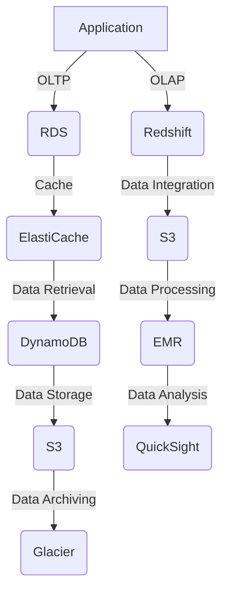

## Introduction
Amazon Web Services (AWS) provides a wide range of database options to cater to various needs and workloads. These options include **Relational Database Service (RDS)**, **Amazon Aurora**, **Amazon DynamoDB**, **Amazon ElastiCache**, and **Amazon Redshift**. Each of these services has its own strengths and use cases, and understanding the differences between them is crucial for designing and implementing scalable, efficient, and cost-effective database architectures. In this section, we will explore the basics of each service, their real-world relevance, and why every engineer needs to know about them.

> **Note:** Choosing the right database service is critical, as it can significantly impact the performance, scalability, and cost of your application.

## Core Concepts
Before diving into the details of each service, let's define some key terms and concepts:

* **Relational databases**: Store data in structured tables with well-defined relationships between them.
* **NoSQL databases**: Store data in flexible, schema-less formats, such as key-value pairs, documents, or graphs.
* **Database as a Service (DBaaS)**: A cloud-based service that provides pre-configured, managed databases, eliminating the need for provisioning and maintenance.
* **OLTP (Online Transactional Processing)**: Supports high-volume, low-latency transactions, such as those found in e-commerce or banking applications.
* **OLAP (Online Analytical Processing)**: Supports complex, data-intensive queries, such as those found in data warehousing or business intelligence applications.

> **Tip:** Understanding the differences between OLTP and OLAP workloads is essential for choosing the right database service.

## How It Works Internally
Let's take a closer look at the internal mechanics of each service:

* **RDS**: Provides a managed relational database service, supporting popular engines like MySQL, PostgreSQL, and Oracle. RDS handles provisioning, patching, and backup/restore, while allowing for fine-grained control over instance types, storage, and networking.
* **Aurora**: A MySQL- and PostgreSQL-compatible database service that provides high performance, high availability, and automatic scaling. Aurora uses a shared storage architecture, which enables fast failover and reduces storage costs.
* **DynamoDB**: A fully managed NoSQL database service that provides fast, predictable performance and seamless scalability. DynamoDB uses a key-value store architecture, with support for document and graph data models.
* **ElastiCache**: A web service that provides an in-memory data store, supporting popular caching engines like Redis and Memcached. ElastiCache helps improve application performance by reducing the load on databases and enhancing data retrieval.
* **Redshift**: A fully managed data warehousing service that provides column-store storage, advanced compression, and massively parallel processing (MPP). Redshift is optimized for OLAP workloads and supports complex queries, data integration, and business intelligence applications.

> **Warning:** Failing to understand the internal mechanics of each service can lead to suboptimal performance, scalability issues, and increased costs.

## Code Examples
Here are three complete, runnable code examples that demonstrate the usage of AWS database services:

**Example 1: Basic RDS Usage (Python)**
```python
import boto3

# Create an RDS client
rds = boto3.client('rds')

# Create a new RDS instance
response = rds.create_db_instance(
    DBInstanceClass='db.t2.micro',
    DBInstanceIdentifier='my-rds-instance',
    Engine='mysql',
    MasterUsername='myuser',
    MasterUserPassword='mypassword'
)

# Print the instance ID
print(response['DBInstance']['DBInstanceIdentifier'])
```

**Example 2: Real-World DynamoDB Usage (Java)**
```java
import software.amazon.awssdk.services.dynamodb.DynamoDbClient;
import software.amazon.awssdk.services.dynamodb.model.PutItemRequest;

public class DynamoDBExample {
    public static void main(String[] args) {
        // Create a DynamoDB client
        DynamoDbClient dynamoDb = DynamoDbClient.create();

        // Create a new item
        PutItemRequest request = PutItemRequest.builder()
                .tableName("my-table")
                .item(Map.of("id", "1", "name", "John Doe"))
                .build();

        // Put the item into the table
        dynamoDb.putItem(request);
    }
}
```

**Example 3: Advanced ElastiCache Usage (Node.js)**
```javascript
const { RedisClient } = require('redis');

// Create a new Redis client
const client = new RedisClient({
    host: 'my-redis-cluster.abcdef.0001.use1.cache.amazonaws.com',
    port: 6379
});

// Set a value in the cache
client.set('my-key', 'Hello, World!', (err, reply) => {
    if (err) {
        console.error(err);
    } else {
        console.log(reply);
    }
});
```

> **Interview:** Can you explain the differences between RDS and Aurora? How would you choose between them for a given use case?

## Visual Diagram


This diagram illustrates the relationships between various AWS services, including database options like RDS, Aurora, DynamoDB, ElastiCache, and Redshift.

> **Note:** Understanding the interactions between these services is crucial for designing and implementing scalable, efficient, and cost-effective architectures.

## Comparison
The following table compares the key features and characteristics of each AWS database service:

| Service | Database Type | Use Case | Scalability | Performance |
| --- | --- | --- | --- | --- |
| RDS | Relational | OLTP, OLAP | Vertical, Horizontal | High |
| Aurora | Relational | OLTP, OLAP | Automatic | High |
| DynamoDB | NoSQL | Real-time, Big Data | Automatic | High |
| ElastiCache | In-Memory | Caching, Real-time | Horizontal | High |
| Redshift | Column-Store | OLAP, Data Warehousing | Horizontal | High |

## Real-world Use Cases
Here are three real-world examples of companies using AWS database services:

* **Netflix**: Uses DynamoDB for real-time data processing and caching, while leveraging Redshift for data warehousing and analytics.
* **Airbnb**: Employs RDS for its relational database needs, while using ElastiCache for caching and performance optimization.
* **Amazon**: Utilizes Aurora for its internal database needs, taking advantage of its high performance, availability, and scalability.

> **Tip:** Understanding the use cases and architectures of successful companies can help inform your own design decisions.

## Common Pitfalls
Here are four common mistakes to avoid when using AWS database services:

* **Incorrect instance sizing**: Failing to choose the right instance type and size can lead to performance issues and increased costs.
* **Insufficient caching**: Not using caching mechanisms like ElastiCache can result in slower performance and increased load on databases.
* **Inadequate backup and restore**: Failing to implement regular backups and restore procedures can lead to data loss and downtime.
* **Inefficient query optimization**: Not optimizing database queries can result in poor performance, increased costs, and reduced scalability.

> **Warning:** Avoiding these common pitfalls can help ensure the success and reliability of your database architectures.

## Interview Tips
Here are three common interview questions related to AWS database services, along with weak and strong answers:

* **Question 1:** What is the difference between RDS and Aurora?
	+ Weak answer: "RDS is a relational database service, while Aurora is a NoSQL database service."
	+ Strong answer: "RDS is a managed relational database service that provides support for popular engines like MySQL and PostgreSQL, while Aurora is a MySQL- and PostgreSQL-compatible database service that provides high performance, high availability, and automatic scaling."
* **Question 2:** How would you optimize the performance of a DynamoDB table?
	+ Weak answer: "I would use a larger instance type and increase the number of read and write units."
	+ Strong answer: "I would start by analyzing the table's access patterns and data distribution, then apply optimization techniques like secondary indexes, caching, and data compression, while also considering the use of DynamoDB Accelerator (DAX) for improved performance."
* **Question 3:** What is the purpose of Redshift, and how does it differ from RDS?
	+ Weak answer: "Redshift is a data warehousing service, while RDS is a relational database service."
	+ Strong answer: "Redshift is a fully managed data warehousing service that provides column-store storage, advanced compression, and massively parallel processing (MPP), making it optimized for OLAP workloads and complex queries, whereas RDS is a managed relational database service that provides support for popular engines like MySQL and PostgreSQL, making it suitable for OLTP workloads."

> **Interview:** Can you explain the trade-offs between using a relational database like RDS versus a NoSQL database like DynamoDB?

## Key Takeaways
Here are ten key takeaways to remember when working with AWS database services:

* **Choose the right database service**: Select the service that best fits your workload and use case.
* **Understand the internal mechanics**: Familiarize yourself with the underlying architecture and implementation details of each service.
* **Optimize performance**: Apply optimization techniques like caching, indexing, and query optimization to improve performance.
* **Ensure scalability**: Design your database architecture to scale horizontally and vertically as needed.
* **Implement backup and restore procedures**: Regularly backup your data and implement restore procedures to ensure data integrity and availability.
* **Monitor and analyze performance**: Use AWS services like CloudWatch and X-Ray to monitor and analyze performance metrics.
* **Consider security and compliance**: Ensure that your database architecture meets security and compliance requirements.
* **Use automation and scripting**: Leverage automation and scripting tools like AWS CloudFormation and AWS CLI to streamline deployment and management.
* **Stay up-to-date with best practices**: Continuously update your knowledge and skills to stay current with best practices and new features.
* **Test and validate**: Thoroughly test and validate your database architecture to ensure it meets performance, scalability, and reliability requirements.

> **Note:** By following these key takeaways, you can design and implement scalable, efficient, and cost-effective database architectures using AWS database services.